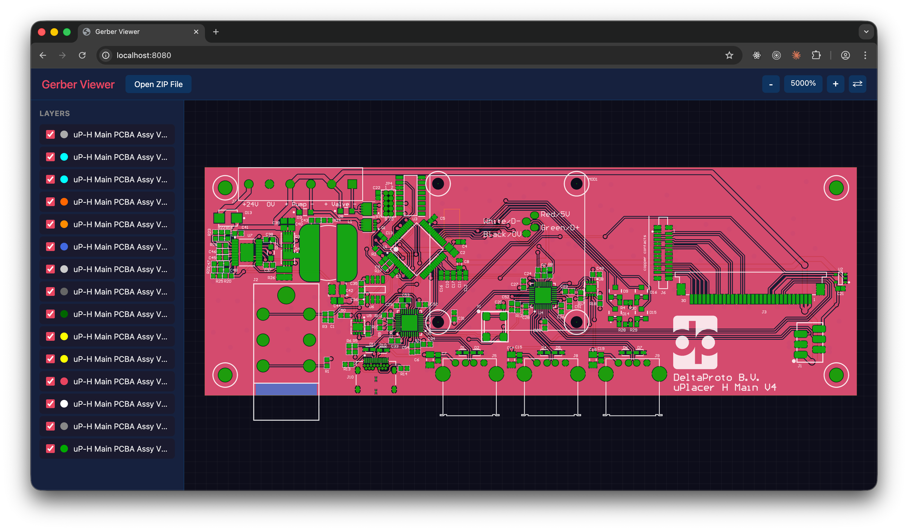

# Gerber Viewer

A Java library for parsing Gerber RS-274X and Excellon drill files with SVG rendering.



## Features

- Parse Gerber RS-274X files (.gbr, .ger, .gtl, .gbl, .gts, .gbs, .gto, .gbo, etc.)
- Parse Excellon drill files (.drl, .txt, .xln)
- Render PCB layers as SVG with proper scaling
- Support for all standard apertures (circle, rectangle, obround, polygon)
- Aperture macros with primitives (circle, line, outline, polygon, moire, thermal)
- Region fills (G36/G37)
- Arc interpolation (G02/G03) with single and multi-quadrant modes
- Layer polarity (LPD/LPC)
- Step and repeat (SR)
- Interactive web viewer with pan/zoom
- Toggle individual layers on/off
- Multi-layer composite rendering

## Quick Start

```bash
mvn clean install
mvn exec:java -Dexec.mainClass="nl.bytesoflife.gerber.web.GerberViewerServer"
```

Open http://localhost:8080 and upload a Gerber ZIP archive.

## Aperture Visual Test

The library includes a comprehensive visual test for aperture rendering that compares our implementation against reference images.

[View Aperture Visual Test](docs/aperture-visual-test.html)

## Project Structure

- `src/main/java/nl/bytesoflife/gerber/parser` - Gerber and Excellon parsers
- `src/main/java/nl/bytesoflife/gerber/lexer` - Tokenizer for Gerber files
- `src/main/java/nl/bytesoflife/gerber/model` - Data model for Gerber documents
- `src/main/java/nl/bytesoflife/gerber/svg` - SVG rendering engine
- `src/main/java/nl/bytesoflife/gerber/web` - Web viewer server

## Usage as Library

```java
// Parse a Gerber file
GerberParser parser = new GerberParser();
GerberDocument doc = parser.parse(gerberContent);

// Render to SVG
GerberToSvgConverter converter = new GerberToSvgConverter();
String svg = converter.convert(doc);

// Parse an Excellon drill file
ExcellonParser drillParser = new ExcellonParser();
ExcellonDocument drillDoc = drillParser.parse(excellonContent);
```

## License

MIT
