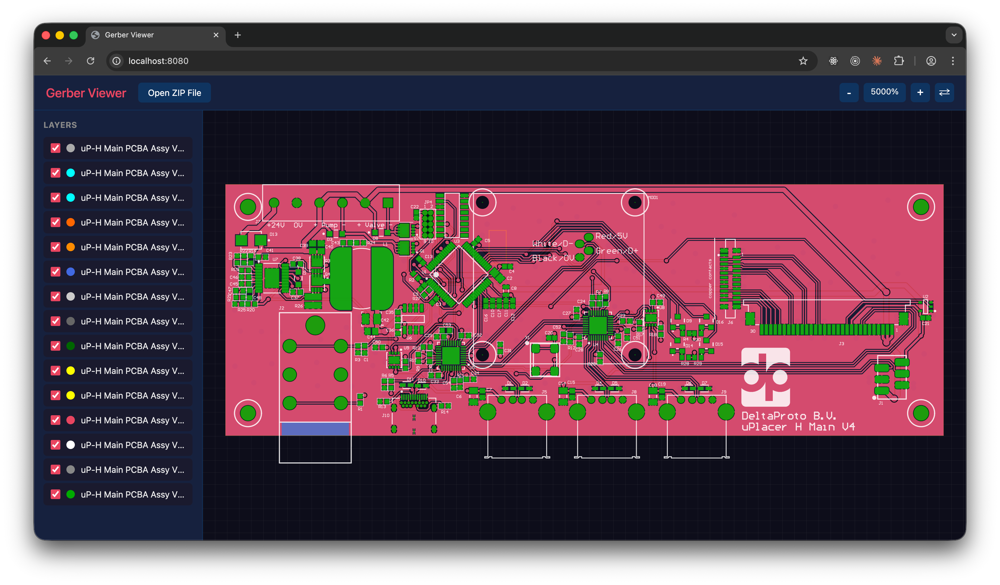
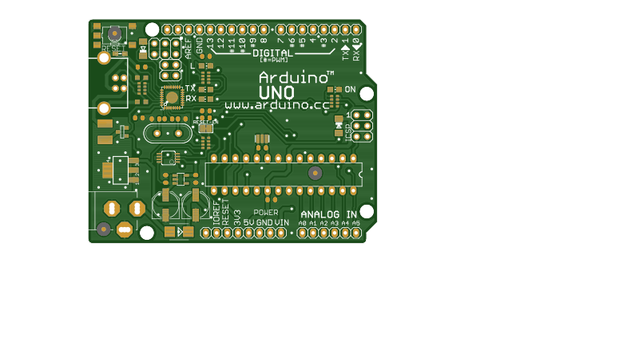
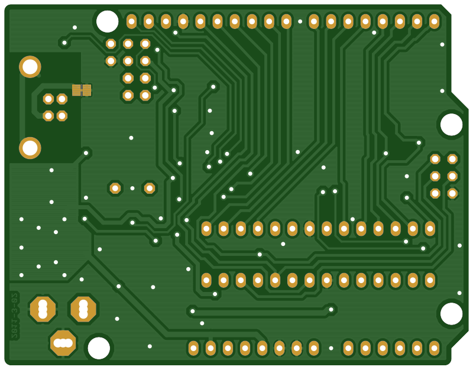

# Delta Gerber

A Java library for parsing Gerber RS-274X and Excellon drill files with SVG rendering and realistic PCB visualization.



## Realistic PCB Rendering

Generate photorealistic top and bottom views of your PCB with proper layer stacking — FR4 substrate, copper, soldermask, silkscreen, and drill holes.

| Top Side | Bottom Side |
|----------|-------------|
|  |  |

## Maven Dependency

```xml
<dependency>
    <groupId>com.deltaproto</groupId>
    <artifactId>delta-gerber</artifactId>
    <version>1.0.6</version>
</dependency>
```

## Features

- Parse Gerber RS-274X files (.gbr, .ger, .gtl, .gbl, .gts, .gbs, .gto, .gbo, etc.)
- Parse Excellon drill files (.drl, .txt, .xln)
- Render PCB layers as SVG with proper scaling
- Support for all standard apertures (circle, rectangle, obround, polygon)
- Extended aperture support (OCn octagon pads from EAGLE)
- Aperture macros with primitives (circle, line, outline, polygon, moire, thermal)
- Region fills (G36/G37)
- Arc interpolation (G02/G03) with single and multi-quadrant modes
- Layer polarity (LPD/LPC)
- Step and repeat (SR)
- Realistic PCB rendering with physically accurate layer stacking
- Interactive web viewer with pan/zoom and layer toggling
- Multi-layer composite rendering with configurable colors and opacity

## Quick Start

```bash
mvn clean install
mvn exec:java -Dexec.mainClass="com.deltaproto.deltagerber.web.GerberViewerServer"
```

Open http://localhost:938 and upload a Gerber ZIP archive.

## Web Viewer

The built-in web viewer provides three visualization modes:

- **All Layers** — Traditional overlay of all PCB layers with configurable colors and opacity
- **Board Top** — Realistic top-side rendering with soldermask, silkscreen, and copper finish
- **Board Bottom** — Realistic bottom-side rendering (horizontally mirrored)

Features: drag-to-pan, scroll-to-zoom, layer toggling via sidebar, layer type reassignment, ZIP file upload, and recent project history.

## Aperture Visual Test

The library includes a comprehensive visual test for aperture rendering that compares our implementation against reference images.

[View Aperture Visual Test](https://htmlpreview.github.io/?https://github.com/Delta-Proto/delta-gerber/blob/main/generated/aperture-visual-test.html)

## Project Structure

- `src/main/java/com/deltaproto/deltagerber/parser` - Gerber and Excellon parsers
- `src/main/java/com/deltaproto/deltagerber/lexer` - Tokenizer for Gerber files
- `src/main/java/com/deltaproto/deltagerber/model` - Data model for Gerber documents
- `src/main/java/com/deltaproto/deltagerber/renderer/svg` - SVG rendering engine
- `src/main/java/com/deltaproto/deltagerber/web` - Web viewer server

## Usage as Library

```java
// Parse a Gerber file
GerberParser parser = new GerberParser();
GerberDocument doc = parser.parse(gerberContent);

// Render to SVG
GerberToSvgConverter converter = new GerberToSvgConverter();
String svg = converter.convert(doc);

// Parse an Excellon drill file
ExcellonParser drillParser = new ExcellonParser();
ExcellonDocument drillDoc = drillParser.parse(excellonContent);
```

### Realistic Rendering

```java
MultiLayerSVGRenderer renderer = new MultiLayerSVGRenderer();

// Build layer map
Map<LayerType, Object> layers = new LinkedHashMap<>();
layers.put(LayerType.OUTLINE, outlineDoc);
layers.put(LayerType.COPPER_TOP, copperTopDoc);
layers.put(LayerType.SOLDERMASK_TOP, soldermaskTopDoc);
layers.put(LayerType.SILKSCREEN_TOP, silkscreenTopDoc);
layers.put(LayerType.DRILL, drillDoc);

// Render realistic top/bottom views
String topSvg = renderer.renderRealistic(layers, true);
String bottomSvg = renderer.renderRealistic(layers, false);
```

## License

MIT
