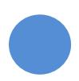
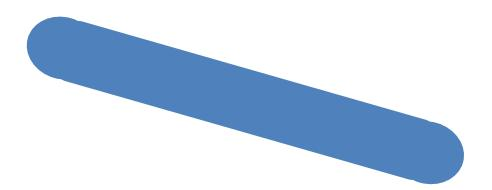
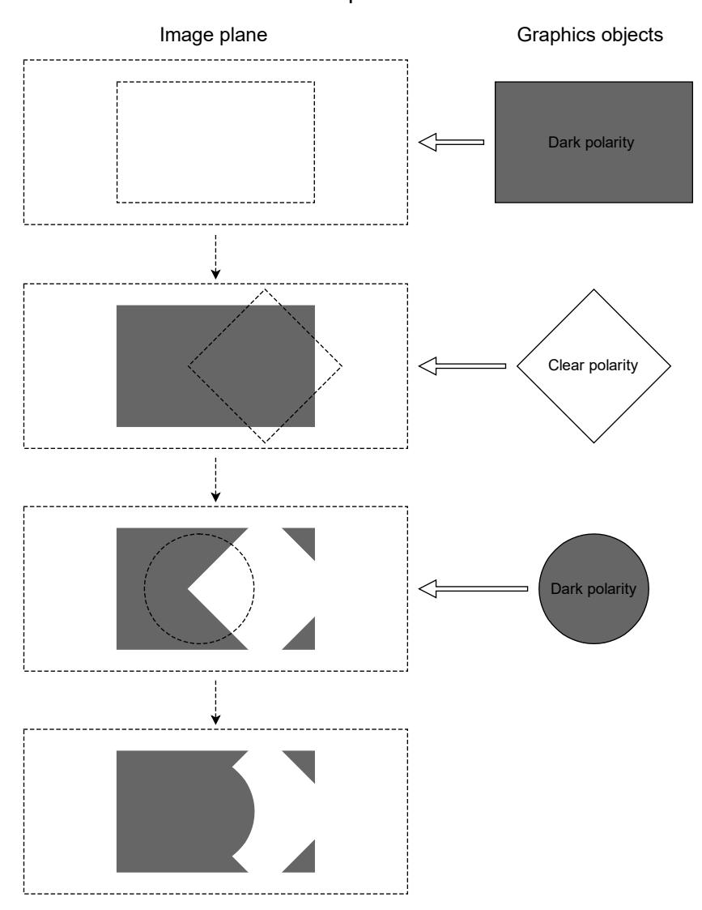
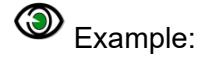
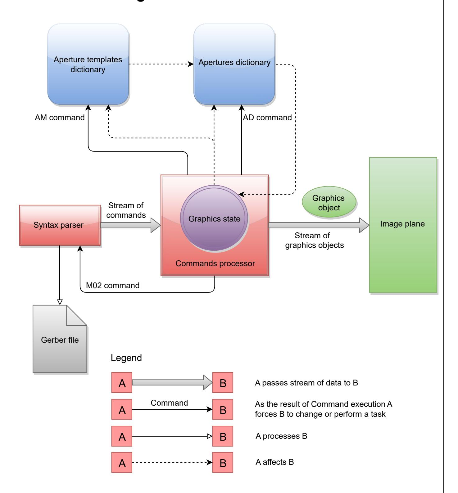
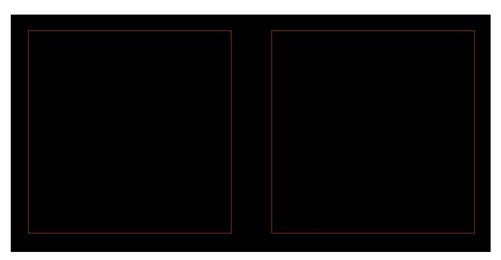
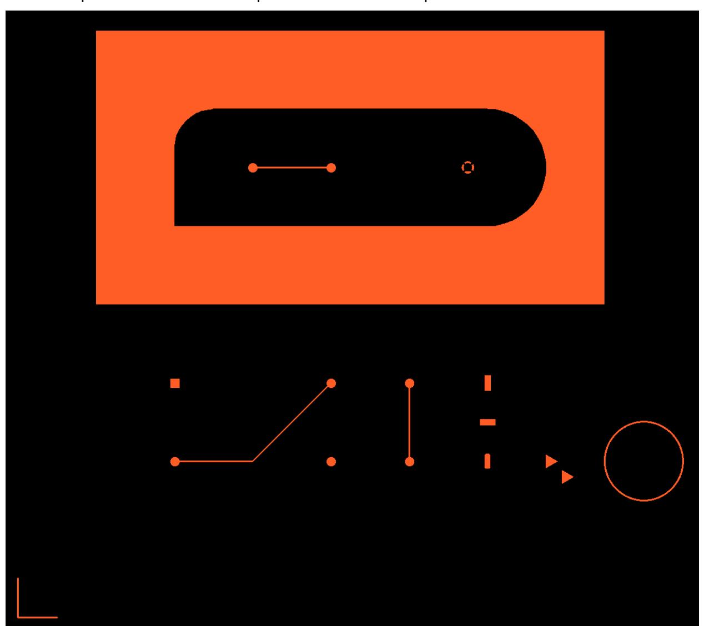

# <span id="page-10-0"></span>2 **Overview**

### <span id="page-10-1"></span>**2.1 File Structure**

The Gerber layer format is a 2D binary vector image format: the image is defined by resolutionindependent graphical objects. In binary or bi-level images each point takes one of two possible values, typically labeled black and white.

A *single* Gerber file specifies a *single* image. A Gerber file is complete: it does not need sidecar files or external parameters to be interpreted. One Gerber file represents one image. One image needs one Gerber file only.

A Gerber file is a *stream of commands.* The commands create a *stream of graphical objects* (see [2.2\)](#page-10-2) that are put on the image plane to create the final image. Other commands add attributes to those objects or to the overall file. Attributes are akin to labels that add meta information to the objects. Attributes do not affect the image itself.

The commands are ordered. A Gerber file can be processed in a single pass. Names, parameters, and objects must be defined *before* they are used.

A Gerber file uses printable 7-bit ASCII characters for all commands and names defined in the specification – this fully covers image generation. For attribute values the complete UTF-8 encoding is allowed, as they can be human defined. This makes the files printable and human readable.

Below is a small example Gerber file that creates a circle of 1.5 mm diameter centered on the origin. There is one command per line.

```
%FSLAX26Y26*%
%MOMM*%
%ADD100C,1.5*%
D100*
X0Y0D03*
M02*
```

### <span id="page-10-2"></span>**2.2 Apertures**

An aperture is a 2D plane figure. Apertures typically are simple shapes, as in the examples below, but complex shapes can be created.




Apertures are the basic tools to create graphic objects. They can be replicated in the plane, optionally rotated, mirrored, and scaled. This replication is called flashing, from the days when these things were done with NC optical equipment. Flashes are used to create pads. Apertures can also be used to draw traces by stroking the aperture as a pen along a line segment.

There are several methods to define apertures: via standard apertures, macro apertures and block apertures. Apertures are identified by a unique aperture number.

The AD (Aperture Define) command creates an aperture based on an aperture template and parameter values giving it a unique D code or aperture number for later reference.

There are two kinds of aperture templates:


- Standard apertures. They are pre-defined: the circle (C), rectangle (R), obround (O) and regular polygon (P). See [4.4.](#page-50-0)
- Macro apertures. They are created with the AM (Aperture Macro) command. Any shape and parametrization can be created. They are identified by their given name. (See [4.4.6\)](#page-55-0).

Standard apertures can be considered as built-in macro apertures. The example AD command below creates an aperture. The aperture number is 123. It uses standard aperture R with parameters 2.5 and 1.5 mm to create a rectangle of 2.5 by 1.5 mm.

```
%ADD123R,2.5X1.5%
```

Macros are a powerful feature of the Gerber format. Templates of any shape and parameters can be created. A file writer can easily define the apertures it needs. A file reader can handle any such aperture by implementing a single macro function. This single flexible mechanism replaces the need for a large - but always insufficient - set of built-in apertures. New apertures can be created without extending the format.

Block apertures are an ordered set of graphical objects. Block apertures are not created with templates. They are created by an AB statement, with the standard object creating commands of the Gerber format and assigns an aperture number to it (see [2.4\)](#page-14-0).

An aperture has an *origin*. When an aperture is flashed, its origin is positioned at the coordinates in the flash command (see [4.1\)](#page-44-1). The origin of a standard aperture is its geometric center. The origin of a macro aperture is the origin used in the AM command defining the macro. The origin of a block aperture is the origin used in the AB command defining the block.

### <span id="page-11-0"></span>**2.3 Graphical objects**

A Gerber file creates an ordered stream of graphical objects. A graphical object represents a plane figure. It has a shape, a size, a position and a polarity (dark or clear). The stream of the graphical objects creates the final image by superimposing the objects on the plane in the order of the stream, with dark polarity objects darkening the plane and clear ones erasing all dark areas under them.

There are four types of graphical objects:

- **Draws** are straight-line segments stroked with a circle.
- **Arcs** are circular segments stroked with a circle.
- **Flashes** are replications of the current aperture in the image plane. Any valid aperture can be flashed (see [4.8.4\)](#page-82-2). An aperture is typically flashed many times.
- **Regions** are defined by its contour (see [4.10.1\)](#page-89-1). A contour is a closed sequence of connected linear or circular segments.

The solid circle *standard* aperture is the only aperture allowed for creating *draw or arc* objects. Other standard apertures or macro apertures that fortuitously have a circular shape are not allowed.

A circle aperture with diameter zero can be used for creating a draw or an arc. It creates graphical objects without an image which can be used to transfer non-image information, e.g., an outline.


### <span id="page-12-0"></span>**Draws and Arcs**

A *draw object* is created by a command with D01 code in linear plot mode. The command strokes the straight-line segment with a solid circle standard aperture resulting in a line with thickness equal to the diameter of the circle and round endings.



An *arc* object is created by a command with D01 code in circular plot mode. In this case the command results in stroking an arc segment with a solid circle standard aperture. The *arc* has round endings, and its thickness is equal to the diameter of the circle.


In PCB copper layers, tracks are represented by draws and arcs, pads by flashes and copper pours by regions. Tracks is then a generic name for draws and arcs.


### <span id="page-13-0"></span>**Polarity**

The final image of the Gerber file is created by superimposing the objects in the order of their creation. Objects have a polarity, either clear or dark. Objects can overlap. A dark polarity object darkens its image in the plane. A clear polarity object clears its image in *all objects beneath it (generated before)*. Subsequent dark objects may again darken the cleared area. See illustration below. Another example is in [4.10.4.6.](#page-97-0)



*1. Superimposing objects with dark and clear polarities*

An object is totally dark or totally clear. It cannot be partially dark and partially clear.

The *order* of superimposed objects with different polarities affects the final image.

The LP command sets the polarity mode, a graphics state parameter (see [4.9\)](#page-84-0). Objects that are created when the polarity mode is dark are dark; when the mode is clear the objects are clear.


### <span id="page-14-0"></span>**2.4 Blocks**

A *block* is a substream of graphical objects that can be appended one or more times to the final graphical objects stream. Blocks can be mirrored, rotated, scaled, shifted and their polarity can be toggled. By using blocks repeated sub-images are defined only once, thus slashing file size, boosting processing speed and preserving the information that these sub-images are identical.

A block is *not* a macro of commands called repeatedly in the command stream. The command stream is processed sequentially, in one pass, without procedure or macro calls. Gerber is not a programming language.

Blocks can contain objects with different polarities (LPD and LPC). Blocks can overlap.

The origin of the block is the (0, 0) point of the file coordinate space.

Once a block is appended to the graphical objects stream its objects become part of the stream, and their effect does not depend on whether they were part of a block or not. A clear object in a block clears *all* objects beneath it, not only the objects contained in the block.

<span id="page-14-1"></span>There are two commands to create a block: SR and AB.

### **2.5 Attributes**

Attributes add meta-information to a Gerber file. These are akin to labels providing additional information about the file or features within. Examples of such meta-information are:

- The function of the file: is it the top solder mask, or the bottom copper layer etc.
- The function of a pad: is the pad a component pad, or a via pad, or a fiducial, etc.



This command defines an attribute indicating the file represents the top solder mask.

%TF.FileFunction,Soldermask,Top\*%

Attributes can be attached to objects, apertures or to the complete file.

Attributes do not affect the image itself, they only add meta-information to the data. A Gerber reader will generate the correct image even if it ignores some or all attributes.

The attribute syntax provides a flexible and standardized way to add meta-information to the images, independent of the specific semantics or application.

Attributes are needed when PCB data is transferred from design to fabrication**.** The PCB fabricator needs more than just the image. For example, the solder mask around via pads needs dedicated clearances to achieve the specified via protection. Without these attributes, the fabricator has to guess which objects represent a via; figuring this out manually is a time consuming and error-prone process. The attributes transfer the design intent from CAD to CAM in an unequivocal and standardized manner. This is sometimes rather grandly called "adding intelligence to the image".

Gerber files containing attribute commands (TF, TA, TO, TD) are called Gerber X2 files, files without attributes Gerber X1 files.

Attributes are described in detail in chapter [5.](#page-121-0)


### <span id="page-15-0"></span>**2.6 Operations (D01, D02, D03)**

D01, D02 and D03 are the *operations*. An *operation* is a command consisting of coordinate data followed by an operation code. Operations create the graphical objects and/or change the current point by operating on the coordinate data.


X100Y100D01\* X200Y200D02\* X300Y-400D03\*

The operations have the following effect.

- D02 moves the current point (see [2.3.2\)](#page-13-0) to the coordinate pair. No graphical object is created.
- D01 creates a linear or circular line segment by plotting from the current point to the coordinate pair in the command. Outside a region statement (see [2.3.2\)](#page-13-0) these segments are converted to draw or arc objects by stroking them with the current aperture (see [2.3.1\)](#page-12-0). Within a region statement these segments form a contour defining a region (see [4.10\)](#page-89-0). The effect of D01, e.g. whether a straight or circular segment is created, depends on the graphics state (see [2.3.2\)](#page-13-0).
- D03 creates a flash object by flashing (replicating) the current aperture. The origin of the current aperture is positioned at the specified coordinate pair.


### <span id="page-16-0"></span>**2.7 Graphics State**

The graphics state is a set of parameters affecting the result of the operation codes (see [2.3.2\)](#page-13-0). Before an operation code is issued all graphics state parameters affecting it must be defined.

The most important graphics state parameter is the *current point*. This is a point in the image plane set implicitly by each operation command (D01, D02, D03) to the coordinates contained in that operation command after finishing.

All other graphics state parameters are set explicitly by corresponding commands. Their values remain constant until explicitly changed.

The table below lists the graphics state parameters. The column 'Constant or variable' indicates whether a parameter remains fixed during the processing of a file or whether it can be changed. The column 'Initial value' is the default value at the beginning of each file; if the default is undefined the parameter value must be explicitly set by a command in the file before it is first used.

| Graphics state<br>parameter | Value range                                                                                | Constant or<br>variable during<br>file processing | Initial<br>value |  |  |  |
|-----------------------------|--------------------------------------------------------------------------------------------|---------------------------------------------------|------------------|--|--|--|
|                             | Coordinate Parameters                                                                      |                                                   |                  |  |  |  |
| Coordinate format           | Coordinate resolution. See the FS command in 4.1                                           | Constant                                          | Undefined        |  |  |  |
| Unit                        | mm or inch. See MO command in 4.2.1                                                        | Constant                                          | Undefined        |  |  |  |
|                             | Generation state                                                                           |                                                   |                  |  |  |  |
| Current point               | Point in plane                                                                             | Variable                                          | Undefined        |  |  |  |
| Current aperture            | Used for stroking and flashing.<br>See D01 and D03 commands in 4.7                         | Variable                                          | Undefined        |  |  |  |
| Plot state                  | Linear, clockwise circular, counterclockwise circular<br>See G01, G02, G03 commands in 4.7 | Variable                                          | Undefined        |  |  |  |
|                             | Aperture transformation state                                                              |                                                   |                  |  |  |  |
| Polarity                    | Dark or clear. See the LP command in 4.9.2                                                 | Variable                                          | Dark             |  |  |  |
| Mirroring                   | See the LM command in 4.9.3                                                                | Variable                                          | No mirror        |  |  |  |
| Rotation                    | See the LR command in 4.9.4                                                                | Variable                                          | No rotation      |  |  |  |
| Scaling                     | See the LS command in 4.9.5                                                                | Variable                                          | No scaling       |  |  |  |

*Graphics state parameters*


The graphics state determines the effect of an operation. If a parameter that is required to perform an operation is undefined at the time of the operation the Gerber file is *invalid*. A graphics state parameter that is not needed can remain undefined.

The relevance of the graphics state parameters for the operations is represented in the table below.

| Graphics state    | Operation codes                                                                                                                                                                                                                       |     |     |
|-------------------|---------------------------------------------------------------------------------------------------------------------------------------------------------------------------------------------------------------------------------------|-----|-----|
|                   | D01                                                                                                                                                                                                                                   | D02 | D03 |
| Coordinate format | Yes                                                                                                                                                                                                                                   | Yes | Yes |
| Unit              | Yes                                                                                                                                                                                                                                   | Yes | Yes |
| Current point     | Yes<br>(plot start point)                                                                                                                                                                                                             | No  | No  |
|                   | Yes/No refers to the explicit use of the complete current point. If an X and/or Y<br>coordinate is omitted in the operation code the corresponding value from the<br>current point is always taken; this is called modal coordinates. |     |     |
| Current aperture  | Yes outside a region<br>statement.<br>No inside a region<br>statement                                                                                                                                                                 | No  | Yes |
| Plot mode         | Yes                                                                                                                                                                                                                                   | No  | No  |
| Polarity          | Yes                                                                                                                                                                                                                                   | No  | Yes |
| Mirroring         | Yes                                                                                                                                                                                                                                   | No  | Yes |
| Rotation          | Yes                                                                                                                                                                                                                                   | No  | Yes |
| Scaling           | Yes                                                                                                                                                                                                                                   | No  | Yes |

*Relevance of graphics state parameters for operation codes*

Copyright Ucamco NV 18

.


### <span id="page-18-0"></span>**2.8 Commands Overview**

| Command     | Long name             | Description                                                                                                                                                                                                                                                  | Ref.  |
|-------------|-----------------------|--------------------------------------------------------------------------------------------------------------------------------------------------------------------------------------------------------------------------------------------------------------|-------|
| G04         | Comment               | A human readable comment, does not affect the image.                                                                                                                                                                                                         | 4.1   |
| MO          | Mode                  | Sets the unit to mm or inch.                                                                                                                                                                                                                                 | 4.2.1 |
| FS          | Format specification  | Sets the coordinate format, e.g. the number of decimals.                                                                                                                                                                                                     | 4.2.2 |
| AD          | Aperture define       | Defines a template-based aperture, assigns a D code to it.                                                                                                                                                                                                   | 4.3   |
| AM          | Aperture macro        | Defines a macro aperture template.                                                                                                                                                                                                                           | 4.5   |
| Dnn (nn≥10) |                       | Sets the current aperture to D code nn.                                                                                                                                                                                                                      | 4.6   |
| D01         | Plot operation        | Outside a region statement D01 creates a draw or arc<br>object with the current aperture. Inside it adds a draw/arc<br>segment to the contour under construction. The current<br>point is moved to draw/arc end point after the creation of<br>the draw/arc. | 4.8.2 |
| D02         | Move operation        | D02 moves the current point to the coordinate in the<br>command. It does not create an object.                                                                                                                                                               | 4.8.3 |
| D03         | Flash operation       | Creates a flash object with the current aperture. The<br>current point is moved to the flash point.                                                                                                                                                          | 4.8.4 |
| G01         |                       | Sets linear/circular mode to linear.                                                                                                                                                                                                                         | 4.7.1 |
| G02         |                       | Sets linear/circular mode to clockwise circular.                                                                                                                                                                                                             | 4.7.2 |
| G03         |                       | Sets linear/circular mode to counterclockwise circular.                                                                                                                                                                                                      | 4.7.2 |
| G75         |                       | A G75 must be called before creating the first arc.                                                                                                                                                                                                          | 4.7.2 |
| LP          | Load polarity         | Loads the polarity object transformation parameter.                                                                                                                                                                                                          | 4.9.2 |
| LM          | Load mirroring        | Loads the mirror object transformation parameter.                                                                                                                                                                                                            | 4.9.3 |
| LR          | Load rotation         | Loads the rotation object transformation parameter.                                                                                                                                                                                                          | 4.9.4 |
| LS          | Load scaling          | Loads the scale object transformation parameter.                                                                                                                                                                                                             | 4.9.5 |
| G36         |                       | Starts a region statement which creates a region by<br>defining its contours.                                                                                                                                                                                | 4.10. |
| G37         |                       | Ends the region statement.                                                                                                                                                                                                                                   | 4.10  |
| AB          | Aperture block        | Opens a block aperture statement and assigns its aperture<br>number or closes a block aperture statement.                                                                                                                                                    | 4.11  |
| SR          | Step and repeat       | Open or closes a step and repeat statement.                                                                                                                                                                                                                  | 4.11  |
| TF          | Attribute on file     | Set a file attribute.                                                                                                                                                                                                                                        | 5.2   |
| TA          | Attribute on aperture | Add an aperture attribute to the dictionary or modify it.                                                                                                                                                                                                    | 5.3   |
| TO          | Attribute on object   | Add an object attribute to the dictionary or modify it.                                                                                                                                                                                                      | 5.4   |
| TD          | Attribute delete      | Delete one or all attributes in the dictionary.                                                                                                                                                                                                              | 5.5   |
| M02         |                       | End of file.                                                                                                                                                                                                                                                 | 4.13  |

*Command Overview*


### <span id="page-19-0"></span>**2.9 Processing a Gerber File**



*2. Gerber file processing diagram*

The syntax parser reads the Gerber file and produces the stream of commands for the commands processor. The commands processor is responsible for handling the stream of


commands and as the result it generates the stream of graphical objects. All the created objects are superimposed on the image plane in order of their creation.

The *graphics state* is a core part of the command processor. How the processor creates graphical objects from the operation codes (see [2.3.2\)](#page-13-0) depends on the graphics state. Conversely, the processor modifies the graphics state when processing certain commands (see [2.3.2\)](#page-13-0).

The aperture template dictionary holds all the templates available. The AD command (see [4.3\)](#page-48-0) instantiates the templates to apertures and adds them to the aperture library. Standard, or builtin, aperture templates are automatically added to the dictionary when file processing is started. Macro aperture templates are created with an AM command (see [4.5\)](#page-56-0); they are added when the AM command is processed.

The *current aperture* is a graphics state parameter that is maintained by Dnn command (see [4.6\)](#page-74-0). When the processor executes a Dnn command a referenced aperture from apertures dictionary is set as the current aperture.

The graphics state also affects the generation of aperture templates and apertures: the templates and apertures depend on 'coordinate format' and 'unit' graphics state parameters (see [2.3.2\)](#page-13-0).

The graphical object stream is without state. Objects are superimposed as they are, in their order of appearance.

After processing the M02 command (see [4.13\)](#page-118-0) the processor interrupts the syntax parser and stops the graphical objects generation.

The image from above illustrates the processing of a Gerber file without attributes.


### <span id="page-21-0"></span>**2.10 Glossary**

**AB statement:** A statement defining a block aperture.

**Aperture:** A 2D shape that is used for stroking or flashing. (The name is historic; vector photoplotters exposed images on lithographic film by shining light through an opening, called aperture.) They are identified by an aperture number.

**Aperture macro:** The content of an Aperture Macro (AM) command. Defines a custom aperture template by combining built-in primitives.

**Aperture template:** A template is used to create the specific apertures used in the file. The AD command defines the parameters to instantiate the template to a defined aperture. There are three types of templates: standard or built-in apertures, macro apertures and block apertures.

**Aperture templates dictionary:** The object that holds all the aperture templates.

**Apertures dictionary:** The object that holds all the apertures.

**Arc:** A graphical object created by a D01 command in a circular plot mode.

**Attribute:** Metadata that is attached to the file or to objects in it; it provides extra information without affecting the image.

**Attributes dictionary**: The object that holds all the current attributes during the processing of a Gerber file.

**Binary image:** A two-dimensional (2D) image represented by two colors, usually black and white.

**Block:** A substream of graphical objects that can be added to the final objects stream.

**Circular plotting**: Creating a circular segment (circular arc) that is either an arc graphical object or used as a circular contour segment.

**Clear**: Clearing or erasing part of the image in the image plane. When a graphical object with clear polarity is added to the stream it erases its shape from any image that was already there.

**Command:** Commands are the basic unit of a Gerber file. Commands create graphical objects, define apertures, manage attributes, modify the graphics state and so on. For compatibility with older format versions there are two command syntax styles: word commands and extended commands.

**Command code:** A code that identifies the command.

**Contour:** A closed sequence of connected linear or circular segments. Contours are used to create regions or outline primitives in macro apertures.

**Coordinate data:** A number whose interpretation is determined by the FS command. It is used to specify the X and Y coordinates of a point in the image plane and a distance or offset in the X and Y direction.

**Coordinate format:** The specification of how to convert coordinate data to coordinates. It is file-dependent and is defined by an FS command.

**Current aperture:** The graphics state parameter that specifies the last aperture selected by a Dnn command. The current aperture is always used to create flashes, draws and arcs.


**Current point:** The graphics state parameter that specifies the point in the plane used as a begin point of linear or circular plotting as the location flash.

**Darken:** Darken the shape of a graphical object on the image plane; this happens when a graphical object with dark polarity added to the image.

**Draw:** A graphical object created by D01 command in linear plot mode.

**File image:** The binary image that is the visual representation of a Gerber file. It is created by superimposing the graphical objects in the plane.

**Flash:** A graphical object created by D03 or flash command.

**Gerber file:** A file in the Gerber format.

**Gerber format:** The vector image format defined by the current specification and used for representing a binary image.

**Graphical object:** A graphical object is a 2D object with a shape, a size, a position in the plane and a polarity (dark or clear). It is of one of the following types: flash, draw, arc, or region. The file image is created by superimposing graphical objects on the image plane. Attributes can optionally be attached to a graphical object.

**Graphics state:** The set of parameters that at each moment determine how the operation codes create graphical objects. For example, it determines whether a D01 operation code creates a draw or an arc.

**Header:** The part of the file from the file beginning to the point where the first operation code is encountered**.** The header typically holds the definitions of file attributes, aperture definitions, file unit and coordinate format.

**Image plane:** The 2D plane in which the image defined by the file is created.

**Plot mode:** The graphics state parameter defining whether the D01 operation creates a linear, a clockwise or counterclockwise arc.

**Interpolating:** A deprecated term for plotting.

**Linear plotting:** Creating a straight segment that is either converted to a draw graphical object or used as a linear contour segment.

**Macro aperture:** An aperture template defined using AM command.

**Operation:** A command containing one of the operation codes D01, D02 or D03 and coordinate data. The operation code defines the type of operation that is performed with the coordinate data. Operations may create graphical objects, create contours, and change the current point of the graphics state.

**Polarity:** A graphics state parameter that can take the value dark or clear. It determines the polarity of the graphical objects generated. Dark means that the object marks the image plane in dark and clear means that the object clears or erases everything underneath it. See also 'Darken' and 'Clear'.

**Region:** A graphical object with an arbitrary shape defined by its contour.

**Region statement:** A statement creating a region by defining its contour.

**Resolution:** The distance expressed by the least significant digit of coordinate data. Thus, the resolution is the step size of the grid on which all coordinates are defined.

**SR statement:** A statement defining a block and step & repeating it.

**Standard aperture:** A built-in aperture template.


**Standard attribute:** A built-in attribute with predefined semantics. See also user attribute.

**Statement**: A coherent sequence of commands delimited by an open and close command defining a higher-level structure.

**Stroke:** To create a draw or an arc graphical object with the current aperture.

**Track:** Either a draw or an arc. Typically used for conductive traces on a PCB.

**Unit:** The measurement unit 'mm' or 'inch' used to interpret the coordinate data. The effective unit is stored as the value of the corresponding graphics state parameter.

**User attribute:** A third-party defined attribute to extend the format with proprietary meta-information.

**Word:** A sequence of characters ending with the '\*' delimiter character. It is the lowlevel syntactical element of a Gerber file used to build commands.


### <span id="page-24-0"></span>**2.11 Annotated Example Files**

These annotated sample files illustrate the Gerber layer format to make the formal specification easier to read.

#### <span id="page-24-1"></span>**Example: Two Square Boxes**



*3. Example: two square boxes*

| Syntax                                 | Annotation                                                                                                                  |
|----------------------------------------|-----------------------------------------------------------------------------------------------------------------------------|
| G04 Ucamco ex. 1: Two<br>square boxes* | A comment                                                                                                                   |
| %MOMM*%                                | Unit set to mm                                                                                                              |
| %FSLAX26Y26*%                          | Format specification:                                                                                                       |
|                                        | Leading zeros omitted<br>Absolute coordinates<br>Coordinates in 2 integer and 6 fractional digits.                          |
| %TF.Part,Other,example*%               | Attribute: the file does not describe a PCB part - it is just an<br>example                                                 |
| %LPD*%                                 | Set the polarity to dark                                                                                                    |
| %ADD10C,0.010*%                        | Define aperture number 10 as a 0.01 mm circle                                                                               |
| D10*                                   | Select aperture 10 as current aperture                                                                                      |
| X0Y0D02*                               | Set current point to (0, 0)                                                                                                 |
| G01*                                   | Set linear plot mode                                                                                                        |
| X5000000Y0D01*                         | Create draw graphical object with the current aperture (10): start point<br>is the current point (0,0), end point is (5, 0) |
| Y5000000D01*                           | Create draw with the current aperture: (5, 0) to (5, 5)                                                                     |
| X0D01*                                 | Create draw with the current aperture: (5, 5) to (0, 5)                                                                     |
| Y0D01*                                 | Create draw with the current aperture: (0, 5) to (0, 0)                                                                     |


| Syntax        | Annotation                                                |
|---------------|-----------------------------------------------------------|
| X6000000D02*  | Set current point to (6, 0)                               |
| X11000000D01* | Create draw with the current aperture: (6, 0) to (11, 0)  |
| Y5000000D01*  | Create draw with the current aperture: (11, 0) to (11, 5) |
| X6000000D01*  | Create draw with the current aperture: (11, 5) to (6, 5)  |
| Y0D01*        | Create draw with the current aperture: (6, 5) to (6, 0)   |
| M02*          | End of file                                               |


### <span id="page-26-0"></span>**Example: Polarities and Apertures**

This example illustrates the use of polarities and various apertures.



*4. Example: various shapes*

| Syntax                         | Annotation                                                                                                                  |
|--------------------------------|-----------------------------------------------------------------------------------------------------------------------------|
| G04 Ucamco ex. 2: Shapes*      | A comment                                                                                                                   |
| G04 Ucamco ex. 2: Shapes*      | Comment                                                                                                                     |
| %MOMM*%                        | Units are mm                                                                                                                |
| %FSLAX36Y36*%                  | Format specification:<br>Leading zeros omitted<br>Absolute coordinates<br>Coordinates in 3 integer and 6 fractional digits. |
| %TF.FileFunction,Other,Sample* | Attribute: the is not a PCB layer, it is just an<br>example                                                                 |
| G04 Define Apertures*          | Comment                                                                                                                     |


| Syntax                       | Annotation                                                                                     |
|------------------------------|------------------------------------------------------------------------------------------------|
| %AMTHERMAL80*                | Define the aperture macro 'THERMAL80'                                                          |
| 7,0,0,0.800,0.550,0.125,45*% | Use thermal primitive in the macro                                                             |
| %ADD10C,0.1*%                | Define aperture 10 as a circle with diameter 0.1 mm                                            |
| %ADD11C,0.6*%                | Define aperture 11 as a circle with diameter 0.6 mm                                            |
| %ADD12R,0.6X0.6*%            | Define aperture 12 as a rectangle with size 0.6 x 0.6 mm                                       |
| %ADD13R,0.4X1.00*%           | Define aperture 13 as a rectangle with size 0.4 x 1 mm                                         |
| %ADD14R,1.00X0.4*%           | Define aperture 14 as a rectangle with size 1 x 0.4 mm                                         |
| %ADD15O,0.4X01.00*%          | Define aperture 15 as an obround with size 0.4 x 1 mm                                          |
| %ADD16P,1.00X3*%             | Define aperture 16 as a polygon with 3 vertices and<br>circumscribed circle with diameter 1 mm |
| %ADD19THERMAL80*%            | Define aperture 19 as an instance of macro aperture<br>'THERMAL80' defined earlier             |
| G04 Start image generation*  | A comment                                                                                      |
| D10*                         | Select aperture 10 as current aperture                                                         |
| X0Y2500000D02*               | Set the current point to (0, 2.5) mm                                                           |
| G01*                         | Set linear plot mode                                                                           |
| X0Y0D01*                     | Create draw with the current aperture                                                          |
| X2500000Y0D01*               | Create draw with the current aperture                                                          |
| X10000000Y10000000D02*       | Set the current point                                                                          |
| X15000000D01*                | Create draw with the current aperture                                                          |
| X20000000Y15000000D01*       | Create draw with the current aperture                                                          |
| X25000000D02*                | Set the current point.                                                                         |
| Y10000000D01*                | Create draw with the current aperture                                                          |
| D11*                         | Select aperture 11 as current aperture                                                         |
| X10000000Y10000000D03*       | Create flash with the current aperture (11) at (10, 10).                                       |
| X20000000D03*                | Create a flash with the current aperture at (20, 10).<br>Y is modal.                           |
| X25000000D03*                | Create a flash with the current aperture at (25, 10).<br>Y is modal.                           |
| Y15000000D03*                | Create a flash with the current aperture at (25, 15).<br>X is modal.                           |
| X20000000D03*                | Create a flash with the current aperture at (20, 15).<br>Y is modal.                           |
| D12*                         | Select aperture 12 as current aperture                                                         |
| X10000000Y15000000D03*       | Create a flash with the current aperture at (10, 15)                                           |
| D13*                         | Select aperture 13 as current aperture                                                         |
| X30000000Y15000000D03*       | Create a flash with the current aperture at (30, 15)                                           |


| Syntax                            | Annotation                                                                            |
|-----------------------------------|---------------------------------------------------------------------------------------|
| D14*                              | Select aperture 14 as current aperture                                                |
| Y12500000D03*                     | Create a flash with the current aperture at (30, 125)                                 |
| D15*                              | Select aperture 14 as current aperture                                                |
| Y10000000D03*                     | Create a flash with the current aperture at (30, 10)                                  |
| D10*                              | Select aperture 10 as current aperture                                                |
| X37500000Y10000000D02*            | Set the current point                                                                 |
| G75*                              | Must be called before an arc is created                                               |
| G03*                              | Set counterclockwise circular plot mode                                               |
| X37500000Y10000000I2500000J0D01*  | Create full circular arc with the current aperture (10).                              |
| D16*                              | Set the current aperture: use aperture 16                                             |
| X34000000Y10000000D03*            | Create a flash with the current aperture 16                                           |
| X35000000Y9000000D03*             | Create a flash with the current aperture 16 again                                     |
| G36*                              | Start a region statement                                                              |
| X5000000Y20000000D02*             | Set the current point to (5, 20)                                                      |
| G01*                              | Set linear plot mode                                                                  |
| Y37500000D01*                     | Create linear segment of the contour                                                  |
| X37500000D01*                     | Create linear segment of the contour                                                  |
| Y20000000D01*                     | Create linear segment of the contour                                                  |
| X5000000D01*                      | Create linear segment of the contour                                                  |
| G37*                              | Close the region statement. This creates the region by<br>filling the created contour |
| %LPC*%                            | Set the polarity to clear                                                             |
| G36*                              | Start the region statement                                                            |
| X10000000Y25000000D02*            | Set the current point to (10, 25)                                                     |
| Y30000000D01*                     | Create linear segment                                                                 |
| G02*                              | Set clockwise circular plot mode                                                      |
| X12500000Y32500000I2500000J0D01*  | Create clockwise circular segment with radius 2.5                                     |
| G01*                              | Set linear plot mode                                                                  |
| X30000000D01*                     | Create linear segment                                                                 |
| G02*                              | Set clockwise circular plot mode                                                      |
| X30000000Y25000000I0J-3750000D01* | Create clockwise circular segment with radius 3.75                                    |
| G01*                              | Set linear plot mode                                                                  |
| X10000000D01*                     | Create linear segment                                                                 |
| G37*                              | Close the region statement, creates region object                                     |
| %LPD*%                            | Set the polarity to dark                                                              |


| Syntax                 | Annotation                                    |
|------------------------|-----------------------------------------------|
| D10*                   | Select aperture 10 as current aperture        |
| X15000000Y28750000D02* | Set the current point                         |
| X20000000D01*          | Create draw with the current aperture         |
| D11*                   | Select aperture 11 as current aperture        |
| X15000000Y28750000D03* | Create a flash with the current aperture (11) |
| X20000000D03*          | Create a flash with the current aperture      |
| D19*                   | Select aperture 19 as current aperture        |
| X28750000Y28750000D03* | Create a flash with the current aperture (19) |
| M02*                   | End of file                                   |


### <span id="page-30-0"></span>**2.12 Conformance**

A file violating any requirement of the specification or with constructs not defined in it is wholly invalid. An invalid Gerber file is meaningless and does *not* represent an image.

A conforming Gerber file writer must write files according to this specification. A current conforming Gerber file writer cannot use deprecated constructs. A writer is not required to consider limitations or errors in particular readers but may assume that a valid file will be processed correctly.

A conforming Gerber file reader must render a valid Gerber file according to this specification. A current reader may support deprecated format elements as they can be present in legacy files. To prepare for future extensions of the format, a Gerber file reader *must* give a warning when encountering an unimplemented command, skip it and continue processing. Otherwise there is *no* mandatory behavior on reading an invalid Gerber file. It is *not* mandatory to report any other errors – this would impose an unreasonable burden on readers and may result in useless messages in some applications. A reader is allowed to attempt to reverse engineer the intended image and display it; note that if reverse engineering fails this is the responsibility of the writer of the file, not the reader, as the invalid file is meaningless – it is the file that is wrong, not the reader.

The responsibilities are obvious and plain. Writers must write valid and numerically robust files and readers must process such files correctly. Writers are not responsible to navigate around problems in the readers, nor are readers responsible to solve problems in the writers. Keep in mind Postel's rule: "*Be conservative in what you send, be liberal in what you accept."*

Standard Gerber (RS-274-D) is revoked and therefore non-conforming. The responsibility for misunderstandings of its non-standardized wheel file rests solely with the party that decided to use Standard Gerber rather than Extended Gerber. See [8.5.](#page-194-0)

This document is the sole specification of the Gerber format. Gerber viewers, however useful, do not overrule this document.


