# <span id="page-44-0"></span>4 **Graphics**

### <span id="page-44-1"></span>**4.1 Comment (G04)**

The G04 command is used for human readable comments. It does not affect the image. The syntax for G04 is as follows.

```
G04 = ('G04' string) '*';
```

The string must follow the string syntax in [3.4.3.](#page-35-3)

### **Example:**

```
G04 This is a comment* 
G04 The space characters as well as ',' and ';' are allowed here.*
```

Content starting with "#@!" is reserved for *standard comments*. The purpose of standard comments is to add meta-information in a formally defined manner, without affecting image generation. They can only be used if defined in this specification.


### <span id="page-45-0"></span>**4.2 Coordinate Commands**

The Gerber Layer Format uses 2D Cartesian coordinates. When the PCB is viewed from the top towards the bottom layer the X axis points to the right then the Y axis points upwards as in the illustration below.

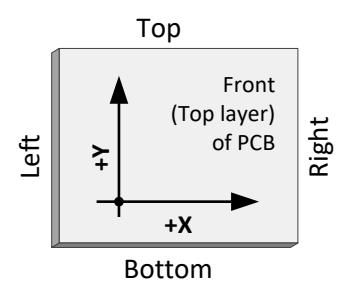

The origin of the system and its orientation can be chosen freely, but it is recommended to put the origin on the bottom left corner of the PCB and orient the X-axis along the bottom edge whenever possible. The same coordinate system *must* be used for all layers, in other words, objects on different layers that align in the real world *must* have the same coordinates. See illustration.

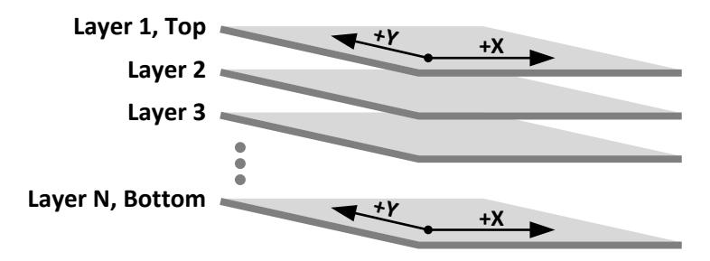

Positive rotation is counterclockwise when viewed from top towards bottom layer.

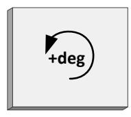


### <span id="page-46-0"></span>**Unit (MO)**

The MO (Mode) command sets the file unit to either metric (mm) or imperial (inch).

The MO command must be used once and only once, in the header of the file, before the first operation command. The syntax is:

MO = '%' ('MO' ('MM'|'IN')) '\*%';

| Syntax | Comments                                            |
|--------|-----------------------------------------------------|
| MO     | MO for Mode                                         |
| MM IN  | MM – metric (millimeter)<br>IN<br>– imperial (inch) |

### **Example:**

G04 Defines aperture 10 as a circle with diameter 0.25mm\* %MOMM\*% … %ADD10C,0.25\*%

Use metric. Imperial is historic and will be deprecated at a future date.


### <span id="page-47-0"></span>**Format Specification (FS)**

Coordinate data represents the X, Y, I and J coordinates or distances in the operation commands (plot, move, flash). Coordinate data is in fixed format decimals, expressed in the unit set by the MO command. Leading zeros may be omitted.

The Format Specification specifies the number of integer and decimal places to expect in the coordinate data. The FS command must be used *once and only once,* in the header, before the first operation command. The syntax is:

**FS = '%' ('FS' 'LA' 'X' coord\_digits 'Y' coord\_digits) '\*%'; coord\_digits = /[1-6][6]/;**

| Syntax       | Comments                                                                                                                                                               |
|--------------|------------------------------------------------------------------------------------------------------------------------------------------------------------------------|
| FS           | FS for Format Specification                                                                                                                                            |
| LA           | These mandatory characters are needed for compatibility<br>with previous format versions, see 8.2.1.                                                                   |
| coord_digits | Specifies the number of integer and decimal digits in the<br>coordinate data.                                                                                          |
|              | The first digit sets the maximum number of integer digits.<br>It can range from 1 up to 6; use a number that is<br>sufficient for the size of the image; 3 is typical. |
|              | The second digit sets the number of decimal digits<br>decimal point. It must now be set to 6. (Previous format<br>versions allowed other values.)                      |
|              | The digits for X and for Y must be the same. The current<br>syntax is for compatibility with previous format versions.                                                 |

## **Example:**

%MOMM\*%

%FSLAX36Y36\*%

The file unit is mm. To interpret a coordinate, it is first left padded with zeros till it has 3+6 digits. The decimal point is then positioned before the 6th digit starting from the right. There are then 6 decimal digits. The resolution of the file 10-6mm, or 1 nm. The coordinate X123123456 means X at 123.123456mm, Y23456 means Y at .023456mm.

Signs in coordinates are allowed; the '+' sign is optional. Coordinate data must have at least one character: zero must therefore be encoded as "0".


### <span id="page-48-0"></span>**4.3 Aperture Definition (AD)**

#### <span id="page-48-1"></span>**AD Command**

The AD command creates an aperture, attaches the aperture attributes at that moment in the attribute dictionary to it and adds it to the apertures dictionary.

The syntax for the AD command is as follows:

```
AD = '%' ('AD' aperture_ident template_call) '*%'; 
template_call = template_name [',' parameter {'X' parameter}*];
```

| Syntax                             | Comments                                                                                                                                                                                                                                                                                                                         |
|------------------------------------|----------------------------------------------------------------------------------------------------------------------------------------------------------------------------------------------------------------------------------------------------------------------------------------------------------------------------------|
| AD                                 | 'AD' is the command code                                                                                                                                                                                                                                                                                                         |
| aperture_ident                     | The aperture identification being defined (≥10). The<br>aperture numbers can range from 10 up to<br>2.147.483.647 (max int 32). The D00 to D09 are<br>reserved and cannot be used for apertures. Once an<br>aperture number is assigned it cannot be re-assigned<br>– thus apertures are uniquely identified by their<br>number. |
| template_call                      | Set the shape of the aperture by calling a template<br>with actual parameters                                                                                                                                                                                                                                                    |
| template_name                      | The name of the template, either a standard aperture<br>or macro (see 2.2). It follows the syntax of names<br>(see 3.4.5).                                                                                                                                                                                                       |
| [',' parameter {'X' parameters}*]; | The number and meaning of the actual parameters<br>depend on the template. Parameters are decimals.<br>All sizes are in the unit of the MO command.                                                                                                                                                                              |

The AD command must precede the first use of the aperture. It is recommended to put all AD commands in the file header.


%ADD10C,.025\*% %ADD10C,0.5X0.25\*%

Section [5.8](#page-156-0) has examples to illustrate how to attach aperture attributes to an aperture.


### <span id="page-49-0"></span>**Examples**

| Syntax                       | Comments                                                                                                                       |
|------------------------------|--------------------------------------------------------------------------------------------------------------------------------|
| %ADD10C,0.025*%              | Create aperture with number 10: a solid circle<br>with diameter 0.025                                                          |
| %ADD22R,0.050X0.050X0.027*%  | Creates aperture 22: a rectangle with sides of<br>0.05 – therefore forming a square - and with a<br>0.027 diameter round hole  |
| %ADD57O,0.030X0.040X0.0015*% | Creates aperture 57: an obround with sizes<br>0.03 x 0.04 with 0.015 diameter round hole                                       |
| %ADD30P,0.016X6*%            | Creates aperture 30: a solid polygon with 0.016<br>outer diameter and 6 vertices                                               |
| %ADD15CIRC*%                 | Creates aperture 15: instantiate the macro<br>aperture template CIRC defined previously with<br>an aperture macro (AM) command |

### <span id="page-49-1"></span>**Zero-size Apertures**

The C (circular) standard apertures with zero diameter are allowed, and so are zero-size objects created with it. Attributes can be attached to such apertures and objects. However, size zero is not allowed with any other aperture type. Zero-size objects do not affect the image but they can be used to indicate locations in the image plane, such as a board outline, and attach metainformation to these locations.

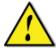

**Warning:** Zero size apertures are only allowed with the .C apertures.

Use zero-size apertures sparingly. When tempted to use a zero-size object, consider whether it is really useful, and whether there is no proper way to convey the meta-information. Certainly do not abuse a zero-size object to indicate the *absence* of an object, e.g. by flashing a zero-size aperture to indicate the absence of a pad; this is just confusing; if there is nothing, put nothing.


### <span id="page-50-0"></span>**4.4 Standard Aperture Templates**

### <span id="page-50-1"></span>**Overview**

| Standard Aperture Templates |           |                                                         |       |
|-----------------------------|-----------|---------------------------------------------------------|-------|
| Name                        | Shape     | Parameters                                              | Ref.  |
| C                           | Circle    | Diameter[, Hole diameter]                               | 4.4.2 |
| R                           | Rectangle | X size, Y size[, Hole diameter]                         | 4.4.3 |
| O                           | Obround   | X size, Y size[, Hole diameter]                         | 4.4.4 |
| P                           | Polygon   | Outer diameter, # vertices[, Rotation[, Hole diameter]] | 4.4.5 |

*Table with standard aperture templates*

### <span id="page-50-2"></span>**Circle**

The syntax of the circle standard template call is:

#### template\_call = 'C' ',' diameter 'X' hole\_diameter

| Syntax        | Comments                                                                                             |
|---------------|------------------------------------------------------------------------------------------------------|
| C             | Indicates the circle aperture template.                                                              |
| diameter      | Diameter. A decimal ≥0.                                                                              |
| hole_diameter | Diameter of a round hole. A decimal >0. If omitted the aperture<br>is solid. See also section 4.4.6. |

### **Examples:**

%ADD10C,0.5\*% %ADD10C,0.5X0.25\*%

These commands define the following apertures:


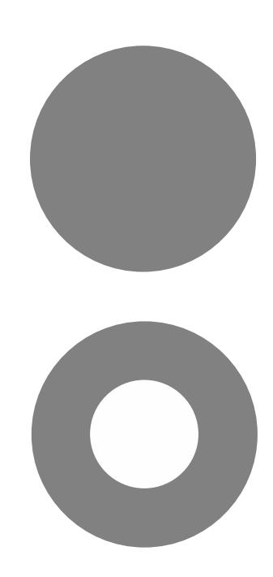

*5. Circles*


### <span id="page-52-0"></span>**Rectangle**

The syntax of the rectangle or square standard template call is:

#### template\_call = 'R' ',' x\_size 'X' y\_size 'X' hole\_diameter

| Syntax           | Comments                                                                                            |
|------------------|-----------------------------------------------------------------------------------------------------|
| R                | Indicates the rectangle aperture template.                                                          |
| x_size<br>y_size | X and Y sizes of the rectangle. Decimals >0.<br>If x_size = y_size the effective shape is a square. |
| hole_diameter    | Diameter of a round hole. A decimal >0. If omitted the aperture is<br>solid.                        |
|                  | See also section 4.4.6.                                                                             |

### **Examples:**

%ADD22R,0.044X0.025\*% %ADD23R,0.044X0.025X0.019\*%

These commands define the following apertures:


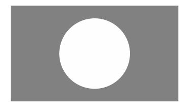

*6. Rectangles*


### <span id="page-53-0"></span>**Obround**

Obround (oval) is a rectangle where the smallest side is rounded to a half-circle. The syntax is:

#### template\_call = 'O' ',' x\_size 'X' y\_size 'X' hole\_diameter

| Syntax           | Comments                                                                                            |
|------------------|-----------------------------------------------------------------------------------------------------|
| O                | Indicates the obround aperture template.                                                            |
| x_size<br>y_size | X and Y sizes of enclosing box. Decimals >0.<br>If x_size = y_size the effective shape is a circle. |
| hole_diameter    | Diameter of a round hole. A decimal >0. If omitted the aperture is<br>solid.                        |
|                  | See also section 4.4.6.                                                                             |

### **Example:**

%ADD22O,0.046X0.026\*% %ADD22O,0.046X0.026X0.019\*%

These commands define the following apertures:

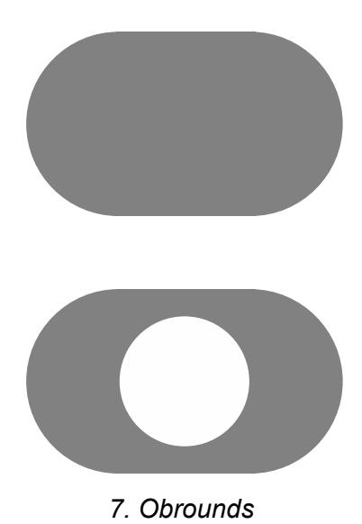


### <span id="page-54-0"></span>**Polygon**

Creates a *regular* polygon aperture. The syntax of the polygon template is:

#### template\_call = 'P' ',' outer\_diameter 'X' vertices 'X' rotation 'X' hole\_diameter

| Syntax         | Comments                                                                                                                                                         |  |
|----------------|------------------------------------------------------------------------------------------------------------------------------------------------------------------|--|
| P              | Indicates the polygon aperture template.                                                                                                                         |  |
| outer_diameter | Diameter of the circle circumscribing the regular polygon, i.e.<br>the circle through the polygon vertices. A decimal > 0.                                       |  |
| vertices       | Number of vertices n, 3 ≤ n ≤ 12. An integer.                                                                                                                    |  |
| rotation       | The rotation angle, in degrees counterclockwise. A decimal.<br>With rotation angle zero there is a vertex on the positive X-axis<br>through the aperture center. |  |
| hole_diameter  | Diameter of a round hole. A decimal >0. If omitted the aperture<br>is solid.<br>See also section 4.4.6.                                                          |  |

### **Examples:**

%ADD17P,.040X6\*%

%ADD17P,.040X6X0.0X0.019\*%

#### These commands define the following apertures:

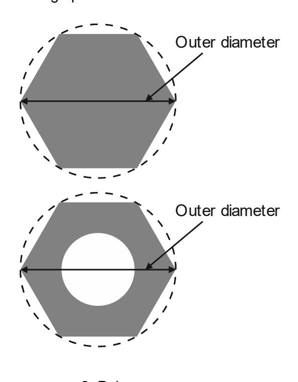

*8. Polygons*


### <span id="page-55-0"></span>**Transparency of Holes**

Standard apertures may have a round hole in them. When an aperture is flashed only the solid part affects the image, the hole does *not.* Objects under a hole remain visible through the hole. For image generation the area of the hole behaves exactly as the area outside the aperture. The hole is not part of the aperture.

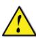

**Warning:** Make no mistake: holes do *not* clear the objects under them.

For all standard apertures the round hole is defined by specifying its diameter as the last parameter: <Hole diameter>. If <Hole diameter> is omitted the aperture is solid. If present the diameter must be > 0. The hole must strictly fit within the standard aperture. It is centered on the aperture.

### **Example:**

```
%FSLAX26Y26*%
%MOMM*%
%ADD10C,10X5*%
%ADD11C,1*%
G01*
%LPD*%
D11*
X-25000000Y-1000000D02*
X25000000Y1000000D01*
D10*
X0Y0D03*
M02*
```

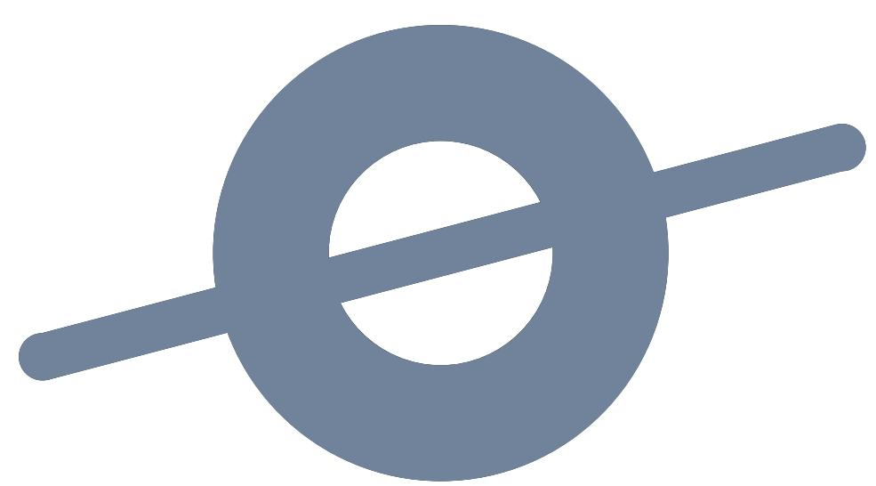

*9. Standard (circle) aperture with a hole above a draw*

Note that the draw is visible through the hole.


### <span id="page-56-0"></span>**4.5 Aperture Macro (AM)**

The AM command creates a macro aperture template and adds it to the aperture template dictionary (see [2.2\)](#page-10-2). A template is a parametrized shape. The AD command instantiates a template into an aperture by supplying values to the template parameters.

Templates of any shape or parametrization can be created. Multiple simple shapes called primitives can be combined in a single template. An aperture macro can contain variables whose actual values are defined by:

- Values provided by the AD command
- Arithmetic expressions with other variables

The template is created by positioning primitives in a coordinate space. The origin of that coordinate space will be the origin of all apertures created with the state.

A template must be defined before the first AD that refers to it. The AM command can be used multiple times in a file.

Attributes are *not* attached to templates. They are attached to the aperture at the time of its creation with the AD command.

An AM command contains the following words:

- The AM declaration with the macro name
- Primitives with their comma-separated parameters
- Macro variables, defined by an arithmetic expression

The syntax for the AM command is:

```
AM = '%' ('AM' macro_name macro_body) '%'; 
macro_name = name '*'; 
macro_body = {in_macro_block}+; 
in_macro_block = 
 |primitive 
 |variable_definition 
 ; 
variable_definition = (macro_variable '=' expression) '*'; 
macro_variable = '$' positive_integer; 
primitive = primitive_code {',' par}* 
par = ',' (expression);
```

| Syntax                              | Comments                                                                                                                                                                       |
|-------------------------------------|--------------------------------------------------------------------------------------------------------------------------------------------------------------------------------|
| AM                                  | AM for Aperture Macro                                                                                                                                                          |
| <macro name=""></macro>             | Name of the aperture macro. The name must be unique, it<br>cannot be reused for another macro. See 3.4.5 for the syntax<br>rules.                                              |
| <macro body=""></macro>             | The macro body contains the primitives generating the image<br>and the calculation of their parameters.                                                                        |
| <variable definition=""></variable> | \$n= <arithmetic expression="">. An arithmetic expression may<br/>use arithmetic operators (described later), constants and<br/>variables \$m defined previously.</arithmetic> |


| Syntax                          | Comments                                                                                                                                                                                                                                                                                                |
|---------------------------------|---------------------------------------------------------------------------------------------------------------------------------------------------------------------------------------------------------------------------------------------------------------------------------------------------------|
| <primitive></primitive>         | A primitive is a basic shape to create the macro. It includes<br>primitive code identifying the primitive and primitive-specific<br>parameters (e.g. center of a circle). See 4.5.1. The primitives<br>are positioned in a coordinates system whose origin is the<br>origin of the resulting apertures. |
| <primitive code=""></primitive> | A code specifying the primitive (e.g. polygon).                                                                                                                                                                                                                                                         |
| <parameter></parameter>         | Parameter can be a decimal number (e.g. 0.050), a macro<br>variable (e.g. \$1) or an arithmetic expression. The actual value<br>is calculated as explained in 4.5.4.3.                                                                                                                                  |

Coordinates and sizes are expressed in the unit set by the MO command.

A macro variable name must be a '\$' character followed by an integer >0, for example \$12. (This is a subset of names allowed in [3.4.3.](#page-35-3))

**Note:** New lines can be added between words of a single command to enhance readability. They do not affect the macro definition.

## **Example:**

The following AM command defines an aperture macro named 'Triangle\_30'.

```
%AMTriangle_30*
4,1,3,
1,-1,
1,1,
2,1,
1,-1,
30*
%
```


### <span id="page-58-1"></span><span id="page-58-0"></span>**Primitives**

### *4.5.1.1 Overview*

|      | Macro Primitives |                                                                     |         |  |
|------|------------------|---------------------------------------------------------------------|---------|--|
| Code | Name             | Parameters                                                          | Ref.    |  |
| 0    | Comment          | A comment string                                                    | 4.5.1.2 |  |
| 1    | Circle           | Exposure, Diameter, Center X, Center Y[, Rotation]                  | 4.5.1.3 |  |
| 20   | Vector Line      | Exposure, Width, Start X, Start Y, End X, End Y, Rotation           | 4.5.1.4 |  |
| 21   | Center Line      | Exposure, Width, Height, Center X, Center Y, Rotation               | 4.5.1.5 |  |
| 4    | Outline          | Exposure, # vertices, Start X, Start Y, Subsequent points, Rotation | 4.5.1.6 |  |
| 5    | Polygon          | Exposure, # vertices, Center X, Center Y, Diameter, Rotation        | 4.5.1.7 |  |
| 7    | Thermal          | Center X, Center Y, Outer diameter, Inner diameter, Gap, Rotation   | 4.5.1.8 |  |

#### *Table with macro primitives*

Except for the comment all the parameters can be a decimal, integer, macro variables or an arithmetic expression.


### <span id="page-59-0"></span>*4.5.1.2 Comment, Code 0*

The comment primitive has no effect on the image but adds human-readable comments in an AM command. The comment primitive starts with the '0' code followed by a space and then a single-line text string. The text string follows the syntax for strings in section [3.4.3.](#page-35-3)

### **Example:**

```
%AMBox*
0 Rectangle with rounded corners, with rotation*
0 The origin of the aperture is its center*
0 $1 X-size*
0 $2 Y-size*
0 $3 Rounding radius*
0 $4 Rotation angle, in degrees counterclockwise*
0 Add two overlapping rectangle primitives as box body*
21,1,$1,$2-$3-$3,0,0,$4*
21,1,$1-$3-$3,$2,0,0,$4*
0 Add four circle primitives for the rounded corners*
$5=$1/2*
$6=$2/2*
$7=2x$3*
1,1,$7,$5-$3,$6-$3,$4*
1,1,$7,-$5+$3,$6-$3,$4*
1,1,$7,-$5+$3,-$6+$3,$4*
1,1,$7,$5-$3,-$6+$3,$4*%
```


### <span id="page-60-0"></span>*4.5.1.3 Circle, Code 1*

A circle primitive is defined by its center point and diameter.

| Parameter<br>number | Description                                                                                                                                                                                                                                         |
|---------------------|-----------------------------------------------------------------------------------------------------------------------------------------------------------------------------------------------------------------------------------------------------|
| 1                   | Exposure off/on (0/1)                                                                                                                                                                                                                               |
| 2                   | Diameter ≥ 0                                                                                                                                                                                                                                        |
| 3                   | Center X coordinate.                                                                                                                                                                                                                                |
| 4                   | Center Y coordinate.                                                                                                                                                                                                                                |
| 5                   | Rotation angle of the center, in degrees counterclockwise. The primitive<br>is rotated around the origin of the macro definition, i.e. the (0, 0) point of<br>macro coordinates.<br>The rotation parameter is optional. The default is no rotation. |

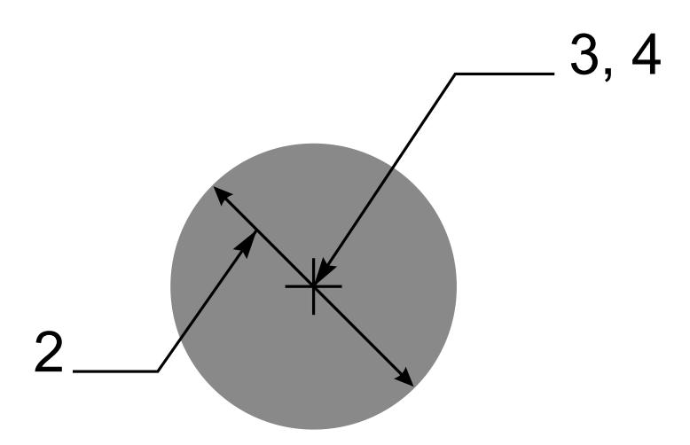

*10. Circle primitive*

Below there is the example of the AM command that uses the circle primitive.

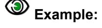

%AMCircle\* 1,1,1.5,0,0,0\*%


### <span id="page-61-0"></span>*4.5.1.4 Vector Line, Code 20.*

A vector line is a rectangle defined by its line width, start and end points. The line ends are rectangular.

| Parameter<br>number | Description                                                                                                                                                       |
|---------------------|-------------------------------------------------------------------------------------------------------------------------------------------------------------------|
| 1                   | Exposure off/on. (0/1)                                                                                                                                            |
| 2                   | Width of the line ≥ 0.                                                                                                                                            |
| 3                   | Start point X coordinate.                                                                                                                                         |
| 4                   | Start point Y coordinate.                                                                                                                                         |
| 5                   | End point X coordinate.                                                                                                                                           |
| 6                   | End point Y coordinate.                                                                                                                                           |
| 7                   | Rotation angle, in degrees counterclockwise. The primitive is rotated<br>around the origin of the macro definition, i.e. the (0, 0) point of macro<br>coordinates |

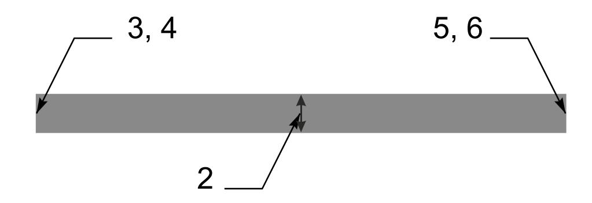

*11. Vector line primitive*

Below there is the example of the AM command that uses the vector line primitive.

### **Example:**

```
%AMLine*
20,1,0.9,0,0.45,12,0.45,0*
%
```


### <span id="page-62-0"></span>*4.5.1.5 Center Line, Code 21*

A center line primitive is a rectangle defined by its width, height, and center point.

| Parameter<br>number | Description                                                                                                                                                                                                                                                                          |  |
|---------------------|--------------------------------------------------------------------------------------------------------------------------------------------------------------------------------------------------------------------------------------------------------------------------------------|--|
| 1                   | Exposure off/on. (0/1)                                                                                                                                                                                                                                                               |  |
| 2                   | Width ≥ 0.                                                                                                                                                                                                                                                                           |  |
| 3                   | Height ≥ 0.                                                                                                                                                                                                                                                                          |  |
| 4                   | Center point X coordinate.                                                                                                                                                                                                                                                           |  |
| 5                   | Center point Y coordinate.                                                                                                                                                                                                                                                           |  |
| 6                   | Rotation angle, in degrees counterclockwise. The primitive is rotated<br>around the origin of the macro definition, i.e. (0, 0) point of macro<br>coordinates.<br>Warning: The rotation is not around the center point. (Unless the<br>center point happens to be the macro origin.) |  |

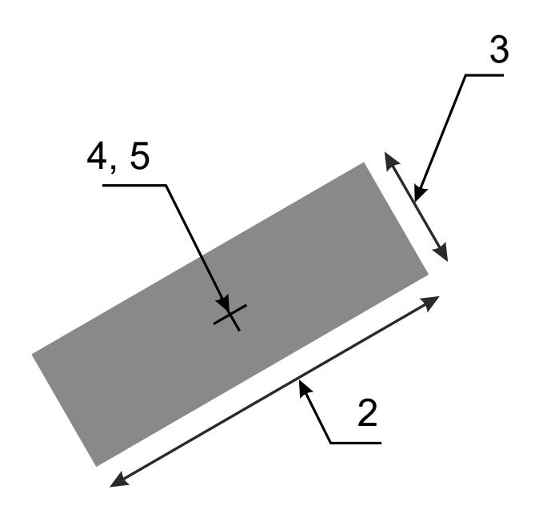

*12. Center line primitive*

Below there is the example of the AM command that uses the center line primitive.

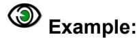

%AMRECTANGLE\* 21,1,6.8,1.2,3.4,0.6,30\*%


### <span id="page-63-0"></span>*4.5.1.6 Outline, Code 4*

An outline primitive is an area defined by its outline or contour. The outline is a polygon, consisting of linear segments only defined by its start vertex and n subsequent vertices. The outline must be closed, i.e. the last vertex must be equal to the start vertex. The outline must comply with all the requirements of a contour according to [4.10.3.](#page-90-0)

| Parameter<br>number | Description                                                                                                                                                                   |
|---------------------|-------------------------------------------------------------------------------------------------------------------------------------------------------------------------------|
| 1                   | Exposure off/on (0/1)                                                                                                                                                         |
| 2                   | The number of vertices of the outline = the number of coordinate<br>pairs minus one. An integer ≥3.                                                                           |
| 3, 4                | Start point X and Y coordinates.                                                                                                                                              |
| 5, 6                | First subsequent X and Y coordinates.                                                                                                                                         |
|                     | Further subsequent X and Y coordinates.<br>The X and Y coordinates are not modal: both X and Y must be<br>specified for all points.                                           |
| 3+2n, 4+2n          | Last subsequent X and Y coordinates. As the outline must be closed<br>the last coordinates must be equal to the start coordinates.                                            |
| 5+2n                | Rotation angle, in degrees counterclockwise, a decimal. The primitive is<br>rotated around the origin of the macro definition, i.e. the (0, 0) point of<br>macro coordinates. |

*13. Outline primitive*

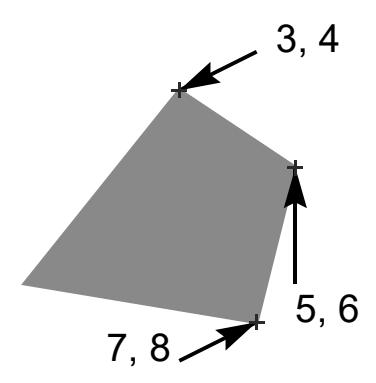

The maximum number of vertices is 5000. The purpose of this primitive is to create apertures to flash *pads* with special shapes. The purpose is not to create copper pours. Use the region statement for copper pours; see [4.10.](#page-89-0)


### **Example:**

The following AM command defines an aperture macro named 'Triangle\_30'. The macro is a triangle rotated 30 degrees around the origin of the macro definition:

```
%AMTriangle_30*
4,1,3,
1,-1,
1,1,
2,1,
1,-1,
30*
%
```

| Syntax          | Comments                                                           |  |
|-----------------|--------------------------------------------------------------------|--|
| AM Triangle _30 | Aperture macro name is 'Triangle _30'                              |  |
| 4,1,3           | 4 – Outline                                                        |  |
|                 | 1 – Exposure on                                                    |  |
|                 | 3 – The outline has three subsequent points                        |  |
| 1,-1            | 1 – X coordinate of the start point                                |  |
|                 | -1 – Y coordinate of the start point                               |  |
| 1,1,            | Coordinates (X, Y) of the subsequent points: (1,1), (2,1), (1,-1). |  |
| 2,1,            | Note that the last point is the same as the start point            |  |
| 1,-1,           |                                                                    |  |
| 30              | Rotation angle is 30 degrees counterclockwise                      |  |

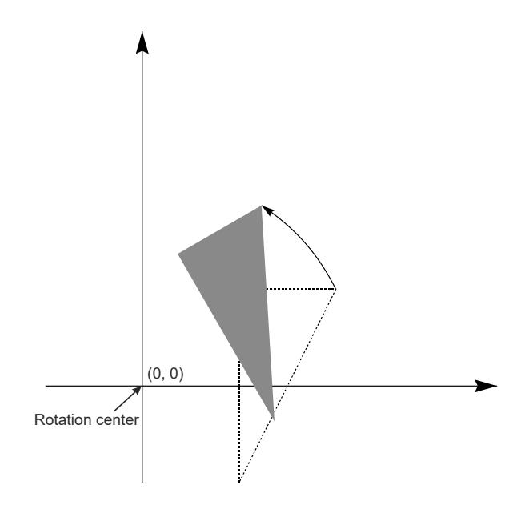

*14. Rotated triangle*


### <span id="page-65-0"></span>*4.5.1.7 Polygon, Code 5*

A polygon primitive is a regular polygon defined by the number of vertices n, the center point and the diameter of the circumscribed circle.

| Parameter<br>number | Description                                                                                                                                                                                                                                                          |  |
|---------------------|----------------------------------------------------------------------------------------------------------------------------------------------------------------------------------------------------------------------------------------------------------------------|--|
| 1                   | Exposure off/on (0/1)                                                                                                                                                                                                                                                |  |
| 2                   | Number of vertices n, 3 ≤ n ≤ 12. An integer. The first vertex is on the<br>positive X-axis through the center point when the rotation angle is<br>zero.                                                                                                             |  |
| 3                   | Center point X coordinate. A                                                                                                                                                                                                                                         |  |
| 4                   | Center point Y coordinate.                                                                                                                                                                                                                                           |  |
| 5                   | Diameter of the circumscribed circle ≥ 0.                                                                                                                                                                                                                            |  |
| 6                   | Rotation angle, in degrees counterclockwise. With rotation angle zero<br>there is a vertex on the positive X-axis through the aperture center.<br>The primitive is rotated around the origin of the macro definition, i.e. the<br>(0, 0) point of macro coordinates. |  |

*15. Polygon primitive*

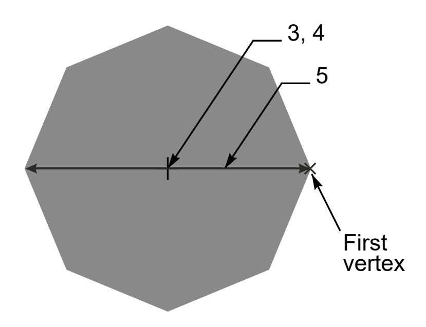

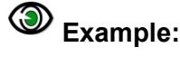

%AMPolygon\* 5,1,8,0,0,8,0\*%


### <span id="page-66-0"></span>*4.5.1.8 Thermal, Code 7*

The thermal primitive is a ring (annulus) interrupted by four gaps. Exposure is always on.

| Parameter<br>number | Description                                                                                                                                                                                                                                                     |  |
|---------------------|-----------------------------------------------------------------------------------------------------------------------------------------------------------------------------------------------------------------------------------------------------------------|--|
| 1                   | Center point X coordinate.                                                                                                                                                                                                                                      |  |
| 2                   | Center point Y coordinate.                                                                                                                                                                                                                                      |  |
| 3                   | Outer diameter > inner diameter                                                                                                                                                                                                                                 |  |
| 4                   | Inner diameter ≥ 0                                                                                                                                                                                                                                              |  |
| 5                   | Gap thickness < (outer diameter)/√2. Note that if the (gap<br>thickness)*√2 ≥ (inner diameter) the inner circle disappears. This is<br>not invalid.<br>The gaps are on the X and Y axes through the center without<br>rotation. They rotate with the primitive. |  |
| 6                   | Rotation angle, in degrees counterclockwise. A decimal. The primitive is<br>rotated around the origin of the macro definition, i.e. (0, 0) point of<br>macro coordinates.                                                                                       |  |

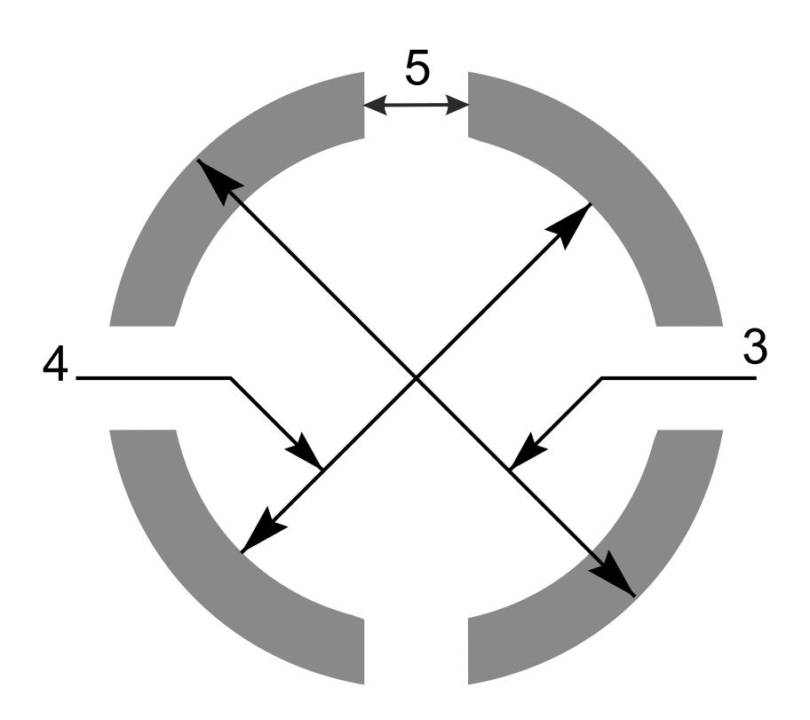

*16. Thermal primitive*

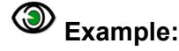

%AMThermal\*

7,0,0,0.95,0.75,0.175,0.0\*%


### <span id="page-67-0"></span>**Exposure Parameter**

The exposure parameter that can take two values:

- 0 means exposure is 'off'
- 1 means exposure is 'on'

Primitives with **exposure on** create the solid part of the macro aperture.

Primitives with **exposure off** erase the solid part created earlier *in the same macro*. Exposure off is used to create a hole in the aperture – see also [4.4.6.](#page-55-0) **Exposure off** only acts on primitives within the same macro definition. The hole does *not* clear objects in the final image. The hole is transparent. Objects under holes remain visible. A macro definition results in a strictly positive image.

### **Example:**

```
%FSLAX26Y26*%
%MOMM*%
%AMSquareWithHole*
21,1,10,10,0,0,0*
1,0,5,0,0*%
%ADD10SquareWithHole*%
%ADD11C,1*%
G01*
%LPD*%
D11*
X-25000000Y-2000000D02*
X25000000Y1000000D01*
D10*
X0Y0D03*
M02*
```

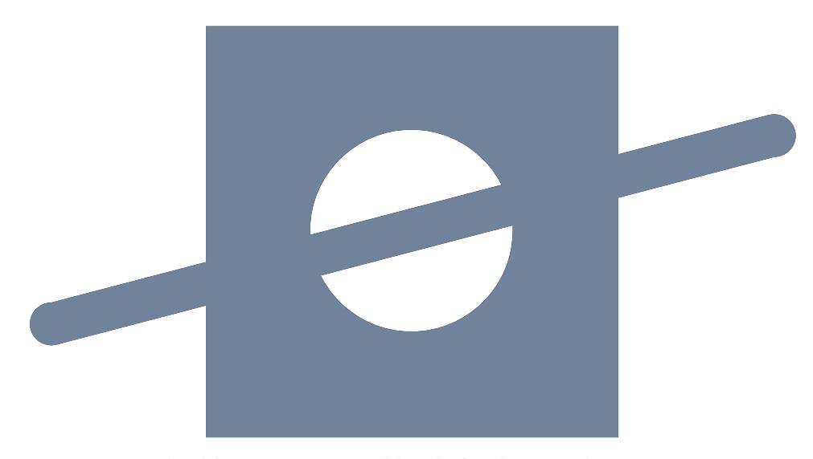

*17. Macro aperture with a hole above a draw*

Note that the draw is still visible through the hole.


#### <span id="page-68-0"></span>**Rotation Parameter**

All primitives can be rotated around the *origin* of the macro definition, i.e. its point (0, 0). (Make no mistake: rotation is *not* around the geometric center of the primitive, unless of course it coincides with the origin.)

A rotation angle is expressed by a decimal number, in degrees counterclockwise. A positive angle means counterclockwise rotation, a negative angle clockwise. The rotation angle is defined by the rotation parameter, the last in the list of the primitive parameters.

To rotate a macro composed of several primitives it is sufficient to rotate all primitives by the same angle. See illustration below.

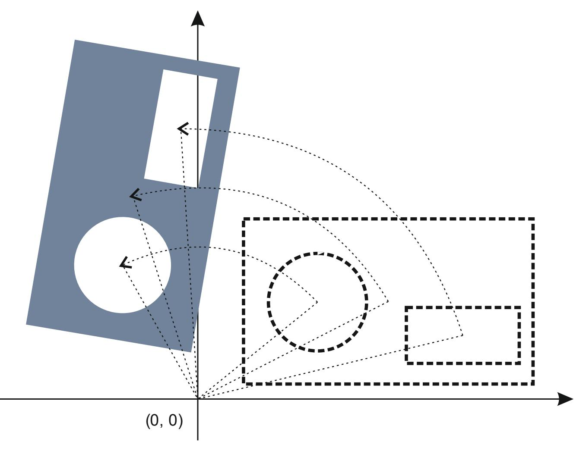

*18. Rotation of an aperture macro composed of several primitives*

**Warning:** Rotation is around the origin of the macro definition, not around the geometric center of the primitive – unless the two coincide of course. The reason is obvious: if rotation were about the center of each primitive a composite aperture like the one above would fall apart under rotation.


### <span id="page-69-0"></span>**Macro Variables and Expressions**

#### *4.5.4.1 Variable Values from the AD Command*

An AM command can use variables whose actual values are provided by the AD command calling the macro. Such variables are identified by '\$n' where n indicates the index in the list of the variable values provided by the AD command. Thus \$1 means the first value in the list, \$2 the second, and so on.


%AMDONUTVAR\*1,1,\$1,\$2,\$3\*1,0,\$4,\$2,\$3\*%

\$1, \$2, \$3 and \$4 are macro variables. With the following calling AD %ADD34DONUTVAR,0.100X0X0X0.080\*%

the variables take the following values:

\$1 = 0.100

\$2 = 0

\$3 = 0

\$4 = 0.080

### *4.5.4.2 Arithmetic Expressions*

A parameter value can also be defined by an arithmetic expression consisting of integer and decimal constants, other variables, the arithmetic operators below and the brackets '(' and ')'.

| Operator       | Function                                                             |
|----------------|----------------------------------------------------------------------|
| +              | Unary plus (expressions without the unary<br>sign are positive)      |
| -              | Unary minus                                                          |
| +              | Add                                                                  |
| -              | Subtract                                                             |
| x (lower case) | Multiply                                                             |
| /              | Divide. The result is a decimal; it is not<br>rounded to an integer. |

#### *Arithmetic operators*

The standard operator precedence rules apply.


#### **Example:**

%AMRect\* 21,1,\$1,\$2-2x\$3,-\$4,-\$5+\$2,0\*%

The corresponding AD command could be:

%ADD146Rect,0.0807087X0.1023622X0.0118110X0.5000000X0.3000000\*%


### <span id="page-70-0"></span>*4.5.4.3 Definition of a New Variable*

New variables can be defined by an assign statement as follows: \$4=\$1x1.25-\$3. The right-hand side is any arithmetic expression as in the previous section.


```
%AMDONUTCAL*
1,1,$1,$2,$3*
$4=$1x1.25*
1,0,$4,$2,$3*%
```

The variable values are determined as follows:

- \$1, \$2, ..., \$n take the values of the n parameters of the calling AD command.
- New variables get their value from their defining expression.
- The undefined variables are 0.
- Macro variables cannot be redefined.

### **Example:**

```
%AMDONUTCAL*
1,1,$1,$2,$3*
$5=$4x0.25*
1,0,$5,$2,$3*%
%ADD35DONUTCAL,0.020X0X0X0.06*%
```

The AD command contains four parameters which define the first four macro variables:

```
$1 = 0.02
$2 = 0
$3 = 0
$4 = 0.06
```

The variable \$5 is defined in the macro body and becomes

```
$5 = 0.06 x 0.25 = 0.015
```

Below are more examples to illustrate the syntax.

### **Examples:**

```
%AMTEST1*
1,1,$1,$2,$3*
$4=$1x0.75*
$5=($2+100)x1.75*
1,0,$4,$5,$3*%
%AMTEST2*
$4=$1x0.75*
$5=100+$3*
1,1,$1,$2,$3*
1,0,$4,$2,$5*
$6=$4x0.5*
1,0,$6,$2,$5*%
```


### <span id="page-71-0"></span>**Examples**

#### *4.5.5.1 Fixed Parameter Values*

The following AM command defines an aperture macro named 'DONUTFIX' consisting of two concentric circles with fixed diameter sizes:

```
%AMDONUTFIX*
1,1,0.100,0,0*
1,0,0.080,0,0*
%
```

| Syntax        | Comments                          |
|---------------|-----------------------------------|
| AMDONUTFIX    | Aperture macro name is 'DONUTFIX' |
| 1,1,0.100,0,0 | 1 – Circle                        |
|               | 1 – Exposure on                   |
|               | 0.100 – Diameter                  |
|               | 0 – X coordinate of the center    |
|               | 0 – Y coordinate of the center    |
| 1,0,0.080,0,0 | 1 – Circle                        |
|               | 0 – Exposure off                  |
|               | 0.080 – Diameter                  |
|               | 0 – X coordinate of the center    |
|               | 0 – Y coordinate of the center    |

An example of an AD command using this aperture macro:

%ADD33DONUTFIX\*%

#### *4.5.5.2 Variable Parameter Values*

The following AM command defines an aperture macro named 'DONUTVAR' consisting of two concentric circles with variable diameter sizes:

```
%AMDONUTVAR*
1,1,$1,$2,$3*
1,0,$4,$2,$3*%
```

| Syntax          | Comments                                                   |
|-----------------|------------------------------------------------------------|
| AMDONUTVAR      | Aperture macro name is 'DONUTVAR'                          |
| 1,1,\$1,\$2,\$3 | 1 – Circle                                                 |
|                 | 1 – Exposure on                                            |
|                 | \$1 – Diameter is provided by AD command                   |
|                 | \$2 – X coordinate of the center is provided by AD command |
|                 | \$3 – Y coordinate of the center is provided by AD command |


| 1,0,\$4,\$2,\$3 | 1 – Circle                                                                              |
|-----------------|-----------------------------------------------------------------------------------------|
|                 | 0 – Exposure off                                                                        |
|                 | \$4 – Diameter is provided by AD command                                                |
|                 | \$2 – X coordinate of the center is provided by AD command (same<br>as in first circle) |
|                 | \$3 – Y coordinate of the center is provided by AD command (same<br>as in first circle) |

The AD command using this aperture macro can look like the following:

%ADD34DONUTVAR,0.100X0X0X0.080\*%

In this case the variable parameters get the following values: \$1 = 0.100, \$2 = 0, \$3 = 0, \$4 = 0.080.

### *4.5.5.3 Definition of a New Variable*

The following AM command defines an aperture macro named 'DONUTCAL' consisting of two concentric circles with the diameter of the second circle defined as a function of the diameter of the first:

%AMDONUTCAL\* 1,1,\$1,\$2,\$3\* \$4=\$1x0.75\* 1,0,\$4,\$2,\$3\*%

| Syntax          | Comments                                                                                                                                              |
|-----------------|-------------------------------------------------------------------------------------------------------------------------------------------------------|
| AMDONUTCAL      | Aperture macro name is 'DONUTCAL'                                                                                                                     |
| 1,1,\$1,\$2,\$3 | 1 – Circle<br>1 – Exposure on                                                                                                                         |
|                 | \$1 – Diameter is provided by AD command                                                                                                              |
|                 | \$2 – X coordinate of the center is provided by AD command                                                                                            |
|                 | \$3 – Y coordinate of the center is provided by AD command                                                                                            |
| \$4=\$1x0.75    | Defines variable \$4 to be used as the diameter of the inner circle;<br>the diameter of this circle is 0.75 times the diameter of the outer<br>circle |
| 1,0,\$4,\$2,\$3 | 1 – Circle                                                                                                                                            |
|                 | 0 – Exposure off                                                                                                                                      |
|                 | \$4 – Diameter is calculated with the previous definition of this<br>variable                                                                         |
|                 | \$2 – X coordinate of the center is provided by AD command (same<br>as in first circle)                                                               |
|                 | \$3 – Y coordinate of the center is provided by AD command (same<br>as in first circle)                                                               |

The AD command using this aperture macro can look like the following:

%ADD35DONUTCAL,0.020X0X0\*%

This defines a donut with outer circle diameter equal to 0.02 and inner circle diameter equal to 0.015.


#### <span id="page-73-0"></span>*4.5.5.4 A useful macro*

The following example creates a rectangle with rounded corners, useful as SMD pad. It uses the following construction:

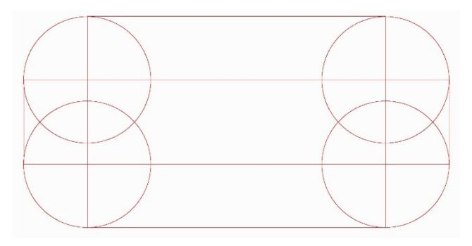

*19. Construction of the Box macro*

```
%AMBox*
0 Rectangle with rounded corners, with rotation*
0 The origin of the aperture is its center*
0 $1 X-size*
0 $2 Y-size*
0 $3 Rounding radius*
0 $4 Rotation angle, in degrees counterclockwise*
0 Add two overlapping rectangle primitives as box body*
21,1,$1,$2-$3-$3,0,0,$4*
21,1,$1-$3-$3,$2,0,0,$4*
0 Add four circle primitives for the rounded corners*
$5=$1/2*
$6=$2/2*
$7=2x$3*
1,1,$7,$5-$3,$6-$3,$4*
1,1,$7,-$5+$3,$6-$3,$4*
1,1,$7,-$5+$3,-$6+$3,$4*
1,1,$7,$5-$3,-$6+$3,$4*
%
```


### <span id="page-74-0"></span>**4.6 Set Current Aperture (Dnn)**

The command Dnn (nn≥10) sets the current aperture graphics state parameter. The syntax is: Dnn = 'D unsigned\_integer '\*';

| Syntax                          | Comments                                                                                                |
|---------------------------------|---------------------------------------------------------------------------------------------------------|
| D                               | Command code                                                                                            |
| <aperture number=""></aperture> | The aperture number (integer ≥10). An aperture with<br>that number must be in the apertures dictionary. |

D-commands 0 to 9 are reserved and *cannot* be used for apertures. The D01 and D03 commands use the current aperture to create track and flash graphical objects.

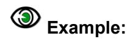

D10\*


### <span id="page-75-0"></span>**4.7 Plot State Commands (G01,G02,G03,G75)**

#### <span id="page-75-1"></span>**Linear Plotting (G01)**

G01 sets linear plot mode. In linear plot mode a D01 operation generates a linear segment, from the current point to the (X, Y) coordinates in the command. The current point is then set to the (X, Y) coordinates.

Outside a region statement the segment is stroked with the current aperture to create a *draw graphical object*. In a region statement the segment is added to the contour under construction.

The G01 command sets linear operation. The syntax is as follows:

$$G01 = ('G01') '*';$$

| Syntax | Comments                                                    |
|--------|-------------------------------------------------------------|
| G01    | Sets plot mode graphics state parameter to 'linear plotting |

#### D01 = (['X' x\_coordinate] ['Y' y\_coordinate] 'D01') '\*';

| Syntax       | Comments                                                                                                                                  |
|--------------|-------------------------------------------------------------------------------------------------------------------------------------------|
| x_coordinate | An integer specifying the X coordinate of the end point of the straight<br>segment. The default is the X coordinate of the current point. |
| y_coordinate | As above, but for the Y axis.                                                                                                             |
| D01          | Plot operation code                                                                                                                       |

The coordinates are interpreted as specified by the FS and MO command.


G01\*

X250000Y155000D01\*


### <span id="page-76-0"></span>**Circular Plotting (G02, G03, G75)**

G02 sets clockwise circular plot mode, G03 counterclockwise. In circular plot mode a D01 operation generates an arc segment, from the current point to the (X, Y) coordinates in the command. The current point is then set to the (X, Y) coordinates.

Outside a region statemen the segment is stroked with the current aperture to create an *arc graphical object.* In a region statement the segment is added to the contour under construction.

For compatibility with older versions of the Gerber format, a G75\* must be issued before the first D01 in circular mode.

The syntax of these commands is:

```
G02 = ('G02') '*'; 
G03 = ('G03') '*'; 
G75 = ('G75') '*';
```

| Syntax | Comments                                                                                                                  |
|--------|---------------------------------------------------------------------------------------------------------------------------|
| G02    | Sets plot mode graphics state parameter to<br>'clockwise circular plotting'                                               |
| G03    | Sets plot mode graphics state parameter to 'counterclockwise<br>circular plotting'                                        |
| G75    | This command must be issued before the first circular plotting<br>operation, for compatibility with older Gerber versions |

### **Examples:**

G02\*

G75\*

The syntax of the D01 command in circular plot mode is:

D01 = (['X' x\_coordinate] ['Y' y\_coordinate] 'I' x\_offset 'J' y-offset 'D01') '\*';

| Syntax       | Comments                                                                                                                                             |  |  |
|--------------|------------------------------------------------------------------------------------------------------------------------------------------------------|--|--|
| x_coordinate | x_coordinate                                                                                                                                         |  |  |
| y_coordinate | As above, but for the Y axis.                                                                                                                        |  |  |
| i_offset     | Add the I offset to the X coordinate of the start point of the arc to<br>calculate the X of the center of the arcs. <offset> is an integer.</offset> |  |  |
| j_offset     | As above, but for the Y axis.                                                                                                                        |  |  |
| D01          | Plot operation code                                                                                                                                  |  |  |

The coordinates and offsets are interpreted according as specified by the FS and MO command.


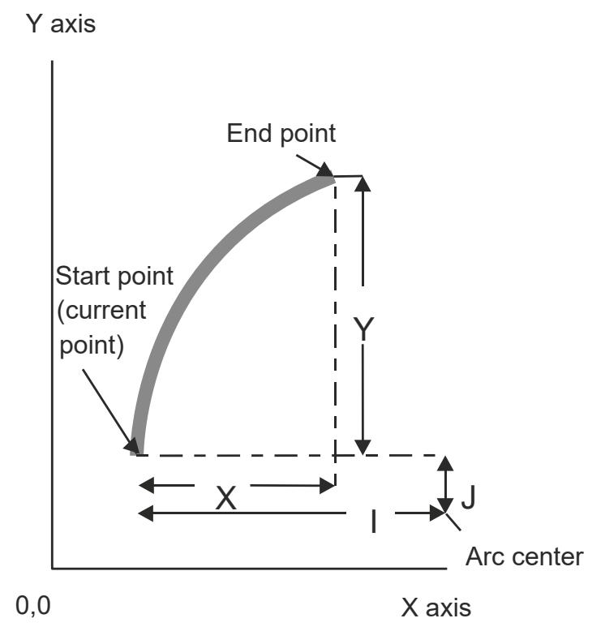

*20. Circular plotting example*


G75\*

G03\*

X75000Y50000I40000J0D01\*

When start point and end point coincide the result is a full 360° arc. An example:

| Syntax                   | Comments                                      |  |
|--------------------------|-----------------------------------------------|--|
| D10*                     | Select aperture 10 as current aperture        |  |
| G01*                     | Set linear plot mode                          |  |
| X0Y600D02*               | Set the current point to (0, 6)               |  |
| G75*                     | Must be called before an arc is created.      |  |
| G02*<br>X0Y600I500J0D01* | Set clockwise circular plot mode              |  |
|                          | Create arc object to (0, 6) with center (5,6) |  |

The resulting image is a full circle.

Note that arcs where the start point and end point of an arc very close together are unstable: a small change in their relative position can turn a large arc in a small one and vice versa, dramatically changing the image. A typical case is very small arcs: start and end point are close together; if due to rounding the end point is slightly moved to coincide with the start point the small arc becomes a full arc.

Rounding must be done carefully. Using high resolution is an obvious prerequisite. See [4.14.](#page-119-0) The Gerber writer must also consider that the reader unavoidably has rounding errors. Perfectly exact numerical calculation cannot be assumed. It is the responsibility of the writer to avoid unstable arcs. Arcs shorter than say 2μm must be replaced with a draw - draws are intrinsically


stable and the error is negligible. Near full arcs must be cut in two big arcs, which too are intrinsically stable.

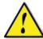

**Warning:** A Gerber file that attempts to create an arc without a preceding G75 is invalid.

### *4.7.2.1 Example*

| Syntax                                                       | Comments                                                                                                                                                           |
|--------------------------------------------------------------|--------------------------------------------------------------------------------------------------------------------------------------------------------------------|
| X3000000Y-2000000D02*<br>G75*<br>G03*<br>X-3000000Y-2000000I | Set the current point to (3, -2) mm<br>Must be called before an arc is created<br>Set counterclockwise plot mode                                                   |
| 3000000J4000000D01*                                          | Create arc object counterclockwise to (-3,-2). The<br>offsets from the start point to the center point are<br>3 for X and 4 for Y, i.e. the center point is (0, 2) |

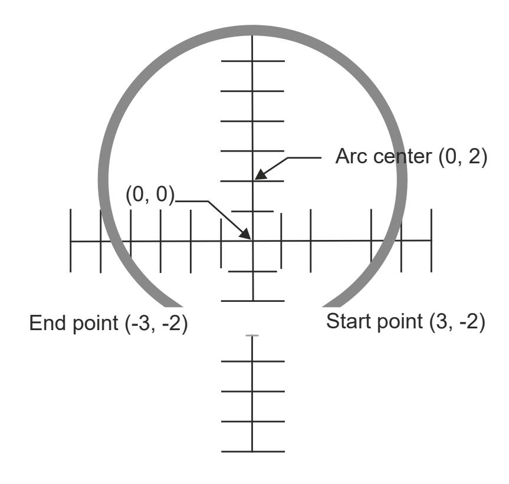

*21. Arc example*

#### *4.7.2.2 Valid Arcs*

Mathematically, the distance from the center to the start point must be exactly equal to the distance to the end point. However, a Gerber file has a finite resolution. It is therefore generally not possible to position the center point exactly so that both distances – radii - are indeed exactly equal. Furthermore, the software generating the Gerber file unavoidably adds rounding errors of its own. In real files the center is unavoidably not positioned exactly, and the two radii are not equal. We will call the difference between the start and end radius the *arc deviation*.

A mathematically exact circle has of course zero deviation. The interpretation of the arc command is then obvious. However, which curve is represented by a "circular arc" with a non-


zero deviation? It cannot be a circular arc with the given center. Either it is not circular, it has another center, or it does not go from start to end. The curve is defined as follow.

Any *continuous and monotonic curve starting at the start point and ending at the end point, approximating the ring with the given center point and with inner and outer radii equal to the start radius and end radius* is a valid rendering of the arc command*.* See figure below.

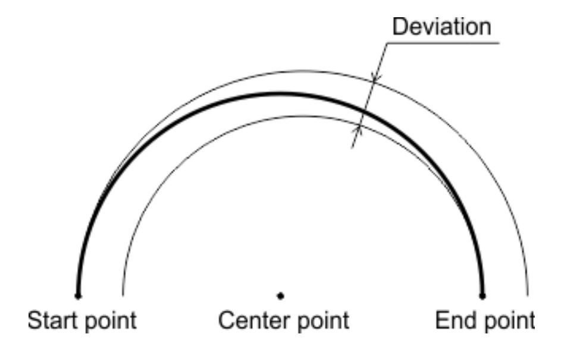

*22. Arc with a non-zero deviation*

The arc therefore has a fuzziness of the order of magnitude of the arc deviation. The writer of the Gerber file accepts any interpretation within the fuzziness above as valid. If the writer requires a more precise interpretation of the arc he needs to write more precise arcs, with lower deviation.

It is however not allowed to place the center point close to the straight line through begin and end point except when it is strictly in between these points. When the center is on or outside the segment between start and end point the construct is nonsensical. See figure below.

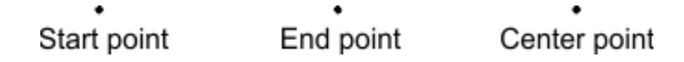

*23. Nonsensical center point*

Note that self-intersecting contours are not allowed, see [4.10.3.](#page-90-0) If any of the valid arc interpretations turns the contour in a self-intersecting one, the file is invalid, with unpredictable results.

The root cause of most problems with arcs is the use a low resolution. One sometimes attempts to force arcs of size of the order of e.g. 1/10 of a mil in a file with resolution of 1/10. This is asking for problems. Use higher resolution. See [4.14.](#page-119-0)


### <span id="page-80-0"></span>**4.8 Operations (D01/D02/D03)**

#### <span id="page-80-1"></span>**Overview**

Commands consisting of coordinate data followed by a D01, D02 or D03 function code are called *operations*.

- Operation with D01 code is called a *plot* operation. It creates a straight-line segment or a circular segment by plotting from the current point to the operation coordinates. Outside a region statement the segment is then stroked with the current aperture to generate a draw or arc graphical object. In a region statement the segment is added to the contour being constructed. The current point is moved to operations coordinate before processing the next command.
- Operation with D02 code is called *move* operation. It moves the current point to the operation coordinates. No graphical object is generated.
- Operation with D03 code is called *flash* operation. It creates a flash object by replicating (flashing) the current aperture at the operation coordinates. When the aperture is flashed its origin is positioned at the coordinates of the operation. The origin of a standard aperture is its geometric center. The origin of a macro aperture is the origin used in the defining AM command. The current point is moved to operations coordinate before processing the next command.

The operations are controlled by the graphics state (see [2.3.2\)](#page-13-0), as summarized in the table below. G01 sets linear, G02 clockwise and G03 counterclockwise circular plotting.

| Operation<br>code | Inside a region statement (G36/G37)                                                |                                                                                         | Outside a region statement             |                                       |
|-------------------|------------------------------------------------------------------------------------|-----------------------------------------------------------------------------------------|----------------------------------------|---------------------------------------|
|                   | Linear mode<br>(G01)                                                               | Circular mode<br>(G02, G03)                                                             | Linear mode<br>(G01)                   | Circular mode<br>(G02, G03)           |
| D01               | Adds linear segment<br>to the contour under<br>construction<br>Moves current point | Adds circular<br>segment to the<br>contour under<br>construction<br>Moves current point | Creates a draw<br>Moves current point  | Creates an arc<br>Moves current point |
| D02               | Starts a new contour<br>Moves current point                                        |                                                                                         | Moves current point                    |                                       |
| D03               | Not allowed                                                                        |                                                                                         | Creates a flash<br>Moves current point |                                       |

*Effect of operation codes depending on graphics state*


The parameters of the operations are coordinate data, see [4.2.](#page-45-0) The FS and MO commands specify how to interpret the coordinate data.


### **Examples:**

X200Y200D02\* move to (+200, +200) Y-300D03\* flash at (+200, -300) I300J100D01\* plot to (+200, -300) with center offset (+300, +100) Y200I50J50D01\* plot to (+200, +200) with center offset (+50, +50) X200Y200I50J50D01\* plot to (+200, +200) with center offset (+50, +50) X+100I-50D01\* plot to (+100, +200) with center offset (-50, 0) D03\* flash at (+100,+200)


### <span id="page-82-0"></span>**Plot (D01)**

Performs a plotting operation, creating a draw or an arc segment. The plot state defines which type of segment is created, see [4.7.](#page-75-0) The syntax depends on the required parameters, and, hence, on the plot state.

| Plot state         | Syntax                                                                                 |  |
|--------------------|----------------------------------------------------------------------------------------|--|
| Linear (G01)       | D01 = (['X' x_coordinate] ['Y' y_coordinate] 'D01')<br>'*';                            |  |
| Circular (G02 G03) | D01 = (['X' x_coordinate] ['Y' y_coordinate] 'I'<br>x_offset 'J' y-offset ) 'D01' '*'; |  |

| Syntax       | Comments                                                                                                                                                                              |  |
|--------------|---------------------------------------------------------------------------------------------------------------------------------------------------------------------------------------|--|
| x_coordinate | <coordinate> is coordinate data – see section 4.2.2. It defines the X coordinate of<br/>the new current point. The default is the X coordinate of the old current point.</coordinate> |  |
| y_coordinate | As above, but for the Y coordinate                                                                                                                                                    |  |
| i_offset     | <offset> is the offset in X – see section 0. It defines the X coordinate the center of the<br/>circle. It is of the coordinate type. There is no default offset.</offset>             |  |
| j_offset     | As above, but for the Y axis.                                                                                                                                                         |  |
| D01          | Move operation code                                                                                                                                                                   |  |

<span id="page-82-1"></span>After the plotting operation the current point is set to X,Y.

#### **Move (D02)**

Moves the current point to the (X,Y) in the comment. The syntax is:

D02 = (['X' x\_coordinate] ['Y' y\_coordinate] 'D02') '\*';

| Syntax       | Comments                                                                                                                                                                                  |  |
|--------------|-------------------------------------------------------------------------------------------------------------------------------------------------------------------------------------------|--|
| x_coordinate | <coordinate> is coordinate data – see section 4.2.2. It defines the X<br/>coordinate of the new current point. The default is the X coordinate of<br/>the old current point.</coordinate> |  |
| y_coordinate | As above, but for the Y coordinate.                                                                                                                                                       |  |
| D02          | Move operation code                                                                                                                                                                       |  |

The D02 command sets the new value for the current point. Inside a region statement it also closes the current contour and starts a new one. (see [4.10\)](#page-89-0).


#### **Example:**

X2152000Y1215000D02\*

#### <span id="page-82-2"></span>**Flash (D03)**

Performs a flash operation, creating a flash object at (X,Y). The syntax is:


### D03 = (['X' x\_coordinate] ['Y' y\_coordinate] 'D03') '\*';

| Syntax                      | Comments                                                                                                                                                  |  |
|-----------------------------|-----------------------------------------------------------------------------------------------------------------------------------------------------------|--|
| x_coordinate                | <coordinate> is an integer specifying the X coordinate of the<br/>aperture origin. The default is the X coordinate of the old current point.</coordinate> |  |
| y_coordinate                | As above, but for the Y coordinate.                                                                                                                       |  |
| D03<br>Flash operation code |                                                                                                                                                           |  |


#### **Example:**

X1215000Y2152000D03\*

<span id="page-83-0"></span>After the flash operation the current point is set to (X, Y).

### **Example**

The example shows a stream of commands in a Gerber file. Some of the commands are operation codes, others are G code commands (G01, G03, G36, G37, G74, and G75). The G code commands set the graphics state parameters that are relevant for the operations: plot mode (G01, G02, G03, G75) – see [4.7.](#page-75-0)


### **Example:**

X275000Y115000D02\*

G01\*

X2512000Y115000D01\*

G75\*

G03\*

X5005000Y3506000I3000J0D01\*

G01\*

X15752000D01\*

Y12221000D01\*


### <span id="page-84-0"></span>**4.9 Aperture Transformations (LP, LM, LR, LS)**

#### <span id="page-84-1"></span>**Overview**

The commands LP, LM, LR and LS load the following object transformation graphics state parameters:

| Object transformation commands |                |                               |  |  |  |
|--------------------------------|----------------|-------------------------------|--|--|--|
| Command                        | Long name      | Parameter                     |  |  |  |
| LP                             | Load polarity  | Polarity (Positive, Negative) |  |  |  |
| LM                             | Load mirroring | Mirror axis (N X Y XY)        |  |  |  |
| LR                             | Load rotation  | Rotation angle                |  |  |  |
| LS                             | Load scaling   | Scaling factor                |  |  |  |

An object transformation parameter transforms the polarity and shape of the current aperture when it creates an object. The transformation is temporary, after the object is created the current aperture returns to its original value. Consequently, the parameter is always applied to the current aperture in its original shape.

The apertures are mirrored/rotated/scaled around the flash point according to the transformation parameters and then used as such in flashes, draws and arcs. Mirroring is performed before rotation.

As the current aperture does not affect regions, the mirror/rotate/scale parameters do not affect the region either.

Object transformation parameters become effective immediately after loading and remain in effect until a new value is loaded. The object transformation parameters affect neither the aperture dictionary nor the current aperture.

### **Example on how the parameter changes affect the image**

D123\* Select D123 X5000Y7000D03\* Flash D123 %LR90.0\*% Set object rotation to 90 degrees X6000Y8000D03\* Flash D123 rotated 90 degrees D124\* Select D124 X6000Y8000D03\* Flash D124 rotated 90 degrees %LR0.0\*% Set object rotation to 0 degrees X7000Y9000D03\* Flash D124, not rotated

D123\* Select D123

X1000Y2000D03\* Flash D123, this is the original, not rotated


### **Example of the effect on plotting (draws and arcs)**

%MOMM\*%

%FSLAX26Y26\*%

X00000000Y00000000D02\* Move to origin

M02\*

%ADD10C,1\*% Define aperture 10 as a 1mm circle

D10\* Select aperture 10

G01\* Set linear plotting

X01000000D01\* Draw a 1mm thick line

%LS1.5\*% Set scale factor to 1.5

Y02000000D01\* Draw a 1.5mm thick line

This results in the following image:

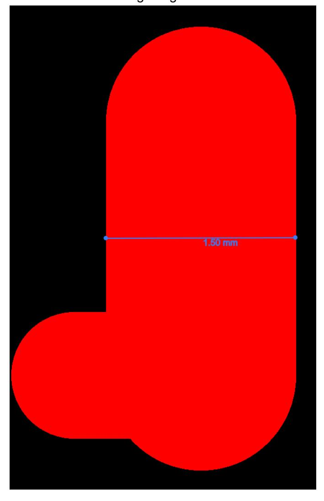


### <span id="page-86-0"></span>**Load Polarity (LP)**

The LP command sets the *polarity graphics state parameter,* see [2.3.2.](#page-13-0) It defines the polarity applied to objects when they are created. Polarity can be either *dark* or *clear*. Its effect is explained in [2.3.2.](#page-13-0) There is an example in [4.10.4.6.](#page-97-0) The syntax for the LP command is:

LP = '%' ('LP' ('C'|'D')) '\*%';

| Syntax | Comments                                |
|--------|-----------------------------------------|
| LP     | LP for Load Polarity                    |
| C D    | C – clear polarity<br>D – dark polarity |

The LP command can be used multiple times in a file. The polarity remains as set until overruled by another LP command.


**Example. Set clear object polarity.** 

%LPC\*%

### <span id="page-86-1"></span>**Load Mirroring (LM)**

The LM command sets the *mirroring graphics state parameter,* see [2.3.2.](#page-13-0) The mirroring option defines the mirroring axis used when creating objects. The aperture is mirrored around its *origin* (which may not be its geometric center) before being used. The syntax for the LM command is:

LM = '%' ('LM' ('N'|'XY'|'Y'|'X')) '\*%';

| Syntax   | Comments                                                                                                                                                                                                                                                                                                                                                              |
|----------|-----------------------------------------------------------------------------------------------------------------------------------------------------------------------------------------------------------------------------------------------------------------------------------------------------------------------------------------------------------------------|
| LM       | LM for Load Mirroring                                                                                                                                                                                                                                                                                                                                                 |
| N X Y XY | N – No mirroring<br>X – Mirroring along the X axis; mirror left to right; the signs of the x<br>coordinates are inverted<br>Y – Mirroring along the Y axis; mirror top to bottom; the signs of the<br>y coordinates are inverted<br>XY – Mirroring along both axes; mirror left to right and top to bottom;<br>the signs of both the x and y coordinates are inverted |


The LM command can be used multiple times in a file. The mirroring remains as set until overruled by another LM command. Mirroring is set at the value in the command, it is *not* cumulated with the previous value.


**Example. Set no object mirroring.** 

%LMN\*%

<span id="page-86-2"></span>The LM command was introduced in revision 2016.12.

### **Load Rotation (LR)**

The LR command sets the *rotation graphics state parameter,* see [2.3.2.](#page-13-0) It defines the rotation angle used when creating objects. The aperture is rotated around its *origin* (which may or may not be its geometric center). The syntax for the LR command is:


### LR = '%' ('LR' decimal) '\*%';

| Syntax                | Comments                                                     |  |
|-----------------------|--------------------------------------------------------------|--|
| LR                    | LR for Load Rotation                                         |  |
| <rotation></rotation> | The rotation angle, in degrees, counterclockwise. A decimal. |  |


The LR command can be used multiple times in a file. The object rotation remains as set until overruled by a subsequent LR command. Rotation is set at the value in the command, it is *not* cumulated with the previous value.


**Example. Set object rotation to 90º.** 

%LR90\*%

<span id="page-87-0"></span>The LR command was introduced in revision 2016.12.

### **Load Scaling (LS)**

The LS command sets the *scaling graphics state parameter,* see [2.3.2.](#page-13-0) It defines the scale factor used when creating objects. The aperture is scaled centered on its *origin* (which may or may not be its geometric center). The syntax for the LS command is:

LS = '%' ('LS' decimal) '\*%';

| Syntax          | Comments            |  |
|-----------------|---------------------|--|
| LS              | LS for Load Scaling |  |
| <scale></scale> | A decimal > 0.      |  |

The LS command can be used multiple times in a file. The object scaling remains as set until overruled by a subsequent LS command. Scaling is set at the value in the command, it is *not* cumulated with the previous scale factor.


**Example. Set object scaling to 80%.** 

%LS0.8\*%

<span id="page-87-1"></span>The LS command was introduced in revision 2016.12.

#### **Example**

A block flashed in different mirroring, orientation, scaling

```
G04 Ucamco copyright*
%TF.GenerationSoftware,Ucamco,UcamX,2016.04-160425*%
%TF.CreationDate,2016-04-25T00:00:00+01:00*%
%FSLAX26Y26*%
%MOMM*%
%ADD10C,1*%
%LPD*%
G04 Define block aperture D12*
%ABD12*%
%ADD11C,0.5*%
D10*
G01*
```


```
X-2500000Y-1000000D03*
Y1000000D03*
%LPC*%
D11*
X-2500000Y-1000000D03*
%LPD*%
X-500000Y-1000000D02*
X2500000D01*
G75*
G03*
X500000Y1000000I-2000000J0D01*
G01*
%AB*%
G04 Flash block aperture D12 in four different orientation*
D12*
X0Y0D03*
%LMX*%
X10000000D03*
%LMY*%
%LR30.0*%
X0Y8000000D03*
%LMXY*%
%LR45.0*%
%LS0.8*%
X10000000D03*
%LPD*%
%LMN*%
%LR0.0*%
%LS1.0*%
```

M02\*

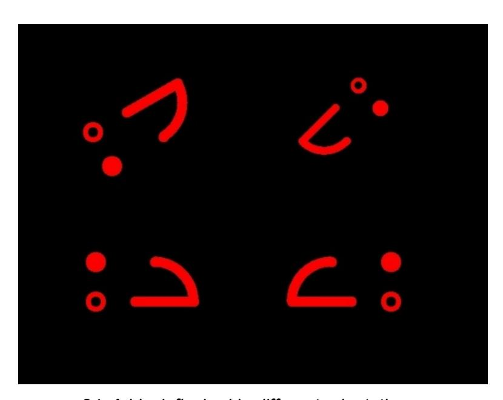

*24. A block flashed in different orientations*


### <span id="page-89-0"></span>**4.10 Region Statement (G36/G37)**

#### <span id="page-89-1"></span>**Region Overview**

A region is a graphical object defined by its contour(s) - see [4.10.3.](#page-90-0)

The G36 command begins a region statement and G37 ends it. A region statement creates contour objects by defining their contour. The D01 and D02 commands create the contour segments. The D02 starts a contour, subsequent D01's add segments to it. When a D02 is encountered the current contour is finished and a new one started. Thus an unlimited number of contours can be created between a single G36/G37 commands pair. When a G37 is encountered the contour is finished and the region statement is closed. A contour can only be finished if it is *closed,* meaning that the last vertex *exactly* coincides with the first one – beware of rounding errors. The commands D01, D02, G01, G02 and G03 are the *only* commands allowed within in a region statement.

When a G37 command is encountered, the region statement is closed and region graphical objects are added to the object stream by filling the newly created contours. A G37 is only allowed when all contours are properly closed. Each contour is filled individually. The overall filled area is the union of the filled areas of each individual contour. The number of region objects created by a single G36/G37 pair is intentionally *not* specified to leave more freedom to implementations; - for example, two overlapping contours may be merged in a single region object.

Holes in a region are defined with cut-ins (see [4.10.3](#page-90-0) and [4.10.4.7\)](#page-100-0).

Contour segments are not in themselves graphical objects –they define the regions which are graphical objects.

Object attributes can be attached to a region. Note that although no aperture is involved in creating a region, a*perture attributes can be attached to a region*, see [5.3.1.](#page-125-0) The rationale is that objects constructed with an aperture can *inherit* aperture attributes from it. As regions cannot get aperture attributes through inheritance these attributes must be attached directly to the region. A way to view this is that a virtual region attribute permanently sits in the aperture dictionary, is involved in creating all regions, and the regions inherit from the virtual region attribute.

#### <span id="page-89-2"></span>**Region Statement Syntax**

The G36 and G37 commands begin and end a region statement respectively. The syntax is:

```
G36 = 'G36*'; 
G37 = 'G37*'; 
region_statement = G36 {contour}+ G37; 
contour = D02 {D01|G01|G02|G03}*;
```

| Syntax | Comments                                   |  |
|--------|--------------------------------------------|--|
| G36    | Begins a region statement.                 |  |
| G37    | Ends a region statement.                   |  |
|        | This creates the region graphical objects. |  |

A valid contour must not only comply with this syntax, but the sequence of draws/arcs must represent a connected closed contour that does not self-intersect. See [4.10.3.](#page-90-0)


### <span id="page-90-0"></span>**Valid Contours**

A contour is a sequence of connected linear or circular segments. A pair of segments is said to connect only if they are defined consecutively, with the second segment starting where the first one ends. Thus, the order in which the segments are defined is significant. Non-consecutive segments that meet or intersect fortuitously are not considered to connect. A contour is closed: the end point of the last segment must coincide with the start point of the first segment. A contour thus defines a closed curve.

There are two classes of valid contours.

S*imple contours*. A contour is said to be *simple* if all its segments are disjointed, except for consecutive segments having only their connection point in common. Note that zero-length draws violate this rule and are therefore not allowed in contours. (Be careful that rounding to file resolution does not inadvertently create them. A simple contour does not self-intersect or selftouch. The inside of the contour constitutes the region object. A simple contour defines a simple region, without holes.

*Simple* c*ut-in contours.* These contours allow to create a region with holes. A cut-in connects the contour defining the hole to its enclosing contour, thus joining them into a single contour. If one travels along the contour in the direction of the segments and the inside must always be to the same side, just as for simple contours. See the illustration below; see [4.10.4.7](#page-100-0) for a fully worked out example.

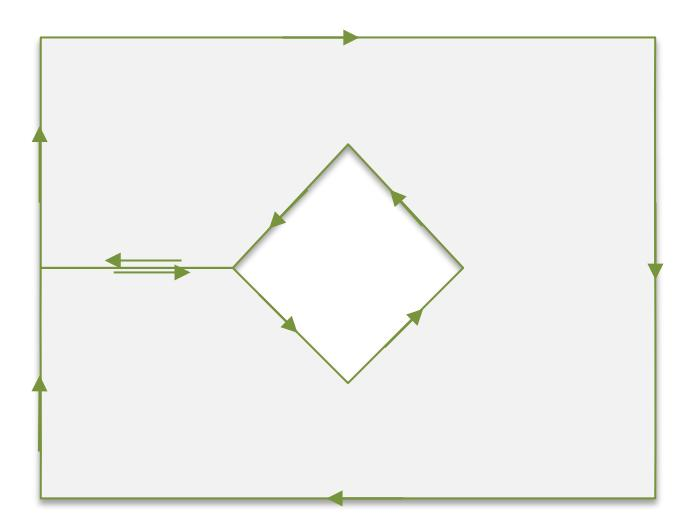

*25. A contour with a cut-in*

Cut-ins are is subject to strict requirements:

- it must consist of two *fully-coincident* linear segments; a pair of linear segments are said to be fully coincident if the segments coincide, with the second segment starting where the first one ends
- cut-ins must be either horizontal or vertical
- all cut-ins in a contour must have the same direction, either horizontal or vertical;
- cut-ins can only touch or overlap the contour in their start and end points.

Any other form of self-touching, self-intersection or self-overlapping is *not allowed*. For the avoidance of doubt, not allowed are, amongst others: segments that partially overlap, fullycoincident linear segments that are diagonal, fully-coincident circular segments, circular segments that are tangent to another segment, vertices on a segment at another location than its endpoints, points where more than two segments end, full arcs except when the contour consist solely of that full arc or the full arc is at the end of a cut-in. An invalid contour has no specified interpretation.


For the mathematically inclined: A contour is said to be *weakly simple* if there exists an infinitesimal perturbation of the vertices changing it in a simple contour. Simple contours with cut-ins are weakly simple. The winding number for valid Gerber contours is for the outside 0 and for the inside everywhere either +1 or -1, depending on the orientation. However, not all weakly simple contours or contours with these winding numbers are valid.

Contours are also used to define outline primitives in macro apertures (see [4.5.1.6\)](#page-63-0).

Processing Gerber files is inevitably subject to rounding errors. Contours must be constructed robustly so that perturbations due to this rounding do not turn an otherwise valid contour in a self-intersecting one. See [4.14.2.](#page-119-2)

In Gerber, the orientation of the contour is not significant.

**Warning:** Use maximum resolution. Low file coordinate resolution brings uncontrolled rounding and often results in self-intersecting contours, see [4.1.](#page-44-1)

**Warning:** Sloppy construction of cut-ins can lead to self-intersecting contours – in fact this is the most prevalent cause of missed clearances in planes. Construct cut-ins carefully or avoid them altogether by making holes in regions with negative objects.


### <span id="page-92-0"></span>**Examples**

#### *4.10.4.1 A Simple Contour*

| Syntax              | Comments                                                 |
|---------------------|----------------------------------------------------------|
| G36*                | Begins a region statement                                |
| X200000Y300000D02*  | Set the current point to (2, 3), beginning a<br>contour. |
| G01*                | Set linear plot mode                                     |
| X700000D01*         | Create linear segment to (7, 3)                          |
| Y100000D01*         | Create linear segment to (7, 1)                          |
| X1100000Y500000D01* | Create linear segment to (11, 5)                         |
| X700000Y900000D01*  | Create linear segment to (7, 9)                          |
| Y700000D01*         | Create linear segment to (7, 7)                          |
| X200000D01*         | Create linear segment to (2, 7)                          |
| Y300000D01*         | Create linear segment to (2, 3), closing the<br>contour. |
| G37*                | Create the region by filling the contour                 |

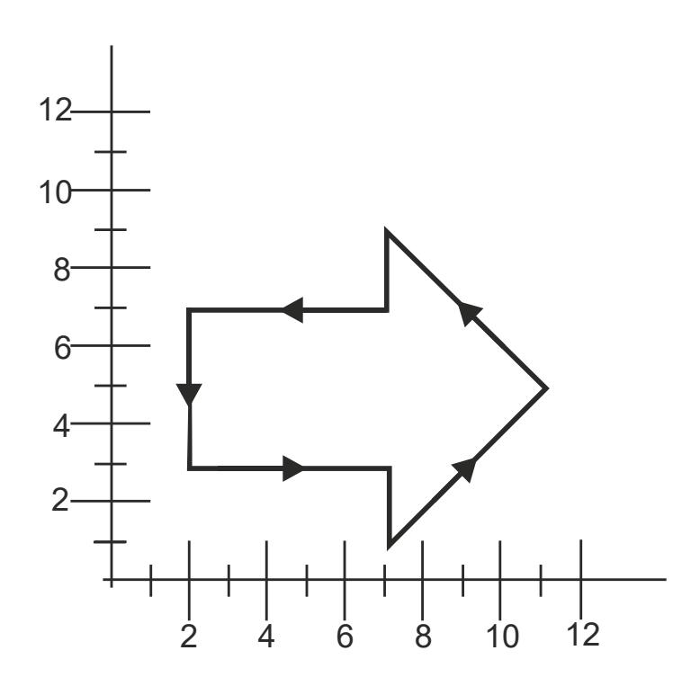

*26. Simple contour example: the segments*


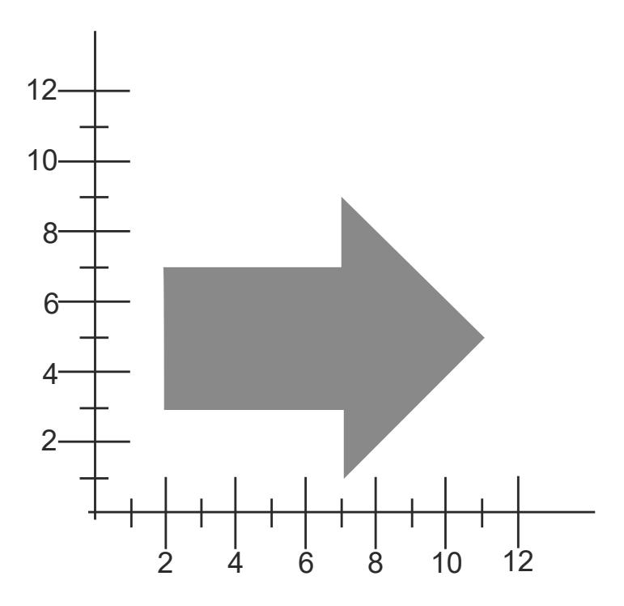

*27. Simple contour example: resulting image*


### *4.10.4.2 Use D02 to Start a Second Contour*

D02 command can be used to start the new contour. All the created contours are converted to regions when the command G37 is encountered. The example below creates two nonoverlapping contours which are then converted into two regions.

### **Example:**

```
G04 Non-overlapping contours*
%MOMM*%
%FSLAX26Y26*%
%ADD10C,1.00000*%
G01*
%LPD*%
G36*
X0Y5000000D02*
Y10000000D01*
X10000000D01*
Y0D01*
X0D01*
Y5000000D01*
X-1000000D02*
X-5000000Y1000000D01*
X-9000000Y5000000D01*
X-5000000Y9000000D01*
X-1000000Y5000000D01*
G37*
M02*
```

#### This creates the following image:

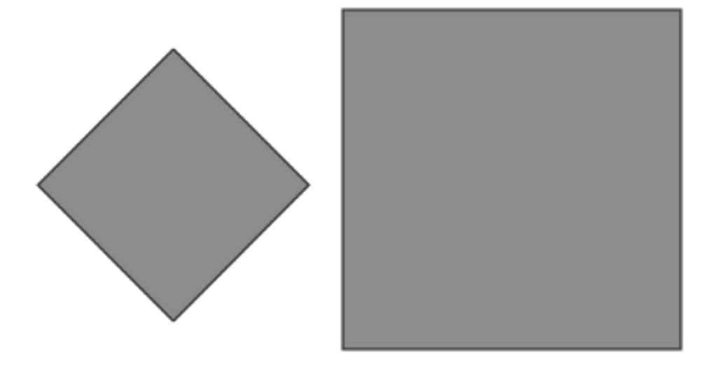

*28. Use of D02 to start a new non-overlapping contour.*

Two different contours were created. Each contour is filled individually. The filled area is the union of the filled areas.


### *4.10.4.3 Overlapping Contours*

The example below creates two overlapping contours which are then converted into one region.

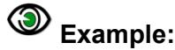

```
G04 Overlapping contours*
%FSLAX26Y26*%
%MOMM*%
%ADD10C,1.00000*%
G01*
%LPD*%
G36*
X0Y5000000D02*
Y10000000D01*
X10000000D01*
Y0D01*
X0D01*
Y5000000D01*
X1000000D02*
X5000000Y1000000D01*
X9000000Y5000000D01*
X5000000Y9000000D01*
X1000000Y5000000D01*
G37*
M02*
```

#### This creates the following image:

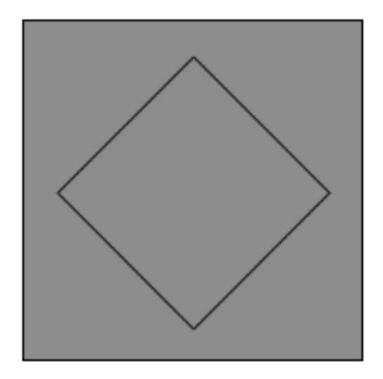

*29. Use of D02 to start a new overlapping contour*

Two different contours were created. Each contour is filled individually. The filled area is the union of the filled areas. As the second contour is completely embedded in the first, the effective filled area is the one of the first contour. The created region object is the same as would be defined by the first contour only.


### *4.10.4.4 Non-overlapping and Touching*

The example below creates two non-overlapping touching contours which are then converted into one region.

### **Example:**

```
G04 Non-overlapping and touching*
%FSLAX26Y26*%
%MOMM*%
%ADD10C,1.00000*%
G01*
%LPD*%
G36*
X0Y5000000D02*
Y10000000D01*
X10000000D01*
Y0D01*
X0D01*
Y5000000D01*
D02*
X-5000000Y1000000D01*
X-9000000Y5000000D01*
X-5000000Y9000000D01*
X0Y5000000D01*
G37*
M02*
```

#### This creates the following image:

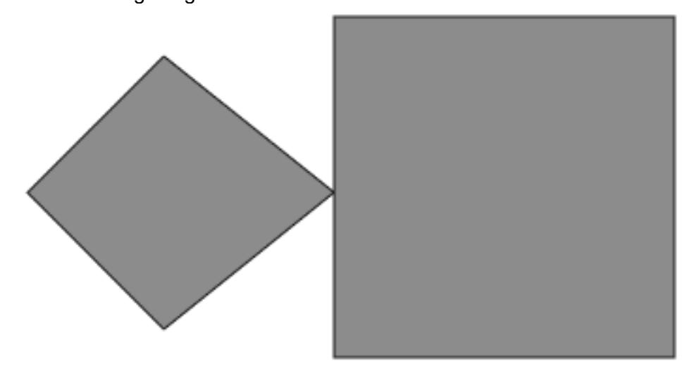

*30. Use of D02 to start a new non-overlapping contour*

As these are two different contours in the same region touching is allowed.


### *4.10.4.5 Overlapping and Touching*

The example below creates two overlapping touching contours which are then converted into one region.


```
G04 Overlapping and touching*
%FSLAX26Y26*%
%MOMM*%
%ADD10C,1.00000*%
G01*
%LPD*%
G36*
X0Y5000000D02*
Y10000000D01*
X10000000D01*
Y0D01*
X0D01*
Y5000000D01*
D02*
X5000000Y1000000D01*
X9000000Y5000000D01*
X5000000Y9000000D01*
X0Y5000000D01*
G37*
M02*
```

#### This creates the following image:


*31. Use of D02 to start a new overlapping and touching contour*

<span id="page-97-0"></span>As these are two different contours in the same region touching is allowed.

#### *4.10.4.6 Using Polarity to Create Holes*

The recommended way to create holes in regions is by alternating dark and clear polarity, as in the following example. Initially the polarity mode is dark. A big square region is generated. The


polarity mode is set to clear and a circular disk is added to the object stream; the disk is cleared from the image and creates a round hole in the big square. Then the polarity is set to dark again and a small square is added, darkening the image inside the hole. The polarity is set to clear again and a small disk added, clearing parts of the big and the small squares.


#### **Example:**

```
G04 This file illustrates how to use polarity to create holes*
%FSLAX26Y26*%
%MOMM*%
G01*
G04 First object: big square - dark polarity*
%LPD*%
G75*
G36*
X25000000Y25000000D02*
X175000000D01*
Y175000000D01*
X25000000D01*
Y25000000D01*
G37*
G04 Second object: big circle - clear polarity*
%LPC*%
G36*
X50000000Y100000000D02*
G03*
X50000000Y100000000I50000000J0D01*
G37*
G04 Third object: small square - dark polarity*
%LPD*%
G01*
G36*
X75000000Y75000000D02*
X125000000D01*
Y125000000D01*
X75000000D01*
Y75000000D01*
G37*
G04 Fourth object: small circle - clear polarity*
%LPC*%
G36*
X115000000Y100000000D02*
G03*
X115000000Y100000000I25000000J0D01*
G37*
M02*
```

Below there are pictures which show the resulting image after adding each object.


*32. Resulting image: first object only*


*33. Resulting image: first and second objects*


*34. Resulting image: first, second and third objects*


*35. Resulting image: all four objects*

#### <span id="page-100-0"></span>*4.10.4.7 A Simple Cut-in*

The example below illustrates how a simple cut-in can be used to create a hole in a region. The coinciding contour segments must follow the requirements defined in [4.10.3.](#page-90-0)


| Syntax                   | Comments                                                           |
|--------------------------|--------------------------------------------------------------------|
| %FSLAX26Y26*%            | Format specification                                               |
| G75*                     | Must be called before an arc is created                            |
| G36*                     | Begins a region statement                                          |
| X20000Y10000000D02*      | Set the current point to (2,10)                                    |
| G01*                     | Set linear plot mode                                               |
| X12000000D01*            | Create linear contour segment to (12,10)                           |
| Y20000000D01*            | Create linear contour segment to (12, 2)                           |
| X2000000D01*             | Create linear contour segment to (2, 2)                            |
| Y6000000D01*             | Create linear contour segment to (2, 6)                            |
| X5000000D01*             | Create linear segment to (5, 6),1st fully-coincident segment       |
| G03*                     | Set counterclockwise circular plot mode                            |
| X50000Y60000I30000J0D01* | Create counterclockwise circle with radius 3                       |
| G01*                     | Set linear plot mode                                               |
| X20000D01*               | Create linear segment to (2, 6), the 2nd fully-coincident segment. |
| Y100000D01*              | Create linear contour segment to (2, 10), closing the contour.     |
| G37*                     | Create the region by filling the contour                           |

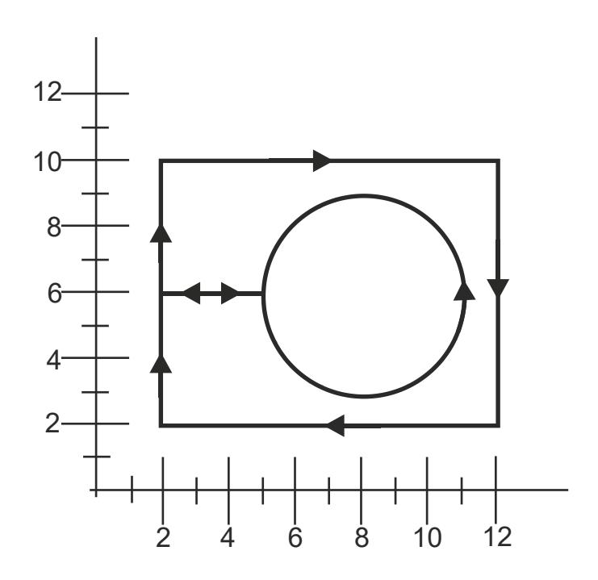

*36. Simple cut-in: the segments*


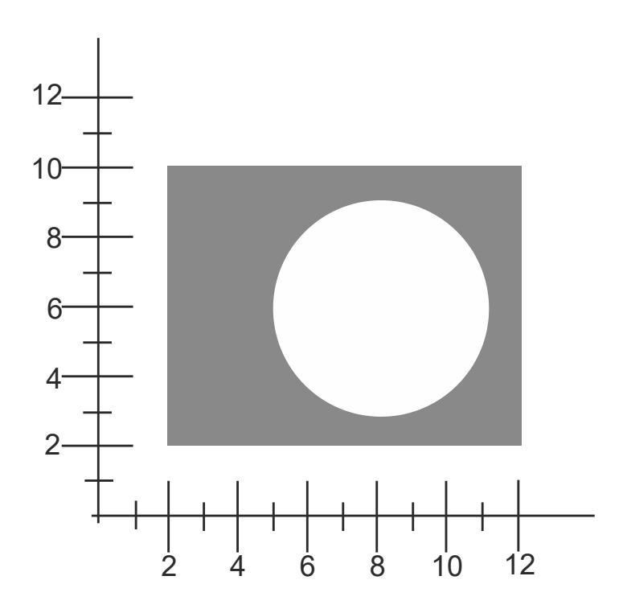

*37. Simple cut-in: the image*

Note the orientation of the inner circle. If the orientation would be different the contour would be self-intersecting. This becomes immediately apparent if you try to perturb the contour to convert it to a simple contour.

### *4.10.4.8 Fully-coincident Segments*

The first example below illustrates how one contour may result in two regions. This happens because there are two fully-coincident linear segments which give the gap between filled areas.

### **Example:**

```
G04 Example contour: two disjunct areas*
%FSLAX26Y26*%
%MOMM*%
G36*
X0Y5000000D02*
G01*
Y10000000D01*
X10000000D01*
Y0D01*
X0D01*
Y5000000D01*
G04 first fully-coincident linear segment*
X-1000000D01*
X-5000000Y1000000D01*
X-9000000Y5000000D01*
X-5000000Y9000000D01*
X-1000000Y5000000D01*
G04 second fully-coincident linear segment*
```


X0D01\* G37\*

M02\*

#### This creates the following image:

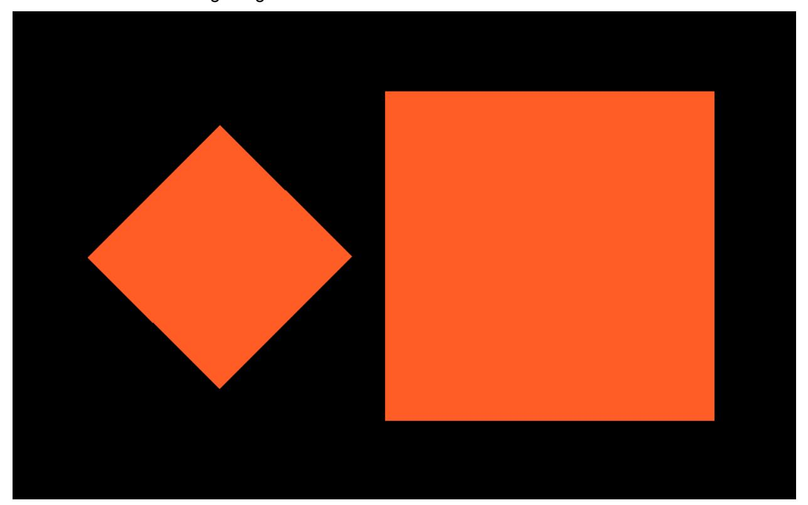

*38. Fully-coincident segments in contours: two regions*

The second example illustrates how one contour can create a region with hole.


```
G04 Example contour: Region with hole*
%FSLAX26Y26*%
%MOMM*%
G36*
X0Y5000000D02*
G01*
Y10000000D01*
X10000000D01*
Y0D01*
X0D01*
Y5000000D01*
G04 first fully-coincident linear segment*
X1000000D01*
X5000000Y1000000D01*
X9000000Y5000000D01*
X5000000Y9000000D01*
X1000000Y5000000D01*
```


```
G04 second fully-coincident linear segment*
X0D01*
G37*
M02*
```

#### This creates the following image:

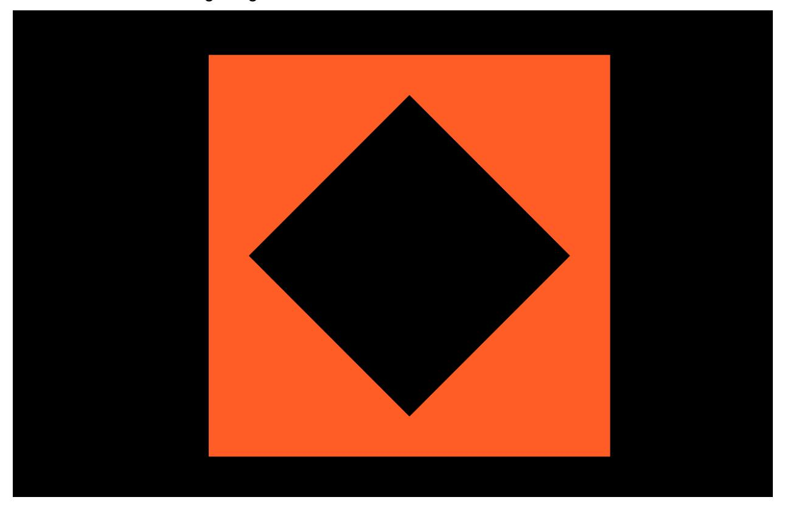

*39. Fully-coincident segments in contours: region with hole*

### *4.10.4.9 Valid and Invalid Cut-ins*

Contours with cut-ins are susceptible to rounding problems: when the vertices move due to the rounding the contour may become self-intersecting. This may lead to unpredictable results. The first example below is a cut-in with valid fully-coincident segments, linear segments which have the *same* end vertices. When the vertices move due to rounding, the segments will remain exactly on top of one another, and no self-intersections are created. This is a valid and robust construction.

#### **Example:**

```
G04 Example contour: Region with two holes*
%FSLAX26Y26*%
%MOMM*%
G36*
X122000000Y257000000D02*
G01*
Y272000000D01*
X131000000D01*
Y257000000D01*
X125000000D01*
Y260000000D01*
```


```
X129000000D01*
Y264000000D01*
X125000000D01*
Y267000000D01*
X129000000D01*
Y270000000D01*
X125000000D01*
Y267000000D01*
Y264000000D01*
Y260000000D01*
Y257000000D01*
```

X122000000D01\*

G37\*

M02\*

#### This results in the following contour:

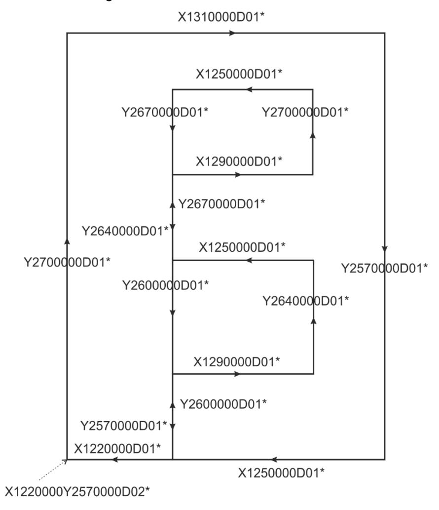

*40. Valid cut-in: fully-coincident segments*

#### This creates the following image:


*41. Valid cut-in: resulting image*

The next example attempts to create the same image as the first example from above, but it is *invalid* due to the use of invalid partially coinciding segments (see the description of a valid contour in [4.10.3\)](#page-90-0). The number of linear segments has been reduced by eliminating vertices between collinear segments, creating invalid overlapping segments. This construction is *invalid*. It is prohibited because it is not robust and hard to handle: when the vertices move slightly due to rounding, the segments that were on top of one another may become intersecting, with unpredictable results.

### **Example:**

%FSLAX26Y26\*% %MOMM\*% G36\* X111000000Y257000000D02\* G01\* Y260000000D01\* X114000000D01\* Y264000000D01\* X111000000D01\* Y267000000D01\* X114000000D01\* Y270000000D01\* X111000000D01\*


Y257000000D01\*

X109000000D01\*

Y272000000D01\*

X117000000D01\*

Y257000000D01\*

X111000000D01\*

G37\*

M02\*

This results in the following contour:

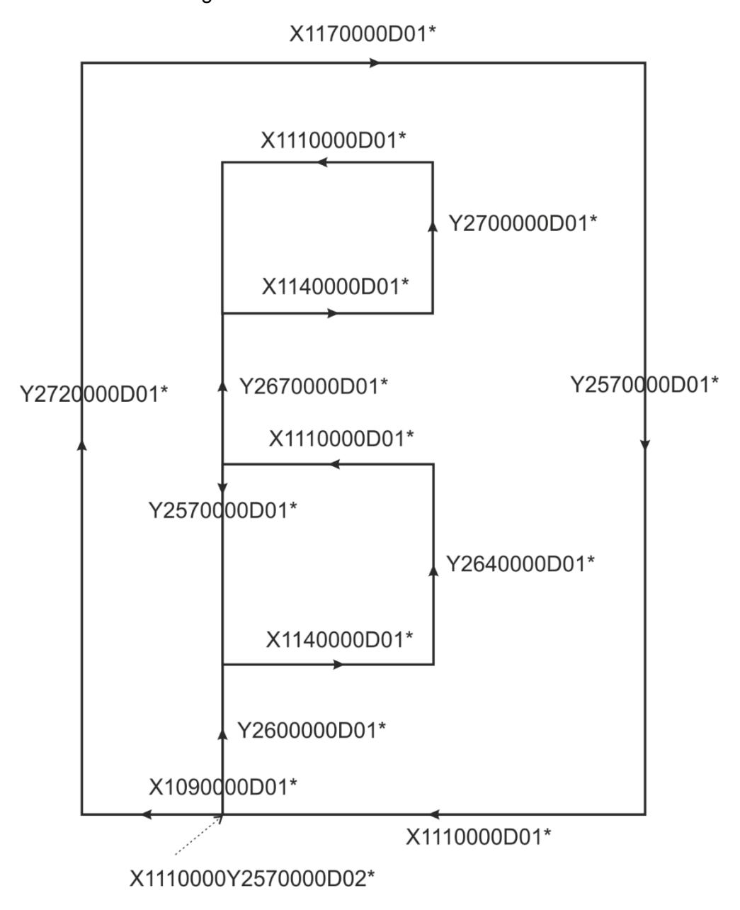

*42. Invalid cut-in: overlapping segments*

#### <span id="page-107-0"></span>**Copper Pours, Power and Ground Planes**

The simplest way to construct power and ground planes is first to create the copper pour with a region in dark polarity (LPD), and then erase the clearances by switching to clear polarity (LPC).


Note the clear polarity objects erase everything under them, so the copper pours and clearances are best output first.


```
G04 We define the antipad used to create the clearances*
%TA.AperFunction,AntiPad*%
%ADD11C….*%
….
G04 We now define the copper pour as a region*
LPD*
G36*
X…Y…D02*
X…Y…D01*
…
G37*
G04 We now flash clearances*
%LPC*%
D11*
X…Y…D03*
```

This is simple and clear. In CAD the location of the anti-pads and other clearances is known. Outputting these directly transfers shape and location information to CAM in a simple way.

Clearances in power and ground planes can also be constructed with cut-ins, as below.

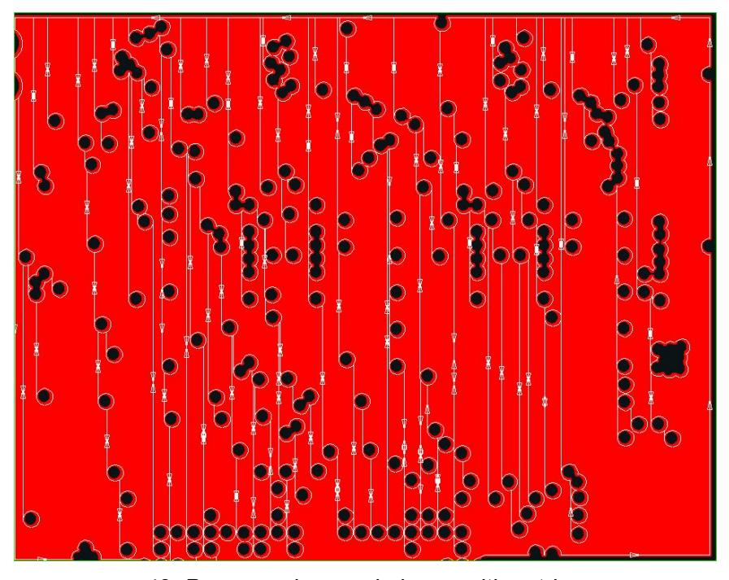

*43. Power and ground planes with cut-ins.*

The cut-ins are rather complex to create on output; in CAM the cut-ins must be removed on input and the original clearances restored, again rather complex. Avoid this more complex construction if at all possible.

Care must be taken to only create valid cut-ins. Sloppy cut-ins are the most frequent cause of scrap due to faulty Gerber files, causing a self-intersecting contour and a missing clearance. Below is an example of such sloppy cut-in; it is a real-life example that lead to expensive scrap.


Watch out for rounding errors. Make sure that coincident points indeed are coincident in the file. With the highest resolution on outputs reduces rounding errors.

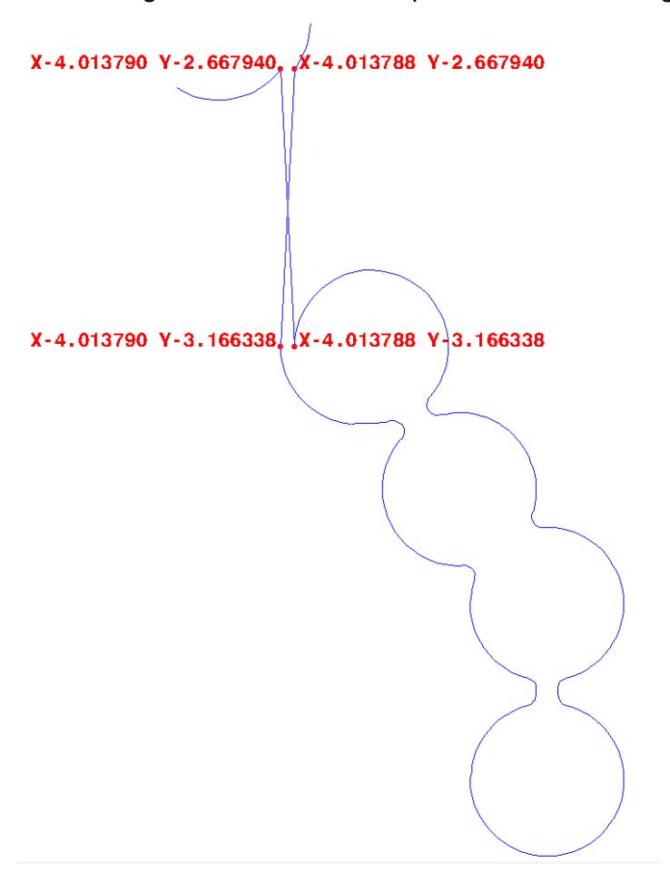

*44. Power plane with invalid cut-in.*

It is sometimes recommended to avoid the cut-ins altogether by splitting the plane in separate pieces, where no piece has holes. Do not follow this terrible recommendation. The remedy is worse than the disease. Splitting the single contour in separate contours without holes is as complex as adding cut-ins. All clearance boundaries must be cut in pieces and split over different contours; not much of an improvement over finding cut-in points. Rounding errors still lurk, and can lead to pieces that are no longer connected; not much of an improvement over invalid cut-ins. The situation is far worse on input. If the plane consists of a single contour it is clear it is a single plane. When planes are split in pieces the coherence is lost. The file reader must figure out from a bewildering set of contours that a single plane is intended. It must recover clearances which boundaries are scattered over different contours. Cutting a plane in pieces to avoid clearances is bad practice. It is asking for problems. See also [4.14.](#page-119-0)


### <span id="page-110-0"></span>**4.11 Block Aperture (AB)**

#### <span id="page-110-1"></span>**Overview of block apertures**

The AB command creates a *block aperture*: The command stream between the opening and closing AB command defines the content of the block aperture which is then stored in the aperture dictionary. Thus, the AB command adds an aperture to the dictionary directly, without needing an AD command. The LM, LR, LS and LP commands affect the flashes of block apertures as any other aperture: when a block aperture is flashed, it is first transformed according to the graphics state transformation parameters and then appended to the object stream.

A block aperture is *not* a single graphical object but an ordered list of objects, each with their own polarity. While a standard or macro aperture always appends a single graphical object to the stream, a block aperture can add any number. Standard and macro apertures always have a single polarity while block apertures can contain both dark and clear objects.

If the polarity is dark (LPD) when the block is flashed then the block aperture is inserted as is. If the polarity is clear (LPC) then the polarity of all objects in the block is toggled (clear becomes dark, and dark becomes clear). This toggle propagates through all nesting levels. In the following example the polarity of objects in the flash of block D12 will be toggled.

```
%ABD12*%
…
%AB*%
….
D12*
%LPC*%
X-2500000Y-1000000D03*
```

Flashing a block aperture updates the current point but otherwise leaves the graphics state unmodified, as with any other apertures.

The origin of the block aperture is the (0,0) point of the file.

<span id="page-110-2"></span>The AB command was introduced in revision 2016.12.

#### **AB Statement Syntax**

The syntax for the AB command is:

**<AB command> = AB[<block aperture number>]\***

| Syntax                                   | Comments                                                                           |
|------------------------------------------|------------------------------------------------------------------------------------|
| AB                                       | AB for Aperture Block. Opens/closes an AB statement.                               |
| <block aperture<br="">number&gt;</block> | The aperture number under which the block is stored in the<br>aperture dictionary. |

#### **Examples:**

| Syntax   | Comments                             |
|----------|--------------------------------------|
| %ABD12*% | Opens the definition of aperture D12 |
| %AB*%    | Closes the current AB statement.     |


The section between the opening and closing AB commands can contain nested AB commands. The resulting apertures are stored in the library and are available subsequently until the end of the file, also outside the enclosing AB section. The syntax is:

```
AB_statement = AB_open block AB_close; 
AB_open = '%' ('AB' aperture_ident) '*%'; 
AB_close = '%' ('AB') '*%'; 
block = 
      {
      | D01
      | D02
      | D03
      | G01
      | G02
      | G03
      | G75
      | Dnn
      | G04 
      | TO
      | TD
      | TA
      | TF 
      | AD
      | AM
      | LP
      | LM
      | LR
      | LS
      | region_statement
      | AB_statement
      }*
 ;
```

Consequently, an AB statement can contain embedded AB statements. It *cannot* contain an SR statement.

In Gerber, the scope of a name is from its definition till the end of the file. Consequently, names defined by an AB statement are available in the whole file, after their first use.

After an AB statemen the graphics state remains as it is at the end of the AB definition, except for the current point, which is undefined. (Gerber has no stack of graphics states.)


### <span id="page-112-0"></span>**Usage of Block Apertures**

The purpose of block apertures is to repeat a sub-image without the need to repeat all the generating commands. Block apertures can be repeated at *any* location and *individually* mirrored, rotated and scaled. Block apertures are more powerful than the SR command: the SR only allows repeats on a regular grid, without mirror, rotate or scale, and, crucially, without nesting. Blocks are typically used to create panels without duplicating the data.

The second purpose of block apertures is to complement macro apertures. A block aperture consisting of a single region creates a single object with one polarity– as with standard or macro apertures. Thus, single object apertures of any shape can easily be created. Such a block aperture can be used to define pads. Blocks are simpler to create than macros. However, macros can have parameters and blocks cannot. On the other hand, a macro outline primitive support only linear segments while the contours in blocks support both linear and circular segments.

<span id="page-112-1"></span>Do not use blocks – or macros - when a standard aperture is available. Standard apertures are built-in and therefore are processed faster.


### <span id="page-113-0"></span>**Example**


#### **A complete Gerber file with nested blocks**

```
G04 Ucamco copyright*
%TF.GenerationSoftware,Ucamco,UcamX,2016.04-160425*%
%TF.CreationDate,2016-04-25T00:00;00+01:00*%
%TF.Part,Other,Testfile*%
%FSLAX46Y46*%
%MOMM*%
G04 Define standard apertures*
%ADD10C,7.500000*%
%ADD11C,15*%
%ADD12R,20X10*%
%ADD13R,10X20*%
G04 Define block aperture 100, consisting of two draws and a round dot*
%ABD100*%
D10*
X65532000Y17605375D02*
Y65865375D01*
X-3556000D01*
D11*
X-3556000Y17605375D03*
%AB*%
G04 Define block aperture 102, consisting of 2x3 flashes of aperture 101 
and 1 flash of D12*
%ABD102*%
G04 Define nested block aperture 101, consisting of 2x2 flashes of 
aperture 100*
%ABD101*%
D100*
X0Y0D03*
X0Y70000000D03*
X100000000Y0D03*
X100000000Y70000000D03*
%AB*%
D101*
X0Y0D03*
X0Y160000000D03*
X0Y320000000D03*
X230000000Y0D03*
X230000000Y160000000D03*
X230000000Y320000000D03*
D12*
X19500000Y-10000000D03*
%AB*%
G04 Flash D13 twice outside of blocks*
D13*
X-30000000Y10000000D03*
```


X143000000Y-30000000D03\* G04 Flash block 102 3x2 times\* D102\* X0Y0D03\* X0Y520000000D03\* X500000000Y0D03\* X500000000Y520000000D03\* X1000000000Y0D03\* X1000000000Y520000000D03\*

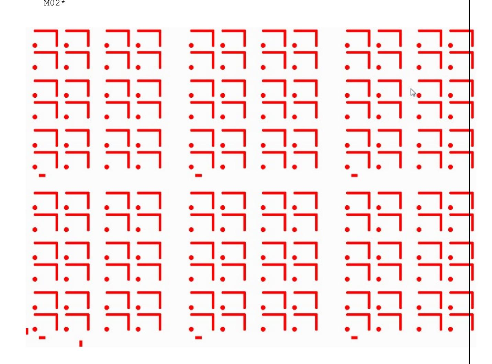

*45. Block aperture example 1*


### <span id="page-115-0"></span>**4.12 Step and Repeat (SR)**

The purpose of the SR command is to replicate a set of graphical objects without replicating the commands that creates the set.

The SR command %SRX…Y…I…J…\*% opens an *SR statement*. All subsequent commands are part of the SR statement until it is closed by an %SR\*%. The parameters X, Y specify the number of repeats in X and Y and I, J their step distances. The graphical objects generated by the command stream in a SR statement are collected in a *block* - see [2.4](#page-14-0) - instead of being added directly to the object stream. When the SR command is closed by an %SR\*%, the block is steprepeated (replicated) in the image plane according to the parameters X, Y, I and J in the opening SR command. Blocks are copied first in the positive Y direction and then in the positive X direction. The syntax for the SR command is:

#### **<SR command> = SR[X<Repeats>Y<Repeats>I<Distance>J<Distance>]\***

| Syntax                  | Comments                                                                                                                                   |  |
|-------------------------|--------------------------------------------------------------------------------------------------------------------------------------------|--|
| SR                      | SR for Step and Repeat                                                                                                                     |  |
| X <repeats></repeats>   | Defines the number of times the block is repeated along the X axis.<br><repeats> is an integer ≥ 1</repeats>                               |  |
| Y <repeats></repeats>   | Defines the number of times the block is repeated along the Y axis.<br><repeats> is an integer ≥ 1</repeats>                               |  |
| I <distance></distance> | Defines the step distance along the X axis.<br><distance> is a decimal number ≥ 0, expressed in the unit of the MO<br/>command</distance>  |  |
| J <distance></distance> | Defines the step distance along the Y axis.<br><distance> is a decimal number ≥ 0, expressed in the unit of the MO<br/>command.</distance> |  |

**Warning:** The step distances are not expressed in coordinate data, but in decimals. The unit is the one defined in the MO command.

#### Examples:

| Syntax            | Comments                                                                                                                                                                                                                                     |
|-------------------|----------------------------------------------------------------------------------------------------------------------------------------------------------------------------------------------------------------------------------------------|
| %SRX2Y3I2.0J3.0*% | Opens an SR statement and starts block accumulation.                                                                                                                                                                                         |
|                   | When block accumulation is finished the block will be repeated 2 times<br>along the X axis and 3 times along the Y axis. The step distance<br>between X-axis repeats is 2.0 units. The step distance between Y<br>axis repeats is 3.0 units. |
| %SRX4Y1I5.0J0*%   | Opens an SR statement and starts block accumulation.                                                                                                                                                                                         |
|                   | When block accumulation is finished the block will be repeated 4 times<br>along the X axis with the step distance of 5.0 units. There are no<br>repeats along the Y axis, so.the step distance in the J is not used.                         |
| %SR*%             | Closes the SR statement and repeats the previously accumulated<br>block                                                                                                                                                                      |


```
The syntax is:
SR_statement = SR_open block SR_close; 
SR_open = '%' ('SR' 'X' positive_integer 'Y' positive_integer 'I' 
decimal 'J' decimal) '*%'; 
SR_close = '%' ('SR') '*%'; 
in_block_statement = 
block = 
      {
      | D01
      | D02
      | D03
      | G01
      | G02
      | G03
      | G75
      | Dnn
      | G04 
      | TO
      | TD
      | TA
      | TF 
      | AD
      | AM
      | LP
      | LM
      | LR
      | LS
      | region_statement
      | AB_statement
```

 **}\***


### **Example:**

G04 A block of two flashes is repeated 3x2 times\* %SRX3Y2I5.0J4.0\*% D13\* X123456Y789012D03\* D14\* X456789Y012345D03\* %SR\*%

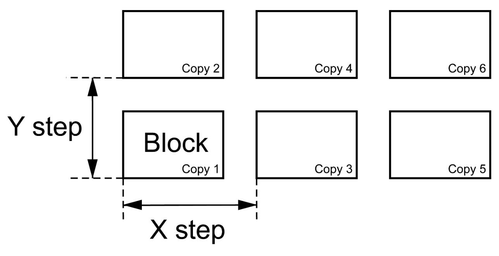

*46. Blocks replication with SR command*

Note that a block contains the graphical objects, not the Gerber source code. The graphical objects in each copy are always identical, even if the graphics state is modified during the SR statement.

The current point is undefined after an SR statement.

A file can contain multiple SR statements. The number of steps and the step distances can be different in X and Y. The number of repeats along an axis can be one; it is then recommended to use the step distance 0.

A step & repeat block can contain different polarities (LPD and LPC – see [4.9.2\)](#page-86-0). A clear object in a block clears *all* objects beneath it, including objects outside the block. When repeats of blocks with both dark and clear polarity objects overlap, the step order affects the image; the correct step order must therefore be respected: step the complete block first in Y and then in X.


### <span id="page-118-0"></span>**4.13 End-of-file (M02)**

The M02 command indicates the end of the file. The syntax is as follows:

M02 = ('M02') '\*';


**Example:** 

M02\*

The last command in a Gerber file *must* be the M02 command. No data is allowed after an M02. Gerber readers are encouraged to give an error on a missing M02 as this is an indication that the file has been truncated.

Note that an M02 command *cannot* be issued *within* a block or region statement. They must first be explicitly closed.


### <span id="page-119-0"></span>**4.14 Numerical Accuracy**

The coordinates of all points and all geometric parameters (e.g. a diameter) have an exact numerical value. Graphical objects are therefore in principle defined with infinite precision with the exception of arcs, which are intrinsically slightly fuzzy (see [4.7.2.](#page-76-0)). A Gerber file specifies an image with infinite precision.

However, Gerber file writers cannot assume that file readers will process their files with infinite precision as this is simply impossible. Nemo potest ad impossibile obligari. This raises the question to what a Gerber file reader is held, and what a Gerber writer *can* assume.

### <span id="page-119-1"></span>**Visualization**

Gerber files are often used to *visualize* an image on a screen, a photoplotter, a direct imager. Visualization is unavoidably constrained by the limitations of the output device. Nonetheless, visualization must comply with the following rules:

- Each individual graphical object must be rendered within the stated accuracy of the output device.
- No spurious holes may appear solid objects must be visualized solid.
- No spurious objects may appear.
- Zero-size objects are *not* visualized.
- Graphical objects can be rendered individually, without considering neighboring objects. In other words, each graphical object is handled individually, regardless of context.

It is intentionally not specified if rendering must be "fat" or "thin" - fat meaning that features below the device accuracy are blown up to be visible, thin meaning that they disappear.

These rules have several noteworthy consequences:

- Gerber objects separated by a very small gap may touch in the visualized image.
- Gerber objects that touch or marginally overlap may be separated by a gap in the visualized image.
- Gerber objects smaller or thinner than the device resolution may totally disappear in the visualized image.
- When what is intended to be a single object is broken down into simpler graphical objects, and these elementary objects do not sufficiently overlap, the resulting image may *not* be solid - it may have internal holes or even break up in pieces. To avoid these effects the best and most robust approach is not to break up the single object at all: the Gerber format has powerful primitives to create almost any shape with a single graphical object or possible a succession of dark and clear objects.

#### <span id="page-119-2"></span>**Construct files robustly.**

#### **Image Processing**

Gerber files are processed for visualization but often also to complex image processing algorithms: e.g. etch compensation, design rule checks in CAM and so on. These algorithms perform long sequences of numerical calculations. Rounding errors unavoidably accumulate. Coordinates can move and object sizes can vary. The specification limits the allowed perturbation to [-0.5µm, +0.5 µm]; furthermore coincident coordinates must remain coincident. The writer can assume that the perturbation is within this limit. Higher accuracy cannot be blindly assumed; if it is needed it must be checked that the applications downstream can handle this. A file is therefore only robust if, under any allowed perturbation, it remains valid and represents the same image.


The perturbation has some noteworthy consequences:

- Contours that are not self-intersecting by a margin of ≤1µm can become self-intersecting under a valid perturbation. Such contours are therefore invalid; see section [4.10.3.](#page-90-0) Contours must be constructed robustly so that allowed processing perturbations do not turn an otherwise valid contour in a self-intersecting one. See [4.14.2.](#page-119-2) Consequently, points and segments that are not coincident must be separated by at least 1µm. Furthermore, circular segments add their own intrinsic fuzziness, see [4.7.2.](#page-76-0) If any valid interpretation of the arc violates the requirement of 1µm separation the contour is invalid. Construct contours defensively. Observe sufficient clearances. Marginal contours can and do lead to problems.
- Objects that touch or overlap marginally can become separated under perturbation. This is important for electrical connection. An electrical connection that is realized by touching objects can get separated by a valid perturbation. Such marginal construction can be validly interpreted as either isolating or connecting. Make proper and robust electrical connections, with an overlap of the order of magnitude of at least the minimum conductor width.
- Arcs with end points separated by less than 1 µm can toggle between very small or nearly 360 degrees under valid perturbations. Do not write such arcs.
- Avoid objects smaller than 1 µm.

**Construct files robustly.**


