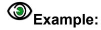
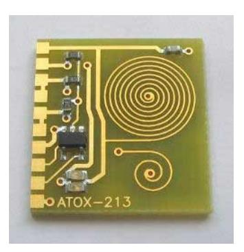
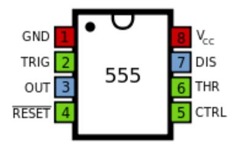

# <span id="page-121-0"></span>5 **Attributes**

### <span id="page-121-1"></span>**5.1 Attributes Overview**

Attributes add meta-information to a Gerber file. Attributes are akin to labels providing information about the file or features within them. Examples of meta-information conveyed by attributes are:

- The function of the file in the layer structure. Is the file the top solder mask, the bottom copper layer, …?
- The function of a pad. Is the pad an SMD pad, or a via pad, or a fiducial, ...?

The attribute syntax provides a flexible and standardized way to add meta-information to a Gerber file, independent of the specific semantics or application.

Attributes do *not* affect the image. A Gerber reader will generate the correct image if it simply ignores the attributes.

Each attribute consists of an *attribute name* and an optional *attribute value:*

### **<Attribute> = <AttributeName>[,<AttributeValue>]\***

Attribute names follow the name syntax in section [3.4.3.](#page-35-3)

The attribute value consists of one or more comma-separated fields, see section [3.4.4.](#page-36-0)

**<AttributeValue> = <Field>{,<Field>}**

There are three types of attributes by the *item* they attach to:

| Attachment type     | The item to which they attach meta-information                                                                               |
|---------------------|------------------------------------------------------------------------------------------------------------------------------|
| File attributes     | Attach meta-information to the file as a whole.                                                                              |
| Aperture attributes | Attach meta-information to an aperture or a region. Objects created by<br>the aperture inherit the aperture meta-information |
| Object attributes   | Attach meta-information to on object directly                                                                                |

There are two types of attributes by the *scope* of their use:

- *Standard attributes*. Standard attribute names, values and semantics are defined in this specification and are part of it. As they are standardized, they can exchange metainformation between all applications.
- *User attributes*. User attributes can be chosen freely by users to extend the format with custom meta-information. Use custom attributes only for unequivocally defined machine-readable information, use G04 for mere human-readable comments.

In accordance with the general rule in [3.4.3](#page-35-3) standard attribute names *must* begin with a dot '.' while user attribute names *cannot* begin with a dot. The dot, if present, is part of the attribute name and indicates that it is a standard attribute whose syntax and semantics are defined in section [5.6.](#page-127-0)


#### Example of a user attributes:

%TFMyAttribute,Yes\*% %TFZap\*% %TFZonk\*%


The following commands govern attributes. (They start with a T as the more obvious A is already taken by the aperture commands.)

| Command | Description                                                                      | Section |  |  |
|---------|----------------------------------------------------------------------------------|---------|--|--|
| TF      | Attribute file. Set a file attribute.                                            | 5.2     |  |  |
| TA      | Attribute aperture. Add an aperture attribute to the dictionary or<br>modify it. | 5.3     |  |  |
| TO      | Attribute object. Add an object attribute to the dictionary or modify<br>it.     | 5.4     |  |  |
| TD      | Attribute delete. Delete one or all attributes in the dictionary.                | 5.5     |  |  |

The syntax is as follows:

```
TF = '%' ('TF' attribute_name {',' attribute_value}*) '*%'; 
TA = '%' ('TA' attribute_name {',' attribute_value}*) '*%'; 
TO = '%' ('TO' attribute_name {',' attribute_value}*) '*%'; 
TD = '%' ('TD' [attribute_name]) '*%'; 
attribute_name = field; 
attribute_value = field;
```

An *attribute dictionary* is maintained during the processing of a Gerber file. Dictionary entries consist of the attribute name, its domain, and its value. The attribute name is the key to the entry; the name must therefore be unique. (For example, an aperture or object attribute cannot share the same name.)

The current aperture dictionary is defined after each command by the following rules:

- Initially the attribute dictionary is empty
- File attributes are added with the TF command
- Aperture attributes are added or updated with the TA command
- Object attributes are added or updated with the TO command
- Attributes are deleted with the TD command

When an aperture or a graphical object is created all attributes with the proper domain in the dictionary at that time are attached to it. They are fixed and cannot be changed.

Attribute commands are not allowed *within* a region statement, see [4.10.2.](#page-89-2)


In the following example the command TF defines an attribute with name ".FileFunction" and with value composed of the two fields: "Soldermask,Top".


%TF.FileFunction,Soldermask,Top\*%

#### <span id="page-123-0"></span>**Comment attributes**

There is legacy software that fails on files with attribute commands. (This software is then nonconforming.) To avoid such problems attributes can also be expressed with standardized comments, see [4.1.](#page-44-1)

For example,

TA.AperFunction,SMDPad,CuDef\*

can be written as

G04 #@! TA.AperFunction,SMDPad,CuDef\*

Both have exactly the same meaning.


### <span id="page-124-0"></span>**5.2 File Attributes (TF)**

File attributes provide meta-information about entire files.

The semantics of a file attribute specifies where it must be defined, typically in the header of the file. File attributes are immutable. They cannot be redefined or deleted.

File attributes are set with the uppercase TF command with the following syntax

```
<TF command> = %TF<AttributeName>[,<AttributeValue>]*%
```

**<AttributeValue> = <Field>{,<Field>}**

The attribute name must follow the syntax in section [3.4.3,](#page-35-3) fields the syntax in [3.4.4.](#page-36-0) The name is unique.


### **Example:**

%TF.FilePolarity,Negative\*%

### <span id="page-124-1"></span>**5.3 Aperture Attributes (TA)**

An *aperture attribute* is attached to an aperture or a region*.* They are a method to assign attributes to graphical objects in bulk: all objects that are created with an aperture inherit its attributes; for example, a via attribute on an aperture means that all pads flashed with this aperture are via pads. Providing information about graphical objects via their apertures is elegant, compact and efficient. As region objects are created without intermediary aperture, aperture objects can be assigned to regions directly.

The TA command adds an aperture attribute into the attributes dictionary. It has the following syntax:

#### **<TA command> = %TA<AttributeName>[,<AttributeValue>]\*%**

```
<AttributeValue> = <Field>{,<Field>}
```

The attribute name must follow the syntax in section [3.4.3,](#page-35-3) fields the one in [3.4.4.](#page-36-0) The name must be unique. The value of an aperture attribute can be modified by a new TA with the same attribute name.

The example below defines several attributes.


#### **Example:**

%TA.AperFunction,ComponentPad\*% %TAMyApertureAttributeWithValue,value\*% %TAMyApertureAttributeWithoutValue\*%

In the next example the aperture value is initially set to ComponentPad and later overruled to ViaPad.


#### **Example:**

%TA.AperFunction,ComponentPad\*% … %TA.AperFunction,ViaPad\*%

When an AD or an AB command creates an aperture all aperture attributes then in the attribute dictionary are attached to it. Once an aperture is defined its attributes cannot be changed.


### <span id="page-125-0"></span>**Aperture Attributes on Regions**

Counter-intuitively, aperture attributes can be attached to regions. When a G36/G37 creates a region all aperture attributes in the dictionary are attached to it, in the same way as they are attached to an aperture created with an AD command. A way to view this is that the G36 command creates a virtual region aperture and attaches attributes to it in the same way as an AD. Regions effectively function as single-use apertures that are flashed and immediately forgotten when the region definition is completed.

Aperture attributes on regions are necessary. Aperture attributes are an efficient way to attach properties to large numbers of draw, arc or flash objects. Sometimes the same property must be attached to regions. For example, both tracks – draws and arcs– and copper pours – regions often have the 'Conductor' function. After all, regions are objects as any other, that purely for syntactic reasons do not have an aperture associated. The first paragraph gives a mechanism to associate the aperture attributes to regions.


#### **Example: Define a copper pour as a region**

```
%TA.AperFunction,Conductor*%
G36*
X118151529Y-78573554D02*
G01*
X118230607Y-78626393D01*
X118283446Y-78705471D01*
X118302000Y-78798750D01*
X118302000Y-79286250D01*
…
X118151529Y-78573554D01*
G37*
```

<span id="page-125-1"></span>For the avoidance of doubt: regions take the aperture attributes from the dictionary, not from the current aperture.

### **5.4 Object Attributes (TO)**

An *object attribute* is attached to graphical objects. When a D01, D03 or region statement (G36/G37) creates an object all object attributes in the attribute dictionary are attached to it. As attribute commands are not allowed inside a region statement, *all* regions created by that statement have the same object attributes. Once attached to an object they cannot be changed.

The TO command adds an object attribute into the attributes dictionary. It has the same syntax as the TF command:

```
<TO command> = %TO<AttributeName>[,<AttributeValue>]*%
<AttributeValue> = <Field>{,<Field>}
```

The attribute name must follow the syntax in section [3.4.3,](#page-35-3) fields the one in [3.4.4.](#page-36-0) The name is unique. The value of an object attribute can be modified by a new TO command with the same attribute name.


#### **Example:**

%TO.C,R6\*%


### <span id="page-126-0"></span>**5.5 Delete Attribute (TD)**

The TD command deletes one or all aperture or object attributes from the attributes dictionary. (File attributes are immutable and are not deleted.)

#### **<TD command> = %TD[<AttributeName>]\*%**

The <AttributeName> is the name of the attribute to delete. If omitted, all aperture and object attributes in the dictionary are deleted.

Note that an attribute remains attached to apertures and objects to which it was attached before it was deleted from the dictionary.


### <span id="page-127-0"></span>**5.6 Standard Attributes**

#### <span id="page-127-1"></span>**Overview**

| Name                | Usage                                                                                                               | Section | Attached<br>to      |
|---------------------|---------------------------------------------------------------------------------------------------------------------|---------|---------------------|
| .Part               | Identifies the part the file represents, e.g. a<br>single PCB                                                       | 5.6.2   | File                |
| .FileFunction       | Identifies the file's function in the PCB, e.g. top<br>copper layer                                                 | 5.6.3   | File                |
| .FilePolarity       | Positive or Negative. This defines whether<br>the image represents the presence or<br>absence of material.          | 5.6.4   | File                |
| .SameCoordinates    | All files in a fabrication data set with this<br>attribute use the same coordinates. In other<br>words, they align. | 5.6.5   | File                |
| .CreationDate       | Defines the creation date and time of the<br>file.                                                                  | 5.6.6   | File                |
| .GenerationSoftware | Identifies the software creating the file.                                                                          | 5.6.7   | File                |
| .ProjectId          | Defines project and revisions.                                                                                      | 5.6.8   | File                |
| .MD5                | Sets the MD5 file signature or checksum.                                                                            | 5.6.9   | File                |
| .AperFunction       | Function objects created with the apertures,<br>e.g. SMD pad                                                        | 5.6.10  | Aperture            |
| .DrillTolerance     | Tolerance of drill holes                                                                                            | 5.6.11  | Aperture            |
| .FlashText          | Provides the source text and font for<br>flashes representing text                                                  | 5.6.12  | Aperture            |
| .N                  | The CAD net name of a conducting object,<br>e.g. Clk13.                                                             | 5.6.13  | Graphical<br>object |
| .P                  | The pin number (or name) and reference<br>descriptor of a component pad on an outer<br>layer, e.g. IC3,7.           | 5.6.14  | Graphical<br>object |
| .C                  | The component reference designator linked<br>to an object, e.g. C2.                                                 | 5.6.15  | Graphical<br>object |
| .Cxxx               | A range of component characteristics, e.g.<br>.CRot,90.                                                             | 5.6.16  | Graphical<br>object |

#### *Standard attributes*


The standard attributes are needed by PCB fabrication and must be included in the PCB data sent from design to fabrication. For example, the fabricator needs to know where the via pads are to handle the solder mask properly. The standard attributes transfer this design intent from CAD to CAM in an unequivocal and standardized manner. This is sometimes rather grandly called "adding intelligence to the image". Without standard attributes the design intent must be gathered from various documents, unwritten rules, conversations, or reverse engineering, with serious risks of errors and delays.

Use standard attributes as comprehensively as possible. If you cannot provide *all* the attributes or are unsure of their use, provide at least all the attributes you are comfortable with. Partial information is better than no information. For professional PCB production the bare minimum attributes are .FileFunction and .FilePolarity – without these even the images are undefined.

Note that standard attribute values typically contain a value "Other" for requirements not yet foreseen in the specification. New values as the need arises to minimize the use of "Other".

If you have suggestions for new standard attributes, please contact Ucamco at [gerber@ucamco.com](mailto:gerber@ucamco.com) . Authors will be properly acknowledged for suggestions that make it to the standard.

**Warning: Do not invent your own standard attribute names** (names starting with a dot). This would defeat the benefits of standardization. User attributes cater to requirements not covered by the standard attributes. Feel free to invent any user attribute you wish.


#### <span id="page-129-0"></span>**.Part**

The value of the .Part file attribute identifies which part is described. The attribute – if present must be defined in the header.

| .Part value                                   | Usage                                                                   |
|-----------------------------------------------|-------------------------------------------------------------------------|
| Single                                        | Single PCB                                                              |
| Array                                         | A.k.a. customer panel, assembly panel, shipping panel,<br>biscuit       |
| FabricationPanel                              | A.k.a. working panel, production panel                                  |
| Coupon                                        | A test coupon                                                           |
| Other, <mandatory<br>field&gt;</mandatory<br> | None of the above. The mandatory field informally<br>indicates the part |

*.Part file attribute values*


%TF.Part,Array\*%


#### <span id="page-130-0"></span>5.6.3 .FileFunction

The .FileFunction file attribute identifies the function of the file in the PCB layer structure. Of all the attributes it is the most important.



%TF.FileFunction,Copper,L1,Top\*%

The attribute must be defined in the header.

The existence of a file function does not mean that it must be included in each PCB fabrication data set. Include only the files that are needed: no more, no less.

The file functions are designed to support all file types in current use. If a type you need is missing please contact us at gerber@ucamco.com.

| Data layers                                                 |                                                                                                                                                                                                                                                                                                                                                                                                                                                                                    |  |
|-------------------------------------------------------------|------------------------------------------------------------------------------------------------------------------------------------------------------------------------------------------------------------------------------------------------------------------------------------------------------------------------------------------------------------------------------------------------------------------------------------------------------------------------------------|--|
| .FileFunction value                                         | Usage                                                                                                                                                                                                                                                                                                                                                                                                                                                                              |  |
| <pre>Copper, L, (Top Inr Bot) [, <type>]</type></pre>       | A conductor or copper layer.  L (p is an integer>0) specifies the physical copper layer number. Numbers are consecutive. The top layer is always L1. (L0 does <i>not</i> exist.) The mandatory field ( <i>Top Inr Bot</i> ) specifies it as the top, an inner or the bottom layer; this redundant information helps in handling partial data. The specification of the top layer is "Copper, L1, Top[, type]", of the bottom layer of an 8 layer job it is Copper, L8, Bot[, type] |  |
|                                                             | The top side is the one with the through-hole components, if any.  The optional <type> field indicates the layer type. If present it must take one of the following values: Plane, Signal, Mixed or Hatched.</type>                                                                                                                                                                                                                                                                |  |
| <pre>Plated,i,j,(PTH Blind Buried) [,<label>]</label></pre> | Plated drill/rout data, span from copper layer i to layer j. The from/to order is not significant. The (PTH Blind Buried) field is mandatory.  The label is optional. If present it must take one of the following values: <i>Drill, Rout</i> or <i>Mixed</i> .                                                                                                                                                                                                                    |  |
| NonPlated,i,j,(NPTH Blind Buried) [, <label>]</label>       | Non-plated drill/rout data, span from copper layer i to layer j. The from/to order is not significant. The (NPTH Blind Buried) field is mandatory.  The label is optional. If present it must take one of the following values: <i>Drill, Rout</i> or <i>Mixed</i> .                                                                                                                                                                                                               |  |


| Profile,(P NP)                          | A file containing the board profile (or outline)<br>and only the board profile. Such a file is<br>mandatory in a PCB fabrication data set. See<br>6.5.                                                                                                                                                                                                                                                      |
|-----------------------------------------|-------------------------------------------------------------------------------------------------------------------------------------------------------------------------------------------------------------------------------------------------------------------------------------------------------------------------------------------------------------------------------------------------------------|
|                                         | The mandatory (P NP) label indicates whether<br>board is edge-plated or not.                                                                                                                                                                                                                                                                                                                                |
| Soldermask,(Top Bot)[, <index>]</index> | Solder mask or solder resist. Not to be<br>confused with the paste layer.                                                                                                                                                                                                                                                                                                                                   |
|                                         | Usually the image represents the solder mask<br>openings; it then has negative polarity, see<br>5.6.4.                                                                                                                                                                                                                                                                                                      |
|                                         | The optional field is only needed when there is<br>more than one solder mask on one side – top<br>or bottom. The integer <index> then numbers<br/>the solder masks from the PCB side outwards,<br/>starting with 1 for the mask directly on the<br/>copper. Usually there is only one solder mask<br/>on a side, and then <index> is omitted.<br/>An<br/>example with two top solder masks:</index></index> |
|                                         | Mask on the copper<br>Soldermask,Top,1                                                                                                                                                                                                                                                                                                                                                                     |
|                                         | <br>Mask on the first<br>Soldermask,Top,2<br>mask                                                                                                                                                                                                                                                                                                                                                          |
| Legend,(Top Bot)[, <index>]</index>     | A legend is printed on top of the solder mask to<br>show which component goes where. A.k.a.<br>'silk' or 'silkscreen'.                                                                                                                                                                                                                                                                                      |
|                                         | See Soldermask for the usage of <index>.</index>                                                                                                                                                                                                                                                                                                                                                            |
| Component,L <p>,(Top Bot)</p>           | A layer with component information.                                                                                                                                                                                                                                                                                                                                                                         |
|                                         | L <p> The integer p is the copper layer number<br/>to which the components described in this file<br/>are attached. (Top Bot) indicates if the<br/>components are on top, upwards, or on the<br/>bottom, downward, of the layer to which they<br/>are attached. This syntax caters for embedded<br/>components.<br/>For jobs without embedded components there<br/>is an intentional redundancy.</p>        |
| Paste,(Top Bot)                         | Locations where solder paste must be applied.<br>This is typically used to make the stencil. Do<br>not confuse it with the solder mask or solder<br>resist.                                                                                                                                                                                                                                                 |
| Glue,(Top Bot)                          | Glue spots to fix components prior to soldering.                                                                                                                                                                                                                                                                                                                                                            |
| Carbonmask,(Top Bot)[, <index>]</index> | See Soldermask for the usage of <index>.</index>                                                                                                                                                                                                                                                                                                                                                            |
| Goldmask,(Top Bot)[, <index>]</index>   | See Soldermask for the usage of <index>.</index>                                                                                                                                                                                                                                                                                                                                                            |
|                                         |                                                                                                                                                                                                                                                                                                                                                                                                             |


| Heatsinkmask,(Top Bot)[, <index>]</index> | See Soldermask for the usage of <index>.</index>                                                                                                                                                                                                                                                                                                                 |
|-------------------------------------------|------------------------------------------------------------------------------------------------------------------------------------------------------------------------------------------------------------------------------------------------------------------------------------------------------------------------------------------------------------------|
| Peelablemask,(Top Bot)[, <index>]</index> | See Soldermask for the usage of <index>.</index>                                                                                                                                                                                                                                                                                                                 |
| Silvermask,(Top Bot)[, <index>]</index>   | See Soldermask for the usage of <index>.</index>                                                                                                                                                                                                                                                                                                                 |
| Tinmask,(Top Bot)[, <index>]</index>      | See Soldermask for the usage of <index>.</index>                                                                                                                                                                                                                                                                                                                 |
| Depthrout,(Top Bot)                       | Area that must be routed to a given depth<br>rather than going through the whole board.                                                                                                                                                                                                                                                                          |
| Vcut[,(Top Bot)]                          | Contains the lines that must be v-cut. (V<br>cutting is also called scoring.)<br>If the optional attachment (Top Bot) is not<br>present the scoring lines are identical on top<br>and bottom – this is the normal case. In the<br>exceptional case scoring is different on top and<br>bottom two files must be supplied, one with<br>Top and the other with Bot. |
| Viafill                                   | Contains the via's that must be filled. It is<br>however recommended to specify the filled<br>via's with the optional field in the .AperFunction<br>ViaDrill.                                                                                                                                                                                                    |
| Pads,(Top Bot)                            | A file containing only the pads (SMD, BGA,<br>component, …). Not needed in a fabrication<br>data set.                                                                                                                                                                                                                                                            |
| Other, <mandatory field=""></mandatory>   | Another data layer then the ones above. The<br>mandatory field informally describes it.                                                                                                                                                                                                                                                                          |
|                                           | Drawing layers                                                                                                                                                                                                                                                                                                                                                   |
| .FileFunction value                       | Usage                                                                                                                                                                                                                                                                                                                                                            |
| Drillmap                                  | A drawing with the locations of the drilled<br>holes. It often also contains the hole sizes,<br>tolerances and plated/non-plated info.                                                                                                                                                                                                                           |
| FabricationDrawing                        | An auxiliary drawing with additional information<br>for the fabrication of the bare PCB: the location<br>of holes and slots, the board outline, sizes and<br>tolerances, layer stack, material, finish, etc.                                                                                                                                                     |
| Vcutmap                                   | A drawing with v-cut or scoring information.                                                                                                                                                                                                                                                                                                                     |
| AssemblyDrawing,(Top Bot)                 | An auxiliary drawing with the locations and<br>reference designators of the components. It is<br>mainly used in PCB assembly.                                                                                                                                                                                                                                    |
| ArrayDrawing                              | A drawing of the array (biscuit, assembly<br>panel, shipment panel, customer panel).                                                                                                                                                                                                                                                                             |
|                                           |                                                                                                                                                                                                                                                                                                                                                                  |


OtherDrawing,<mandatory field> Any other drawing than the five ones above. The mandatory field describes its topic.

*.FileFunction attribute values*


#### **Examples. File functions of a four layer board (One for each Gerber file):**

```
%TF.FileFunction,Legend,Top*%
%TF.FileFunction,Soldermask,Top*%
%TF.FileFunction,Copper,L1,Top*%
%TF.FileFunction,Copper,L2,Inr,Plane*%
%TF.FileFunction,Copper,L3,Inr,Plane*%
%TF.FileFunction,Copper,L4,Bot*%
%TF.FileFunction,Soldermask,Bot*%
%TF.FileFunction,NonPlated,1,4,NPTH,Drill*%
%TF.FileFunction,NonPlated,1,4,NPTH,Rout*%
%TF.FileFunction,Plated,1,4,PTH*%
%TF.FileFunction,Profile,NP*%
%TF.FileFunction,Drillmap*%
```


### <span id="page-135-0"></span>**.FilePolarity**

The .FilePolarity specifies whether the image represents the *presence or absence* of material.

The .FilePolarity attribute does *not* change the image - no attribute does. It changes the interpretation of the image. For example, in a copper layer in positive polarity a round flash generates a copper *pad*. In a copper layer in negative polarity it generates a *clearance*.

The .FilePolarity attribute must be defined in the header.

| .FilePolarity value | Usage                                                          |
|---------------------|----------------------------------------------------------------|
| Positive            | The image represents the presence of material<br>(recommended) |
| Negative            | The image represents the absence of material                   |

*.FilePolarity attribute values*


#### **Example 1:**

%TF.FileFunction,Copper,L2,Inr,Plane\*% %TF.FilePolarity,Positive\*%

**Warning:** *Solder mask layers are nearly always negative.* Solder mask layers typically represent the mask openings, or the *absence* of solder mask, and are therefore *negative*. This may be counter intuitive as such masks are so ubiquitous to be regarded as normal, and positive is also regarded as normal.


### **Example2:**

%TF.FileFunction,Soldermask,Top\*% %TF.FilePolarity,Negative\*%

Drill and rout files indicate where the drill bit hits and are therefore always positive. It is recommended output copper layers in positive. Power/ground planes in negative made sense in the 1970s and 1980s to get around the limitations in the vector photoplotters of that age but there is no longer any reason for negative today.


### <span id="page-136-0"></span>**.SameCoordinates**

All layers in a PCB fabrication data set must use the same coordinate system – the origin and orientation of the axes must be the same. Data in different layers then aligns: the pads, drill holes, pads and solder mask openings of a pad stack all have the same coordinates.

This is obvious but unfortunately layers sometimes layers are flipped or origins shifted. The fabricator consequently cannot trust the incoming data and must reverse-engineer the layer alignment. This uncertainty can lead to scrap with boards where wrong alignment is not obvious, such as very symmetric or HF boards.

The .SameCoordinates attribute tells the fabricator that the alignment is correct.

The attribute must be defined in the header. The syntax is as follows:

%TF.SameCoordinates[,<ident>]\*%


### **Example – without ident:**

%TF.SameCoordinates\*%

If this attribute is present in a number of Gerber files in a PCB fabrication data set then these files are in alignment with each other.


#### **Example – with a GUID as ident:**

%TF.SameCoordinates,f81d4fae-7dec-11d0-a765-00a0c91e6bf6\*%

The ident is optional. Its purpose is the following. Files in the fabrication data can be output at different times, and in between the CAD origin may have changed. In that situation simply outputting the attribute would wrongly signal the layers do align. The ident distinguishes between these different coordinate systems at output time. Files with the same ident align, files with different idents don't necessarily. The ident can be freely chosen, but the GUID is recommended. When all files have the same coordinates, the ident is not needed.

<span id="page-136-1"></span>Note that all data files must align anyhow, attribute or no attribute.

#### **.CreationDate**

The .CreationDate file attribute identifies the moment of creation of the Gerber file.

The attribute – if present - must be defined in the header. The attribute value must conform to the full version of the ISO 8601 date and time format, including the time zone. A formally defined creation date can be helpful in tracking revisions – see also [5.6.8](#page-137-1)


#### **Example:**

%TF.CreationDate,2015-02-23T15:59:51+01:00\*%


#### <span id="page-137-0"></span>**.GenerationSoftware**

The .GenerationSoftware file attribute identifies the software that generated the Gerber file. The field <vendor> identifies the organization that supplies the generating software to its users; this can be a commercial company, an open-source organization, etc.

The attribute – if present - must be defined in the header. The syntax is as follows:

%TF.GenerationSoftware,<vendor>,<application>,<version>\*%


### **Example:**

%TF.GenerationSoftware,Ucamco,UcamX,2017.04\*%

#### <span id="page-137-1"></span>**.ProjectId**

Usually a Gerber file is part of a PCB project with a sequence of revisions. The purpose of the .ProjectId file attribute is to uniquely identify project and revision. This is especially important to check whether all files belong to the same revision. By its nature, these values can only be defined by the creator of the project and revision.

The attribute – if present - must be defined in the header. The syntax is as follows:

%TF.ProjectId,<Name>,<GUID>,<Revision>\*%

The field <Name> is the id or reference used by the design owner, <GUID> defines the project using a global unique ID and <Revision> specifies its revision. All parameters must conform to the field syntax, see [3.4.4.](#page-36-0) The <GUID> is a field conforming to RFC4122 version 1 or version 4.

### **Examples:**

%TF.ProjectId,My PCB,f81d4fae-7dec-11d0-a765-00a0c91e6bf6,2\*%

%TF.ProjectId,project#8,68753a44-4D6F-1226-9C60-0050E4C00067,/main/18\*%


### <span id="page-138-0"></span>**.MD5**

The .MD5 file attribute sets a file signature (checksum, hash, digest) that uniquely identifies the file and provides a high degree of security against accidental modifications.

The .MD5 checksum is not intended for CAD to CAM data transfer which is probably sufficiently protected by the checksum of the zip, but rather for individual files used within fabrication, with a bewildering collection of legacy systems and protocols, and where file transmission errors sometimes occur.

The 128 bit signature is calculated with the MD5 algorithm and expressed as a 32 digit hexadecimal number (see [https://en.wikipedia.org/wiki/MD5\)](https://en.wikipedia.org/wiki/MD5). The signature is calculated over the bits from the beginning of the file up to but excluding the .MD5 file attribute command itself. Note that this excludes the closing M02\*. The complete .MD5 file attribute command, with both '%' and '\*', is excluded. Any CR and LF are excluded from signature calculation. As CR and LF do not affect the interpretation of the file but may be altered when moving platforms excluding them makes the signature portable without sacrificing security.

The signature, if present, must be put at the end of the file, just before the closing M02\*. Thus the file can be processed in a single pass.


### **Example:**

Consider the following Gerber file segment, without checksum:

```
…
D11*
X1500000Y2875000D03* 
X2000000D03* 
D19* 
X2875000Y2875000D03* 
M02*
```

As the CR and LF characters are skipped the checksum is taken over the following data:

```
…D11*X1500000Y2875000D03*X2000000D03*D19*X2875000Y2875000D03*
```

With the checksum the file then becomes:

```
…
D11*
X1500000Y2875000D03* 
X2000000D03* 
D19* 
X2875000Y2875000D03*
%TF.MD5,6ab9e892830469cdff7e3e346331d404*% <- Excluded from the MD5
M02* <- Excluded from the MD5
```


The following Perl script specifies precisely how the .MD5 is calculated:

```
#script expects one parameter (original Gerber X2 file)
use Digest::MD5;
local $_ = shift;
local *IN;
my $content;
local $/;
open(IN, "<$_") or die "Cannot open $_ due to $!";
$content = <IN>; #read file to the variable
close IN; 
$content =~ s/\r|\n//g; #remove all CRLF (end of line) characters
$content =~ s/M02\*//; #remove M02 from the end of file
#calculate MD5
$md5 = Digest::MD5->new; #init MD5
$md5->add($content); #send content of the file to MD5 engine
print "Add 2 following lines to the Gerber file, please.\n";
print "%TF.MD5,";
print $md5->hexdigest; #print correct MD5 hash 
print "*%\nM02*\n\n";
```

#### <span id="page-139-0"></span>**.AperFunction**

The .AperFunction aperture attribute defines the *function* or purpose of an aperture, or rather the graphical objects created with it. PCB CAM needs to know the function of graphical objects, especially pads. If this is not possible define the function of all attributes then at least define if for those where you can - partial information is better than no information. The bare minimum is to identify via pads: the PCB fabricator must know where the via pads are.

**One function, one aperture.** Objects with different functions must be created with different apertures, even if they have the same shape and size. Apertures with objects with mixed functions are devilishly hard to handle in CAM: the CAM engineer must check each individual object to determine which action to take. It is far more efficient and secure to do this per aperture. This also applies to drill tools: suppose via and component holes have the same size; vias and component holes need different tool compensations; when they are separate tools the compensation can be done per tool; when they use the same tool the CAM engineer must laboriously go over each drill to determine whether it is a via or a component hole, and compensate accordingly.

**Regions.** Counterintuitively, regions can carry aperture attributes, see [5.3.1.](#page-125-0) Use .AperFunction to define the function of the regions.

**Painted pads and painted copper pours (aka vector-fill).** How to set attributes on painted pads or copper pours? Simple. Replace the painting with proper flashes or regions and then proceed as in this specification.

The .AperFunction values are defined in the tables below. Attribute values typically can only be used on specific layers - for example, SMDPad can only be used on outer copper layers.


<span id="page-140-0"></span>

| Drill and rout layers                                                                                                 |                                                                                                                                                                                                                                             |  |
|-----------------------------------------------------------------------------------------------------------------------|---------------------------------------------------------------------------------------------------------------------------------------------------------------------------------------------------------------------------------------------|--|
| .AperFunction value<br>Usage                                                                                          |                                                                                                                                                                                                                                             |  |
| ViaDrill[, <ipc-4761>]<br/><ipc-4761>=(Ia Ib IIa IIb <br/>IIIa IIIb IVa IVb V VI <br/>VII None)</ipc-4761></ipc-4761> | A via hole, a plated hole whose sole function is to<br>connect different layers, where there is no intention to<br>insert component leads or mechanical objects.<br>An optional field specifies the via protection according<br>to IPC-4761 |  |
| BackDrill                                                                                                             | A hole to remove plating over a sub-span by drilling that<br>sub-span with a larger diameter.                                                                                                                                               |  |
| ComponentDrill<br>[,PressFit]                                                                                         | A hole that is used for the attachment and/or electrical<br>connection of component terminations, including pins<br>and wires, to a printed board. (Per IPC-T-50). The<br>attribute applies to drill holes and rout slots.                  |  |
|                                                                                                                       | The optional label PressFit indicates drill holes for press<br>fit leads. Press fit leads are pressed in properly sized<br>plated-through holes to realize the electrical contact.<br>The label can only be applied on PTH holes.           |  |
|                                                                                                                       | See also ComponentPad.                                                                                                                                                                                                                      |  |
| MechanicalDrill<br>[,(Tooling Breakout Other)]                                                                        | A hole with mechanical function (registration, screw,<br>etc.) It applies to drill holes and rout slots. The specifier<br>is optional. If present it can take one of the following<br>values:                                               |  |
|                                                                                                                       | •<br>Tooling: Holes placed on a PCB or a panel of<br>PCBs for registration and hold-down purposes<br>during the manufacturing process Also called<br>mounting holes.                                                                        |  |
|                                                                                                                       | •<br>BreakOut: Non-plated holes forming a break<br>out tab used in break routing.                                                                                                                                                           |  |
|                                                                                                                       | •<br>Other                                                                                                                                                                                                                                  |  |
|                                                                                                                       | Example:<br>.AperFunction,MechanicalDrill,Breakout<br>.AperFunction,MechanicalDrill                                                                                                                                                         |  |


<span id="page-141-1"></span><span id="page-141-0"></span>

| CastellatedDrill                             | Plated holes cut- through by the board edge; used to<br>join PCBs.<br>Image courtesy Eurocircuits.                                                                                                                                                                                                                                                                                                                                                                                                                             |
|----------------------------------------------|--------------------------------------------------------------------------------------------------------------------------------------------------------------------------------------------------------------------------------------------------------------------------------------------------------------------------------------------------------------------------------------------------------------------------------------------------------------------------------------------------------------------------------|
| OtherDrill, <mandatory field=""></mandatory> | A hole, but none of the above. The mandatory field<br>informally describes the type.                                                                                                                                                                                                                                                                                                                                                                                                                                           |
|                                              | Copper layers                                                                                                                                                                                                                                                                                                                                                                                                                                                                                                                  |
| .AperFunction value                          | Usage                                                                                                                                                                                                                                                                                                                                                                                                                                                                                                                          |
| ComponentPad                                 | A pad associated with a component hole. The pads<br>around a ComponentDrill on all layers take the value<br>ComponentPad although indeed on inner layers they<br>only have a via function. In other words, the pad<br>attribute value follows the drill tool attribute value.<br>Only for through-hole components; SMD and BGA have                                                                                                                                                                                            |
|                                              | their own dedicated type.                                                                                                                                                                                                                                                                                                                                                                                                                                                                                                      |
|                                              | See also ComponentDrill.                                                                                                                                                                                                                                                                                                                                                                                                                                                                                                       |
| SMDPad,(CuDef SMDef)                         | A pad belonging to the footprint of an SMD component,<br>whether the corresponding lead is connected or not.<br>Applies only for the normal electrical pads, thermal<br>pads have their own function; see HeatsinkPad.                                                                                                                                                                                                                                                                                                         |
|                                              | BGA pads which have their own type.                                                                                                                                                                                                                                                                                                                                                                                                                                                                                            |
|                                              | The specifier (CuDef SMDef) is mandatory. CuDef<br>stands for copper defined; it is by far the most common<br>SMD pad; the copper pad is completely free of solder<br>mask; the area to be covered by solder paste is defined<br>by the copper pad. SMDef stand for solder mask<br>defined; the solder mask overlaps the copper pad; the<br>area to be covered by solder paste is defined by the<br>solder mask opening and not by the copper pad.<br>(CuDef is sometimes rather awkwardly called non<br>solder mask defined.) |
|                                              | Only applicable for outer layers.                                                                                                                                                                                                                                                                                                                                                                                                                                                                                              |
|                                              | When an SMD pad contains a via hole the pad where<br>the SMD is soldered, on the outer layer with the SMD,<br>is SMDPad, all other pads in the stack are ViaPad. If<br>the SMD pad contains an embedded via pad, as it<br>should, then that embedded pad is of course ViaPad.                                                                                                                                                                                                                                                  |


<span id="page-142-0"></span>

| BGAPad,(CuDef SMDef)  | A pad belonging to the footprint of a BGA component,<br>whether the corresponding lead is connected or not.                                                                                                                                                                                                                                                            |
|-----------------------|------------------------------------------------------------------------------------------------------------------------------------------------------------------------------------------------------------------------------------------------------------------------------------------------------------------------------------------------------------------------|
|                       | The specifier (CuDef SMDef) is mandatory. CuDef<br>stands for copper defined, SMDef for solder mask<br>defined; see SMDPad.                                                                                                                                                                                                                                            |
|                       | Only applicable for outer layers.                                                                                                                                                                                                                                                                                                                                      |
|                       | When a BGA pad contains a via hole the pad where the<br>BGA is soldered is BGAPad, all other pads in the stack<br>are ViaPad. If the BGA pad contains an embedded via<br>pad, as it should, then that embedded pad is of course<br>ViaPad.                                                                                                                             |
| ConnectorPad          | An edge connector pad.<br>Only applicable for outer layers.                                                                                                                                                                                                                                                                                                            |
| HeatsinkPad           | Heat sink or thermal pad, typically for SMDs                                                                                                                                                                                                                                                                                                                           |
| ViaPad                | A via pad. It provides a ring to attach the plating in the<br>barrel. This is reserved for pads that have no other<br>function than making the connection between layers:<br>For example component pads often also have a via<br>function however they must have the Component<br>function.                                                                            |
| TestPad               | A test pad. Only applicable for outer layers.                                                                                                                                                                                                                                                                                                                          |
|                       | Sometimes a test pad is drilled and also has a via<br>function, to save space. Such a pad must be specified<br>as test pad. (It is clear from the construction that it has<br>a via function, but the fabricator must know it is a test<br>pad, and this is not obvious. Similarly, a component pad<br>can also function as a via, but it remains a component<br>pad.) |
| CastellatedPad        | Pads on plated holes cut- through by the board edge;<br>used to join PCBs.<br>Image courtesy Eurocircuits.                                                                                                                                                                                                                                                             |
| FiducialPad           | A fiducial pad.                                                                                                                                                                                                                                                                                                                                                        |
| ,(Local Global Panel) | The specifier (Local GlobalPanel) is mandatory. Local<br>fiducials locate the position of an individual component<br>on a PCB, global fiducials locate a PCB on the<br>assembly panel, and panel fiducials locate an assembly<br>panel on the fabrication panel.                                                                                                       |
| ThermalReliefPad      | A thermal relief pad connected to the surrounding<br>copper while restricting heat flow.                                                                                                                                                                                                                                                                               |
|                       |                                                                                                                                                                                                                                                                                                                                                                        |


<span id="page-143-0"></span>

| WasherPad                                           | A pad around a non-plated hole without electrical<br>function. Several applications, e.g. a pad that<br>strengthens the PCB where fixed with a bolt – hence<br>the name washer.                                                                                                                                                                                                                     |
|-----------------------------------------------------|-----------------------------------------------------------------------------------------------------------------------------------------------------------------------------------------------------------------------------------------------------------------------------------------------------------------------------------------------------------------------------------------------------|
| AntiPad                                             | A pad with clearing polarity (LPC) creating a clearance<br>in a plane. It makes room for a drill pass without<br>connecting to the plane. Note that setting the AntiPad<br>attribute itself has no effect on the image, and therefore<br>does not turn the pad into LPC as a side effect– this<br>must be done explicitly by an %LPC*% command.                                                     |
| OtherPad, <mandatory field=""></mandatory>          | A pad not specified above. The mandatory field<br>informally describes the type.                                                                                                                                                                                                                                                                                                                    |
| Conductor                                           | Copper whose function is to connect pads or to provide<br>shielding, typically tracks and copper pours such as<br>power and ground planes. Conductive copper pours<br>must carry this attribute.                                                                                                                                                                                                    |
| EtchedComponent                                     | Etched components are embedded inductors,<br>transformers and capacitors which are etched into the<br>PCB copper. The following illustration shows two<br>etched inductors:<br>For the CAD netlist these are components like others:<br>the net names are different on both sides. (However, for<br>bare-board electrical test they may be conducting<br>copper and connect the net on both sides.) |
| NonConductor                                        | Copper that does not serve as a conductor, that has no<br>electrical function; typically text in the PCB such as a<br>part number and version. This attribute can only be<br>applied to copper, not to drawing elements in a copper<br>layer; see also NonMaterial and Profile.                                                                                                                     |
| CopperBalancing                                     | Copper pattern added to balance copper coverage for<br>the plating process.                                                                                                                                                                                                                                                                                                                         |
| Border                                              | The copper border of a production panel.                                                                                                                                                                                                                                                                                                                                                            |
| OtherCopper, <mandatory<br>field&gt;</mandatory<br> | Indicates another function. The mandatory field<br>informally describes it.                                                                                                                                                                                                                                                                                                                         |


| Component layers                                                                            |                                                                                                                                                                                                                                                                                                                                                                                                                                                                                                                  |  |
|---------------------------------------------------------------------------------------------|------------------------------------------------------------------------------------------------------------------------------------------------------------------------------------------------------------------------------------------------------------------------------------------------------------------------------------------------------------------------------------------------------------------------------------------------------------------------------------------------------------------|--|
| .AperFunction value                                                                         | Usage                                                                                                                                                                                                                                                                                                                                                                                                                                                                                                            |  |
| ComponentMain                                                                               | This aperture is flashed at the centroid of a<br>component. A .C object attribute must be attached to<br>the flash to identify the reference descriptor. Optional<br>.Cxxx object attributes defin the characteristics of the<br>component. See also 6.9.                                                                                                                                                                                                                                                        |  |
|                                                                                             | The following aperture must be used:<br>%ADDnnC,0.300*%<br>(mm)<br>%ADDnnC,0.012*%<br>(in)<br>nn is an aperture number, an integer ≥ 10.                                                                                                                                                                                                                                                                                                                                                                         |  |
| ComponentOutline, <type><br/><type>=(Body Lead2Lead <br/>Footprint Courtyard)</type></type> | This aperture draws the component outline. There are<br>four different outline types:                                                                                                                                                                                                                                                                                                                                                                                                                            |  |
|                                                                                             |                                                                                                                                                                                                                                                                                                                                                                                                                                                                                                                  |  |
|                                                                                             | Different outlines for one component are allowed. A .C<br>object attribute must be attached to each draw/arc to<br>identify the reference descriptor. See also 6.9.                                                                                                                                                                                                                                                                                                                                              |  |
|                                                                                             | The outline is drawn with a sequence of connected<br>draws and arcs (D01). They are said to connect only if<br>they are defined consecutively, with the second<br>starting where the first one ends. Thus, the order in<br>which they are defined is significant. An outline is<br>closed: the end point of the last draw/arc must<br>coincide with the start point of the first. Outlines cannot<br>self-intersect. The following apertures must be used:<br>%ADDnnC,0.100*%<br>(mm)<br>%ADDnnC,0.004*%<br>(in) |  |


| ComponentPin | This aperture identifies the pin (or lead) locations. The<br>coordinates in the flash command (D03) indicate the<br>location of the component pins (leads). A .P object<br>attribute must be attached to each ComponentPin<br>flash to identify the reference descriptor and pin<br>number; the .N object attribute may be attached. See<br>also 6.9. |
|--------------|-------------------------------------------------------------------------------------------------------------------------------------------------------------------------------------------------------------------------------------------------------------------------------------------------------------------------------------------------------|
|              | For the key pin, typically pin "1" or "A1", the following<br>diamond shape aperture must be used:<br>%ADDnnP,0.360X4X0.0*%<br>(mm)<br>%ADDnnP,0.014X4X0.0*%<br>(in)                                                                                                                                                                                   |
|              | For all other pins the following small circle aperture<br>must be used:<br>%ADDnnC,0.1*%<br>(mm)<br>%ADDnnC,0.004*%<br>(in)<br>This clearly identifies the key pin and visualizes the<br>other pins without cluttering the image.                                                                                                                     |

<span id="page-145-1"></span><span id="page-145-0"></span>

| All data layers     |                                                                                                                                                                                                                                                                                                                                                                                                                                                                                                                                                 |  |
|---------------------|-------------------------------------------------------------------------------------------------------------------------------------------------------------------------------------------------------------------------------------------------------------------------------------------------------------------------------------------------------------------------------------------------------------------------------------------------------------------------------------------------------------------------------------------------|--|
| .AperFunction value | Usage                                                                                                                                                                                                                                                                                                                                                                                                                                                                                                                                           |  |
| Profile             | Identifies the draws and arcs that exactly define the<br>profile or outline of the PCB. This is the content of the<br>Profile file but can also be present in other layers. See<br>6.5                                                                                                                                                                                                                                                                                                                                                          |  |
| NonMaterial         | The attribute value NonMaterial identifies objects that<br>do not represent physical material but drawing<br>elements. NonMaterial is only meaningful on files that<br>define the pattern of physical layers of a PCB such as<br>copper layers or solder mask. Such files unfortunately<br>sometimes not only contain data representing material<br>but also drawing elements such as a frame and a title<br>block. (Note: drawing elements should not be mixed<br>with pattern data, see 6.6.2. Use separate drawing<br>layers for drawings.). |  |
| Material            | Identifies the proper part of the data file.<br>Solder masks are traditionally negative. The image<br>represents the solder mask openings. The apertures<br>take the value 'Material' – they define solder mask<br>material, but in a negative way.<br>For copper and drill layers Material is split into more<br>specific functions such as SMD pad. Use the specific<br>functions when available rather than 'Material'.                                                                                                                      |  |


| Other, <mandatory field=""></mandatory> | The value 'Other' is to be used if none of the values<br>above fits. By putting the value 'Other' rather than<br>crudely omitting the attribute it is made explicit that the<br>value is none of the above – an omitted attribute can be<br>one of the above. Certainly do not abuse existing<br>values by horseshoeing an attribute with a vaguely<br>similar function into that value that does not fit perfectly<br>– keep the identification clean by using 'Other'. |
|-----------------------------------------|--------------------------------------------------------------------------------------------------------------------------------------------------------------------------------------------------------------------------------------------------------------------------------------------------------------------------------------------------------------------------------------------------------------------------------------------------------------------------|
|                                         | The mandatory field informally describes the aperture                                                                                                                                                                                                                                                                                                                                                                                                                    |

function.

*.AperFunction attribute values*


**Functions on extra layers.** The solder mask, paste and other extra layers openings *cannot* take pad values. Pad values are reserved for copper layers. The solder mask openings and paste pads take their function from the underlying copper pads. The reason for this is that a single solder mask opening may have multiple underlying copper pads – e.g. an SMD pad with an embedded via pad - and hence multiple functions. Consequently, solder mask openings have the aperture function 'Material'. (This is somewhat a misnomer in this context as solder masks are usually negative, and the presence of image indicates therefore the absence of material)

The following file creates a circular hole in the solder mask. In negative file polarity the image represents the absence of material.

```
%FSLAX36Y36*%
%MOMM*%
%TF.FileFunction,Soldermask,Top*%
%TF.Part,Single*%
%TF.FilePolarity,Negative*%
%TA.AperFunction,Material*%
%ADD10C,2.54*%
%LPD*%
D10*
X123500000Y12500D0003*
...
M02*
```

If the file polarity is positive an otherwise identical file creates a circle consisting of solder mask.

```
%FSLAX36Y36*%
%MOMM*%
%TF.FileFunction,Soldermask,Top*%
%TF.Part,Single*%
%TF.FilePolarity,Positive*%
%TA.AperFunction,Material*%
%ADD10C,2.54*%
%LPD*%
D10*
X123500000Y125000000D03*
...
M02*
```

#### <span id="page-147-0"></span>**.DrillTolerance**

.DrillTolerance defines the plus and minus tolerance of a drill hole end diameter. Both values are positive decimals expressed in the MO units. The attribute value has the following syntax:

```
<plus tolerance>,<minus tolerance>
```


#### **Examples:**

%TA.DrillTolerance,0.01,0.005\*%

#### <span id="page-147-1"></span>**.FlashText**

Gerber intentionally does not contain fonts or typographic text – this would introduce a complexity out of proportion to its benefits. Any text can be represented with the available graphic constructs, especially with contours. However, such generic graphic constructs do not maintain the information about which text string is represented.

The .FlashText aperture attribute transfers this otherwise lost information. .FlashText is designed for text image created with a flash. If the text is created with draws and arcs rather than a flash, it can always be flashed by collecting them in a block aperture.


Bar codes are handled as text – one can view a barcode as a special font.

The syntax and semantic of the attribute value is as follows:

<Text>,(B|C),[(R|M)],[<Font>],[Size],[<Comment>]

| .FlashText fields     | Usage                                                                           |
|-----------------------|---------------------------------------------------------------------------------|
| <text></text>         | The text string represented by the aperture image.                              |
| (B C)                 | Indicates if the text is represented by a barcode – B -or<br>by characters - C. |
| (R M)                 | Indicates if the text is readable or mirrored left-right .<br>Optional.         |
| <font></font>         | Font name. Content not standardized. Optional.                                  |
| <size></size>         | Font size. Content not standardized. Optional.                                  |
| <comments></comments> | Any extra information one wants to add. Optional.                               |

An empty field means that the corresponding meta-data is not specified.

#### **Examples:**

```
%TA.FlashText,L1,C,R,Courier,10,Layer number (L1 is top)*%
```

Text: L1

B|C: Characters, (R|M): Readable Font: Courier Size: 10

Comment: Layer number (L1 is top)

```
%TA.FlashText,XZ12ADF,B,,Code128,,Project identifier *%
```

Text: XZ12ADF B|C: Barcode (R|M) Not specified Font: Code128 Size: Not specified Comment: Project identifier


### <span id="page-149-0"></span>**.N (Net)**

The .N object attribute attaches a CAD netlist name to any conducting object. The attribute can be attached to objects on any copper layer or plated drill/rout file and to ComponentMain or ComponentPin objects on component layers. It indicates the object is part of the given net. The .N attribute is intended to allow quick visualization of nets and, more importantly, to define the CAD netlist.

#### The syntax is:

#### **<.N Attribute> = .N,<netname>{,<netname>}**

| .N field            | Usage                                                                      |
|---------------------|----------------------------------------------------------------------------|
| <netname></netname> | The CAD net name. It can take any value conforming to<br>the field syntax. |

#### **Example:**

| %TA.aperFunction,Conductor*% |                                           |
|------------------------------|-------------------------------------------|
| %ADD21C,1*%                  | Create aperture 21, for conductive tracks |
| …                            |                                           |
| D21*                         | Select aperture 21                        |
| %TO.N,Clk3*%                 | Select net Clk3                           |
| X5600000Y1200000D02*         | Move to the start of a track              |
| X5600000Y1202500D01*         | Draw the tracks with Clk3 is attached     |
| X5605000Y1205000D01*         |                                           |
| X5605000Y1220000D01*         |                                           |
| …                            |                                           |

#### There are two reserved net names:

- 1) The empty string, defined by %TO.N,\*% identifies objects not connected to a net, such as tooling holes, text, logos, pads for component leads not connected to the component circuitry.
- 2) The name N/C, defined by %TO.N,N/C\*%, identifies a single pad net, as an alternative to giving each such net a unique name. (N/C stands for not-connected.)

Except the reserved names all net names must be unique.

It is recommended to attach a .N attribute to all copper objects, also those without net. The absence of the .N attribute does not mean there is no net and is therefore ambiguous.

Normally an object is fully connected and consequently belongs to a single net. However, if an object consists of different disconnected parts or is split in several disconnected parts by clear (LPC) objects it may belong to different nets. Then the .N attribute value must include all net names involved. It is recommended to avoid creating disconnected objects: one object, one net.

#### *5.6.13.1 Etched Components*

Etched components are embedded inductors, transformers and capacitors which are etched into the PCB copper. The following illustration shows two etched inductors.




They are identified by the .AperFunction attribute value 'EtchedComponent' on to the aperture used to create them. See [EtchedComponent](#page-143-0).

For the CAD netlist these are components like others: the net names are different on both sides. (However, for bare-board electrical test they may be conducting copper and simply connect the nets on both sides.)

Etched components do not need and normally do not have pads. There is no .P associated with them. The net on each side is different however.


### <span id="page-151-0"></span>**.P (Pin)**

The .P object attribute attaches the reference descriptor and pin number of a component pin to a pad on an outer copper layer or a ComponentPin in a component layer. The syntax is:

**<.P Attribute> = .P,<refdes>,<number>[,<function>]**

| .P fields             | Usage                                                                                                                                                                                                                                                                                                                                                        |
|-----------------------|--------------------------------------------------------------------------------------------------------------------------------------------------------------------------------------------------------------------------------------------------------------------------------------------------------------------------------------------------------------|
| <refdes></refdes>     | The component reference descriptor. It can take any<br>value conforming to the field syntax.                                                                                                                                                                                                                                                                 |
| <number></number>     | The pin number. It is normally a number but it can<br>actually be any name. It must comply with the field<br>syntax.                                                                                                                                                                                                                                         |
| <function></function> | The pin function. It can take any value conforming to<br>the field syntax. It is strongly recommended to include<br>both pin number and pin function. The pin function is<br>less prone to error than the pin number, and the<br>redundancy provides extra security. This is especially<br>important for diodes, electrolytic capacitors and<br>transistors. |

## **Example:**

Take the following integrated circuit:



#### The pin attributes could be as follows:

| D13*                 | Select aperture 13 for the pads for<br>IC12 |
|----------------------|---------------------------------------------|
| %TO.P,IC12,1,GND*%   |                                             |
| X5600000Y1200000D03* | The Pad for IC12, pin 1, GND                |
| %TO.P,IC12,2,TRIG*%  |                                             |
| X5600000Y1202500D03* | The Pad for IC12, pin 2, TRIG               |
| …                    |                                             |

### **Example (pin number only):**

| D13*                 | Select aperture 13 for the pads for R5 |
|----------------------|----------------------------------------|
| %TO.P,R5,1*%         |                                        |
| X5600000Y1200000D03* | The pad for R5, pin 1                  |
| %TO.P,R5,2*%         |                                        |
| X5600000Y1202500D03* | The pad for R5, pin 2                  |
| …                    |                                        |


The .P attribute can be attached to any pad belonging to a component pin, and only to those. (The pin number must be a non-empty field except if the pad is part of the component footprint but not connected to the component circuitry, e.g. %TO.P,U3,\*%; pads with an empty number are normally not part of a net and therefore also have an empty net name defined by %TO.N,\*%.) Consequently, .P can only be used on *component layers* and on *copper layers* that carry the components - typically the outer layers, but also inner layers with embedded or etched components.

A single component pad can consist of multiple flashes. Each flash then carries the same reference descriptor and pin number.

It is technically possible to create a single object representing multiple pads. For example, a single macro aperture can describe a complete component footprint. This is possible but *not allowed*. (It would be a neat way to make life miserable for CAM engineers though.)

### <span id="page-152-0"></span>**.C (Component Refdes)**

The .C object attribute attaches the component reference descriptor to an object. It indicates that the object belongs to the given component. It can be attached to objects on any layer. It is intended to identify e.g. which objects in a legend belong to which components.

The syntax is:

#### **<.C Attribute> = .C,<refdes>**

| .C field          | Usage                                                                                        |
|-------------------|----------------------------------------------------------------------------------------------|
| <refdes></refdes> | The component reference descriptor. It can take any<br>value conforming to the field syntax. |

### **Example in a legend layer:**

| D21*                 | Select aperture 21, used for component symbols |
|----------------------|------------------------------------------------|
| %TO.C,R2*%           | Select reference descriptor R2                 |
| X5600000Y1200000D02* | Move to the start of the symbol                |
| X5600000Y1202500D01* | Draw the symbol                                |
| X5605000Y1205000D01* |                                                |
| X5605000Y1220000D01* |                                                |

…

The attribute .C,R2 is attached to all tracks drawing the resistor symbol.

On component layers the .C attribute *must* be attached to all ComponentMain flashes and all ComponentOutline draws.


### <span id="page-153-0"></span>**. Cxxx (Component Characteristics)**

These attributes can be attached to the component objects in component layers. They provide information needed for assembly.

| Object attributes             | Usage                                                                                                                                                                                                                                                                                                     |
|-------------------------------|-----------------------------------------------------------------------------------------------------------------------------------------------------------------------------------------------------------------------------------------------------------------------------------------------------------|
| .CRot, <decimal></decimal>    | The rotation angle of the component.                                                                                                                                                                                                                                                                      |
|                               | Rotation zero of a top side component is defined as in<br>IPC-7351B. Rotation zero of a bottom side component<br>is defined by flipping the rotation zero top side<br>component along the X axis. Positive rotation always is<br>counterclockwise as viewed from the top toward the<br>bottom of the PCB. |
|                               |                                                                                                                                                                                                                                                                                                           |
|                               |                                                                                                                                                                                                                                                                                                           |
|                               |                                                                                                                                                                                                                                                                                                           |
|                               |                                                                                                                                                                                                                                                                                                           |
|                               | Image courtesy Urban Bruhin.                                                                                                                                                                                                                                                                              |
| .CMfr, <field></field>        | Manufacturer                                                                                                                                                                                                                                                                                              |
| .CMPN, <field></field>        | Manufacturer part number                                                                                                                                                                                                                                                                                  |
| .CVal, <field></field>        | Value, e.g. 220nF                                                                                                                                                                                                                                                                                         |
| .CMnt,(TH SMD Pressfit Other) | Mount type                                                                                                                                                                                                                                                                                                |
| .CFtp, <field></field>        | Footprint. The name of the footprint or land pattern, the<br>combination of pads to mount and connect the<br>component. Follow IPC 7351B when possible.<br>E.g. SOIC127P600X175-8.                                                                                                                        |
| .CPgN, <field></field>        | Package name. The package is the container protecting<br>the circuit and providing terminals for connections. Use<br>the JEDEC package designators when possible. E.g.<br>SOIC-16-N.                                                                                                                      |
| .CPgD, <field></field>        | Package description.                                                                                                                                                                                                                                                                                      |


| .CHgt, <decimal></decimal>                           | Height, in the unit of the file.                                                                             |
|------------------------------------------------------|--------------------------------------------------------------------------------------------------------------|
| .CLbN, <field></field>                               | Library name. Name of the component library from<br>where the component information originates               |
| .CLbD, <field></field>                               | Library description. Description of the component library<br>from where the component information originates |
| .CSup, <sn>,<spn>,{<sn>,<spn>}</spn></sn></spn></sn> | Supplier. <sn> is a field with the supplier name.<br/><spn> is a field with a supplier part name</spn></sn>  |

All ComponentMain and ComponentOutline objects must have a .C object attribute. The <RefDes> value for each component should be unique since it links the ComponentOutline objects to their ComponentMain object. The other .Cxxx attributes are only valid for ComponentMain objects. If attached to other objects, they are ignored.


### <span id="page-155-0"></span>**5.7 Text in the Image**

Gerber has no native font support – this would add too much complication in relation to the modest text requirements in PCB fabrication data. Text must be represented as pure image data, best as regions (contours), see [4.10.](#page-89-0)

Font definitions often contain splines and Gerber does has linear and circular segments but no splines. The splines must therefore be approximated to either linear or circular segments. Circular is more precise with less objects than linear, but mathematically more complicated.

An issue with representing text as image is that the information is lost that this image is text, and which string it represents. This is easily solved with the attributes .AperFunction (5.6.4.1) and .FlashText (5.6.4.3). (It may be counterintuitive, but these aperture attributes can be associated with regions; see 5.3, attributes on regions.) An example; suppose one needs to add the text 'Intercept' on the bottom copper layer. Here is how it goes:

%TA.AperFunction,NonConductor\*% <- Indicates the copper is not a conductor, typically text and graphics %TA.Flashtext,Intercept,C,M\*% <- Indicates the copper represents the string 'Intercept', as characters and mirrored G36\* … <- Draws creating the contours G37\* %TD.AperFunction\*% <- Deletes the attribute %TD.FlashText\*% <- Deletes the attribute


### <span id="page-156-0"></span>**5.8 Examples**

The example below shows the usage of a simple aperture attribute.


D12\*

G01\* %ADD13R,200X200\*% G04 this aperture has no attribute\* D13\* %TAIAmATA\*% G04 add attribute IAmATA in attributes dictionary\* X0Y0D03\* G04 this flash object has no attribute\* %ADD11R,200X200\*% G04 this aperture now has attached attribute IAmATA\* %TDIAmATA\*% G04 delete attribute IAmATA from current attributes dictionary\* %ADD12C,5\*% G04 this aperture does not have attribute IAmATA\* D11\* X100Y0D03\* G04 this flash object has attribute IAmATA\* X150Y50D02\*

The next example illustrates an aperture attribute definition and changing value.

X100Y150D01\* G04 this draw object has no attribute\*


| Example:                     |                                                                                                                    |
|------------------------------|--------------------------------------------------------------------------------------------------------------------|
| G01*                         |                                                                                                                    |
| %TA.AperFunction,SMDPad*%    | G04 Adds attribute .AperFunction in the<br>current dictionary with value SMDPad to<br>identify SMD pads*           |
| %ADD11…*%                    | G04 Aperture with number 11 gets the<br>.AperFunction,SMDPad attribute attached*                                   |
| %TA.AperFunction,Conductor*% | G04 Changes the value of .AperFunction<br>attribute to define conductors*                                          |
| %ADD20…*%                    | G04 Aperture with number 20 gets the<br>.AperFunction,Conductor attribute attached*                                |
| %TACustAttr,val*%            | G04 Adds attribute CustAttr in the current<br>attributes dictionary and sets its value to<br>val*                  |
| %ADD21…*%                    | G04 Aperture with number 21 is a conductor<br>with attached attribute CustAttr = val*                              |
| %TD.AperFunction*%           | G04 Deletes the .AperFunction attribute from<br>the attributes dictionary*                                         |
| %ADD22…*%                    | G04 Aperture<br>with number<br>22 has no attached<br>.AperFunction attribute, but has attribute<br>CustAttr = val* |
| %TDCustAttr *%               | G04 Deletes the CustAttr attribute from the<br>attributes dictionary*                                              |
| %ADD23…*%                    | G04 Aperture with number 23 has no attached<br>aperture attributes*                                                |
| …                            |                                                                                                                    |
| D11*                         | G04 Set current aperture to aperture 11*                                                                           |
| X1000Y1000D03*<br>D20*       | G04 Flash an SMD pad*<br>G04 Use aperture 20 for graphical objects &<br>attach it to regions*                      |
| X2000Y1500D01*               | G04 Draw a conductor*                                                                                              |
| %TA.AperFunction,Conductor*% | G04 Changes the value of .AperFunction<br>attribute to define conductors*                                          |
| G36*                         | G04 Start a conductive region. IT TAKES ON<br>THE ATTRIBUTE VALUES FROM THE DICTIONARY*                            |
|                              |                                                                                                                    |
| G37*                         |                                                                                                                    |
|                              |                                                                                                                    |

G37\*

….

Copyright Ucamco NV 158

%TD\*% G04 Clear attribute dictionary\*

G36\* G04 Start a region, without attributes\*


