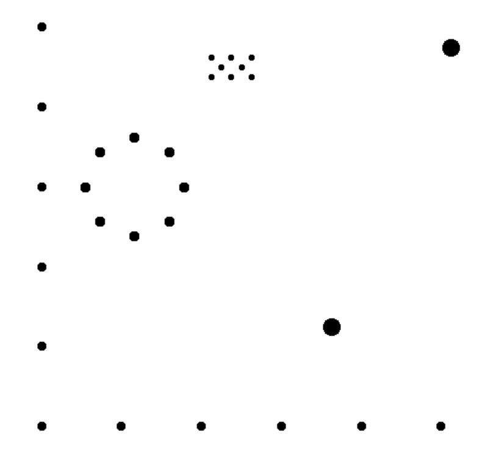
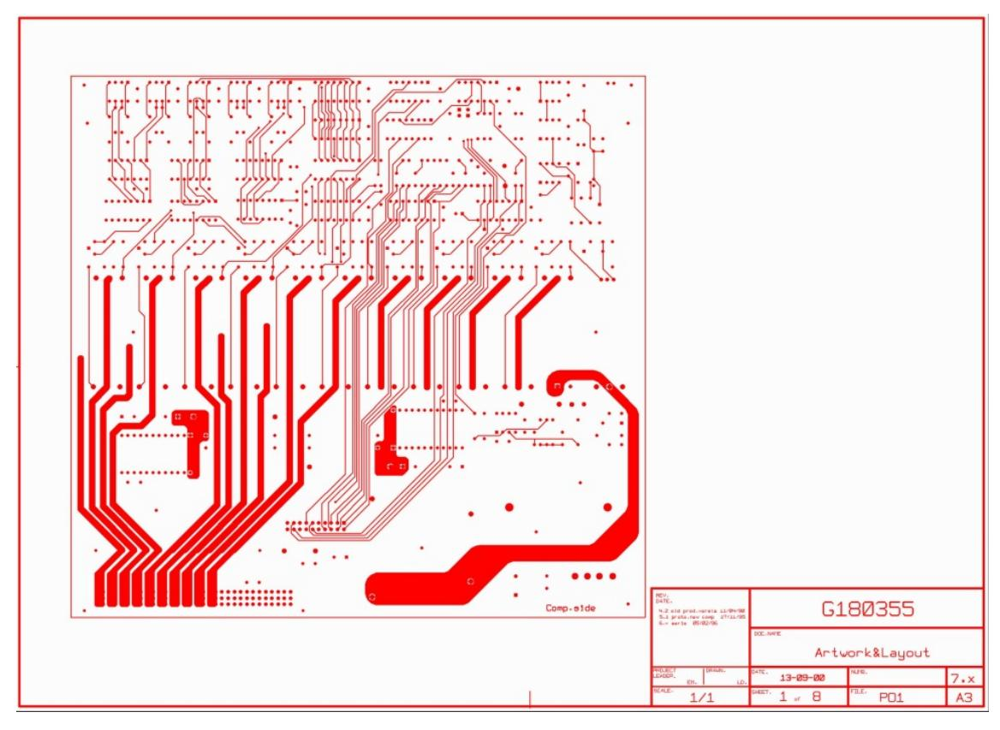

# <span id="page-158-0"></span>6 **PCB Fabrication and Assembly Data**

### <span id="page-158-1"></span>**6.1 Structure**

PCB Fabrication data is a set of Gerber files and possibly files in other portable formats such as PDF. The files can either be in a directory or combined in a zip file. Other archive formats such as rar, 7z are not allowed.

### <span id="page-158-2"></span>**6.2 Mandatory Attributes**

A single Gerber file defines a single 2D layer image. A PCB, however, is a 3D object. To define a PCB one must not only define each layer, but also where it fits in the layer structure. This is defined by the following attributes, which are mandatory in fabrication data:

- .FileFunction
- .FilePolarity
- .SameCoordinates

### <span id="page-158-3"></span>**6.3 Alignment**

All data files in a fabrication data set must align – same offset, no mirroring, seen from the top to bottom. Data must be in 1/1 scale.

### <span id="page-158-4"></span>**6.4 Pads**

The fabricators must be able to distinguish between pads and other copper. For example, SMD pads often have stricter tolerances than other copper, pads are the test points for electrical test, and pads must be clear of legend. To identify pads all pads must be flashed (D03), and all flashes must be pads. Pads embedded in copper pours must also be flashed, although the flash does not affect the image – its purpose is to transfer information, namely the location and shape of the pad.

## <span id="page-158-5"></span>**6.5 The Profile**

The profile defines the physical extent of the PCB in a machine-readable manner. The profile is represented by a contour (G36/G37) or by a cleanly connected closed path made of draws/arcs (D01) obeying the same rules as for contour segments (see [4.10.3\)](#page-90-0). In case the path uses a non-zero aperture *the center line* represents the profile. A profile may contain openings of cutouts.

A fabrication data set *must* contain a separate file with the profile. Other layers *may* contain a replica of that profile provided its aperture has the .AperFunction,Profile attribute.

A roughly sketched outline, where lines do not connect cleanly, is not good enough. Corner marks are not good enough as they are only suitable for manual processing. Fabrication drawings can and should contain an outline drawing, but that is not a substitute for machine readable data, just as a drill map is not a substitute for drill data.


### <span id="page-159-0"></span>**6.6 Drill/rout files**

The image represents which material to remove. This specification does not differentiate between drilling and routing: the fabricator will determine what to drill and what to rout.

In drill or rout files only circular apertures can be used, and only in the following manner:

- For drill holes: flashes.
- For slots draws and arcs: a single draw/arc or a non-closed chain of draw/arcs
- For milling or cutouts (openings with a general shape): openings in the profile layer.

The drill/rout file image represents the *end diameter* of the hole; this is the diameter after plating, also known as the inner diameter. Routs are taken as is, the width of the aperture is the width. Cut-outs defined by draws where the center line defines the edge of the board does not belong to a rout file, add them to the profile layer.

Each drill span (from-to layers) must be put in a separate Gerber file. PTH and NPTH must be split into two separate files.

Drill files must be positive.

**Note:** Use Gerber rather than an NC format for drill and rout layers in fabrication data. The copper layers are in Gerber, and mixing formats is asking for problems, especially in registration. Gerber supports attributes, and Gerber files are typically of far better quality. The objection is sometimes raised that a Gerber file cannot be sent to a drill machine. While this is true, it is irrelevant for fabrication data. No fabricator uses his client's incoming files directly on his equipment but always loads them in the CAM system. The CAM system outputs the panelized drill files in the appropriate NC format, including feeds and speeds, exactly as the drill machine needs. If for whatever reason you need to output the drill files in an NC format, then use the XNC format, which is the only one that is clearly specified and targeted to CAD to CAM data transfer.

#### <span id="page-159-1"></span>**Backdrilling**

An example explains best how to structure a job with backdrilling. Suppose we have an 8 layer job with backdrilling to remove via plating between layers 8 and 7. We need two files:

One file contains the via's. It has .FileFunction *Plated,1,8,PTH.* The drill tool has the via end diameter. Its .AperFunction value is *Via*.

The second file contains the backdrills. It has .FileFunction *NonPlated,8,7,Blind.* The drill tool has the same diameter as the via – the manufacturer will determine the tool diameter. Its .AperFunction value is *Backdrill*.


### <span id="page-160-0"></span>**Example Drill File**



*47. Example: drill file*

| Syntax                            | Annotation                                                                                                                                                                                                                                    |
|-----------------------------------|-----------------------------------------------------------------------------------------------------------------------------------------------------------------------------------------------------------------------------------------------|
| %FSLAX36Y36*%                     | Format specification:<br>Leading zeros omitted<br>Absolute coordinates<br>3 integer and 6 fractional digits                                                                                                                                   |
| %MOMM*%                           | Unit is mm                                                                                                                                                                                                                                    |
| %TF.FileFunction,Plated,1,8,PTH*% | This file describes plated-through holes                                                                                                                                                                                                      |
| %TF.FilePolarity,Positive*%       | Always positive polarity for drill files                                                                                                                                                                                                      |
| %TF.Part,Single*%                 | This file is part of a single PCB                                                                                                                                                                                                             |
| %TA.DrillTolerance,0.02,0.01*%    | Set the drill tolerance attribute to 0.02 mm in<br>plus and 0.01 mm in minus in the attribute<br>dictionary. It will be attached to all aperture<br>definitions until changed or deleted                                                      |
| %TA.AperFunction,ComponentDrill*% | Attribute indicates that the following apertures<br>define component drill holes.                                                                                                                                                             |
| %ADD10C,0.14000*%                 | Define the aperture to create holes with 0.14 mm<br>end diameter. The AD command picks up the<br>attributes in the attribute dictionary, which<br>defines the as a component hole, with a 0.02<br>mm positive and 0.01 mm negative tolerance. |


%TA.AperFunction,Other,Special\*% Attribute indicates that the following apertures are special drill holes %ADD11C,0.24000\*% Define the aperture: a plated hole for a special purpose, with 0.24 mm end diameter with a tolerance of +0.02 mm and -0.01mm. %TA.DrillTolerance,0.15,0.15\*% Changes the drill tolerance attribute for the following apertures to 0.15 mm in both directions %TA.AperFunction,MechanicalDrill\*% Change the tool function attribute in the dictionary to mechanical %ADD12C,0.43000\*% Define aperture 12 as a plated mechanical drill tool with 0.43 mm end diameter, and a tolerance of 0.15 mm in both directions. %ADD13C,0.22000\*% Define aperture13, a tool with the same attributes but an end diameter of 0.22 mm %TD.AperFunction\*% Remove the .AperFunction aperture attribute from the attributes dictionary %TD.DrillTolerance\*% Remove the .DrillTolerance aperture attribute from the attributes dictionary G01\* Set linear plot mode D10\* Set aperture 10 as the current aperture. X2420000Y2750000D03\* Create flash graphical objects with aperture 10: drill plated component holes with diameter 0.14 mm at the indicated coordinates Y3250000D03\* X2170000Y3000000D03\* X1920000Y3250000D03\* X2920000Y2750000D03\* X1920000D03\* X2920000Y3250000D03\* X2670000Y3000000D03\* D11\* Set the current aperture to drill tool 11 X1240000Y0D03\* Create flash graphical objects with aperture 11: drill plated special drill holes with diameter 0.24 mm at the indicated coordinates X0Y-1240000D03\* X-1240000Y0D03\* X880000Y880000D03\* X-880000D03\* X0Y1240000D03\* X880000Y-880000D03\* X-880000D03\* D12\* Set the current aperture to drill tool 12 X7920000Y3500000D03\* Create flash graphical objects with aperture D12: drill plated mechanical drill holes with diameter 0.43 mm at the indicated coordinates X4920000Y-3500000D03\*


X5670000D03\*

X-2330000Y2000000D03\*

Y4000000D03\*

Y0D03\*

Y-2000000D03\*

Y-6000000D03\*

Y-4000000D03\*

X-330000Y-6000000D03\*

X1670000D03\*

X3670000D03\*

D13\* Set the current aperture to drill tool 13

X7670000Y-6000000D03\* Create flash graphical objects with aperture D13: drill plated mechanical drill holes with diameter 0.22 mm at the indicated coordinates

M02\* End of file


### <span id="page-163-0"></span>**6.7 Drawings and Data**

Gerber files in PCB fabrication data contains two types of images.

- Drawings, such as a drill map, a fabrication drawing or an assembly drawing. Such images are intended to be looked at by humans, and may contain vital fabrication instructions.
- Digital data representing the patterns of the copper, the solder mask, legend, drills. This digital data is intended to be processed by CAM software.

Unfortunately, the two are sometimes mixed, and drawing elements added to copper files etc. as in the example below.



*48. Confusing a drawing and digital data*

Such a file is no longer machine readable. An operator must first manually remove the drawing elements. Before doing so he must check if these elements do not contain vital information and write this down somewhere for future reference. Keep data files pure. The drawings must contain all information that belongs to drawing. If need be, information that belongs to a specific file can be put in attributes. Less manual work, less risk of error. Simpler and cleaner.


### <span id="page-164-0"></span>**6.8 The CAD Netlist**

The CAD netlist describes which component pins are connected. Pins are identified by their component reference descriptor and pin number or name. Nets are identified by the net name. Here is an example of a CAD netlist; The first line lists all pins of net Clk3.

```
Clk3: U1-4,U2-3,U5-9,U6-9,U7-9
Sig11: U1-3,U5-12
Data8: U2-4,U5-10,U6-10,U7-8,U8-1
GND: U1-1,U2-1,U3-8,U4-16,U5-16,U6-1,U7-8,U8-8
…
```

The CAD netlist links component pads to nets. It specifies the function of the PCB and is the basis for the layout.

In Gerber the CAD netlist is defined by attaching both the pin and the net attribute to each component pad. This defines a pad – net entry in the CAD netlist, and at the same time associates a pad location and shape to it. For instance, the first entry in the CAD netlist above is given by the following sequence:

```
%TO.P,U1,4*%
%TO.N,Clk3*%
X…Y…D03* The flash that creates the pad
…
```

It is recommended to add .P attribute to all electrical end points, not only physical component leads but edge connectors and test points. Although vias are part of a net, they are not component pads and cannot have a .P attached. Washer pads or any pads that are not part of a component cannot have a .P attached.

#### <span id="page-164-1"></span>**Benefits of Including the CAD Netlist**

For the assembly process the location and orientation of each component must be known. This can easily be extracted from the Gerber file.

The netlist and component names facilitate the communication between the parties involved in design and fabrication. Viewers show more complete PCB information.

More importantly, the netlist information dramatically increases the security of the design to fabrication data transfer. If the image CAM reads from a Gerber file significantly differs from the image intended by CAD, due to bugs, operator errors or transmission errors, the inevitable result is scrap. Such a difference in image results in a difference in board netlist, which can be detected by comparing the calculated board netlist with the supplied CAD netlist. The CAD netlist therefore provides a very powerful redundancy check against image errors. To be precise, the following assert must be valid:

- Interpret all N/C's (not connected, meaning single pad nets) as unique names
- Flashes with the same reference descriptor and pad are deemed connected
- Etched components are removed before connection is calculated
- Assert 1: pads with the same net name must be connected
- Assert 2: pads with different net names must be isolated.

Lastly, a bare board PCB fabricator is expected to perform an electrical test on the bare PCB and guarantee the PCB conforms to the CAD netlist. It then is logical to provide him with the netlist to test against. Without providing the netlist the fabricator is expected to reverse engineer the netlist and must test against a reverse engineered net – hardly a secure procedure.


### <span id="page-165-0"></span>**IP Considerations**

Net names such as Clk13 provide information about the design. This may be a concern. A solution is to replace the meaningful names with obfuscated names such a sequential number. This still allows to compare the design netlist with the image netlist as a redundancy check – meaningful names are not needed for that. The obfuscated names are a little less convenient when communicating between creator and receiver of the Gerber file, but both can still identify the same net as long as the creator can identify the net corresponding to the obfuscated name he created. Obfuscated names are sometimes a sensible balance between IP protection and data transfer security.

It is sometimes alleged that even a net list with obfuscated names pose an IP security risk as it still shows the connections between the pads. This is an obvious fallacy as the connections between the pads can be worked out from the image. In fact, if this were not true, a fabricator would be unable to perform a bare board electrical test without netlist information.


### <span id="page-166-0"></span>6.9 Component Data

#### <span id="page-166-1"></span>6.9.1 Overview

The component information is included in two dedicated Gerber layers: the top and bottom component file. The purpose of the top and bottom component layers is to transfer the needed component information from CAD to manufacturing. The intended workflow is that the Gerber data is read into an assembly CAM system which allows to:

- analyze and check the component placement to check for errors and set up the assembly,
- visualize the component placement to check for errors and set up the assembly,
- generate the manufacturing tools such as the paste stencils and the pick and place machine programs,
- collect information to procure the components.

Component information was added in revision 2020.09, also called X3, by defining two new Gerber layers. By placing the component data in separate files, full compatibility is maintained: if one does not need component information, one can simply ignore the component layers. The new standard is therefore compatible with existing workflows. Legacy software can handle the CAD data with the new assembly information without change. Great care is taken to minimize the development effort by keeping the existing fabrication outputs in place and sticking to an existing syntax. Benefits:

- o Compatible with installed base
- Minimal implementation work.
- o Any decent legacy viewer displays the new component layers.

#### <span id="page-166-2"></span>6.9.2 Assembly Data Set

Component information is included by adding component layers to the bare board fabrication data set. If the confidentiality of the design is a concern one can omit the inner layers as they dp not affect assembly. Below is an example data set for a four-layer board:

```
%TF.FileFunction,Component,L1,Top*%
%TF.FileFunction,Legend,Top*%
%TF.FileFunction,Soldermask,Top*%
%TF.FileFunction,Copper,L1,Top*%
%TF.FileFunction,Copper,L4,Bot*%
%TF.FileFunction,Soldermask,Bot*%
%TF.FileFunction,Legend,Bot*%
%TF.FileFunction,Component,L4,Bot*%
%TF.FileFunction,Component,L4,Bot*%
%TF.FileFunction,NonPlated,1,4,PTH*%
```

The top and bottom component layers contain the component information needed for the assembly process. Attributes identify each component's location, orientation, identification, and properties such as manufacturer part number. The outer copper layers, mask, legend, and drill layers verify component placement and provide registration information for pick-and-place machines. An assembly drawing can contain information that is not included in the component layers.

The ComponentPin and .P attribute in the component layer specify the pin locations and as such unequivocally specify location and rotation of the components. The .P attribute is mandatory for each ComponentPin flash. Any .Cxxx attributes attached to a pin are ignored.


Local fiducials are deemed part of the footpring and can therefore be added to the component layer. The fiducial locations must be identified by a flash with zero-size circle aperture, with the attributes .AperFunction,FiducialPad,Local and .C,<refdes>. The zero size is chosen so as not to clutter the image.

See the Component Layers section of the table in [5.6.10,](#page-139-0) as well as [5.6.14,](#page-151-0) [5.6.15](#page-152-0) and [5.6.16](#page-153-0) for more information on specifying components.

### <span id="page-167-0"></span>**Annotated Example Component Layer**

| Commands                                                                                   | Annotation                                                           |
|--------------------------------------------------------------------------------------------|----------------------------------------------------------------------|
| %TF.GenerationSoftware,KiCad,Pcbnew,(5.99.0-<br>190-g0fd48dd4f-dirty)*%                    |                                                                      |
| %TF.CreationDate,2019-10-02T18:52:55+02:00*%                                               |                                                                      |
| %TF.ProjectId,kit-dev-coldfire<br>xilinx_5213,6b69742d-6465-4762-9d63-<br>6f6c64666972,2*% |                                                                      |
| %TF.SameCoordinates,PX3e22018PY8d89728*%                                                   |                                                                      |
| %TF.FileFunction,Component,L1,Top*%                                                        | This file is the top<br>component layer                              |
| %TF.FilePolarity,Positive*%                                                                |                                                                      |
| %FSLAX46Y46*%                                                                              |                                                                      |
| %MOMM*%                                                                                    |                                                                      |
| %LPD*%                                                                                     |                                                                      |
| G04 Aperture begin list*                                                                   |                                                                      |
| %TA.AperFunction,ComponentMain*%                                                           |                                                                      |
| %ADD10C,0.3*%                                                                              | The aperture for the flash<br>with the main component<br>information |
| %TA.AperFunction,ComponentOutline,Courtyard*%                                              |                                                                      |
| %ADD11C,0.1*%                                                                              | The aperture to draw the<br>outline                                  |
| %TA.AperFunction,ComponentPin*%                                                            |                                                                      |
| %ADD12P,0.36X4X0.0*%                                                                       | The aperture to flash the<br>pin 1 location                          |
| %ADD13C,0.1*%                                                                              | The aperture for the other<br>pin locations                          |
| %TD*%                                                                                      |                                                                      |
| G04 Aperture end list*                                                                     |                                                                      |
| G04 Begin component info*                                                                  |                                                                      |
| D10*                                                                                       | Select main component<br>aperture                                    |
| %TO.C,R301*%                                                                               | Attach reference descriptor<br>R301                                  |
| %TO.CFtp,R_0805_2012Metric*%                                                               | Attach footprint                                                     |
| %TO.CVal,4K7*%                                                                             | Attach value                                                         |
| %TO.CMnt,SMD*%                                                                             | Attach mount type                                                    |


| Commands                 | Annotation                                |
|--------------------------|-------------------------------------------|
| %TO.CRot,-90*%           | Attach rotation                           |
| X218250000Y-73000000D03* | Flash at reference point                  |
| D11*                     | Select outline aperture                   |
| X219250000Y-71310000D02* | Draw outline                              |
| X217250000Y-71310000D01* | Draw outline                              |
| X217250000Y-74690000D01* | Draw outline                              |
| X219250000Y-74690000D01* | Draw outline                              |
| X219250000Y-71310000D01* | Draw outline                              |
| D12*                     | Select key pin aperture                   |
| %TO.P,R301,1*%           | Attach ref. desc and pin<br>number        |
| X218250000Y-72045000D03* | Flash at key pin location                 |
| D13*                     | Select subsequent pin<br>aperture         |
| %TO.P,R301,2*%           | Attach pin 2 ident                        |
| X218250000Y-73955000D03* | Flash at pin location                     |
| %TD*%                    | Clear attributes before next<br>component |
| G04 Next component*      |                                           |
| …                        |                                           |


