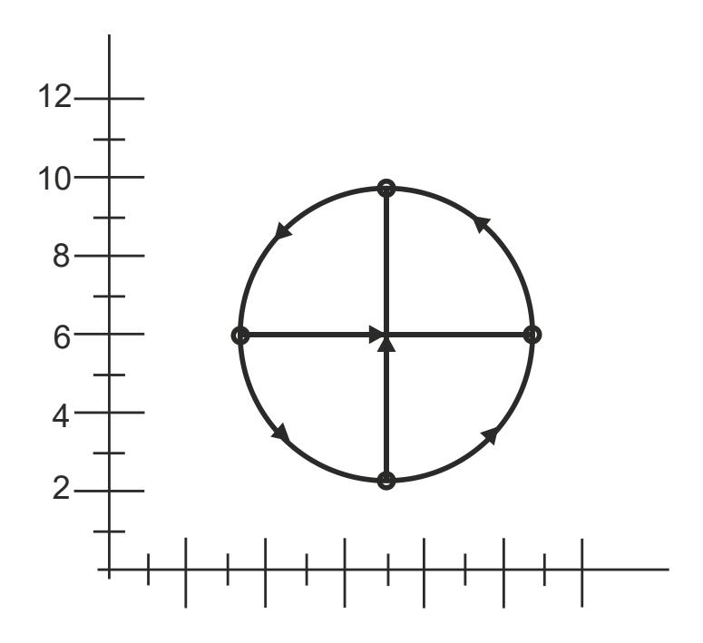
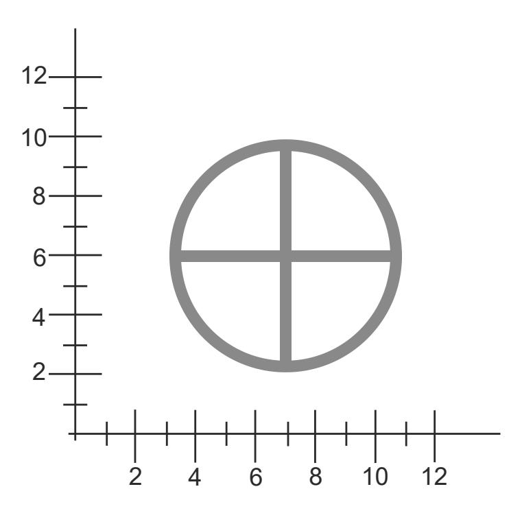
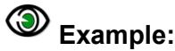
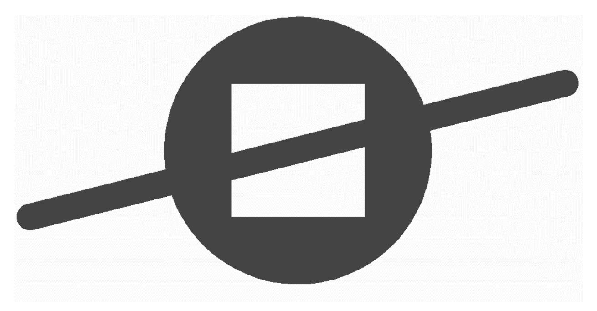
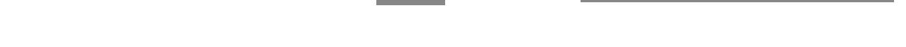
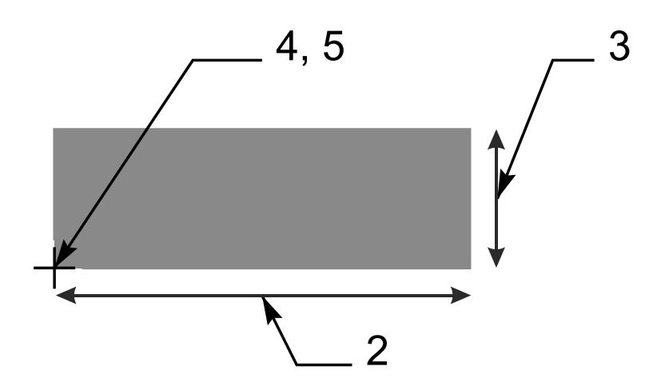
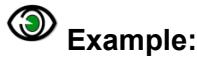
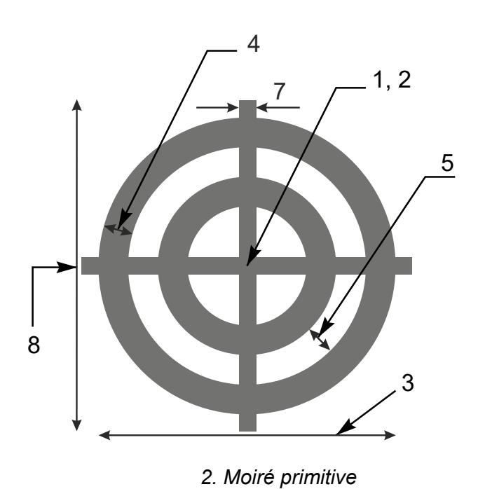
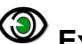

# <span id="page-173-0"></span>8 **Deprecated Format Elements**

### <span id="page-173-1"></span>**8.1 Deprecated Commands**

#### <span id="page-173-2"></span>**Overview**

Current Gerber writers must not use the deprecated commands. Gerber readers may implement them to support legacy applications and files. The next table lists deprecated commands.

| Code       | Function                                                   | Comments                                                                                                                                                                                                                                                                                                                                                            |
|------------|------------------------------------------------------------|---------------------------------------------------------------------------------------------------------------------------------------------------------------------------------------------------------------------------------------------------------------------------------------------------------------------------------------------------------------------|
| G54        | Select aperture                                            | This historic code optionally precedes an aperture<br>selection Dnn command. It has no effect.<br>Sometimes used. Deprecated in 2012.                                                                                                                                                                                                                               |
| G55        | Prepare for flash                                          | This historic code optionally precedes D03 code. It<br>has no effect.<br>Very rarely used nowadays. Deprecated in 2012.                                                                                                                                                                                                                                             |
| G70<br>G71 | Set the 'Unit' to inch<br>Set the 'Unit' to mm             | These historic codes perform a function handled by<br>the MO command. See 4.2.1.                                                                                                                                                                                                                                                                                    |
| G90        | Set the 'Coordinate format' to 'Absolute<br>notation'      | Sometimes used. Deprecated in 2012<br>These historic codes perform a function handled by<br>the FS command. See 4.1.                                                                                                                                                                                                                                                |
| G91        | Set the 'Coordinate format' to 'Incremental<br>notation'   | Very rarely used nowadays. Deprecated in 2012.                                                                                                                                                                                                                                                                                                                      |
| G74        | Sets single quadrant mode                                  | A more complicated way to create arcs. See<br>8.1.10.<br>Rarely used, and then often without effect.<br>Deprecated in 2020.                                                                                                                                                                                                                                         |
| M00        | Program stop                                               | This historic code has the same effect as M02. See<br>4.13.<br>Very rarely, if ever, used nowadays. Deprecated in<br>2012.                                                                                                                                                                                                                                          |
| M01        | Optional stop                                              | This historic code has no effect.<br>Very rarely, if ever, used nowadays. Deprecated in<br>2012.                                                                                                                                                                                                                                                                    |
| IP         | Sets the 'Image polarity' graphics state<br>parameter      | This command has no effect in CAD to CAM<br>workflows. Sometimes used, and then usually as<br>%IPPOS*% to confirm the default and it then has<br>no effect. As it is not clear how %IPNEG*% must<br>be handled it is probably a waste of time to try to<br>fully implement it, and sufficient to give a warning<br>on a %IPNEG*% and skip it.<br>Deprecated in 2013 |
| AS         | Sets the 'Axes correspondence' graphics<br>state parameter |                                                                                                                                                                                                                                                                                                                                                                     |


| IR | Sets 'Image rotation' graphics state<br>parameter                                                     | Deprecated in 2013. Rarely, if ever, used<br>nowadays. If used it was nearly always, if not                                                            |  |
|----|-------------------------------------------------------------------------------------------------------|--------------------------------------------------------------------------------------------------------------------------------------------------------|--|
| MI | Sets 'Image mirroring' graphics state<br>parameter                                                    | always, to confirm the default value and then<br>these commands have no effect.                                                                        |  |
| OF | Sets 'Image offset' graphics state parameter                                                          | It is a waste of time to fully implement these<br>commands. The simplest is simply to ignore these<br>commands. Theoretically safer is to skip them if |  |
| SF | Sets 'Scale factor' graphics state parameter                                                          | they confirm the default and throw an error on any<br>other use; chances are you will never see the<br>error.                                          |  |
| IN | Sets the name of the file image. This has<br>no effect on the image. It is no more than a<br>comment. | This is just a comment. Use G04 for comments.<br>See 4.1. Ignore it.<br>Sometimes used. Deprecated in 2013.                                            |  |
| LN | Loads a name. Has no effect. It is a<br>comment.                                                      | This is just a comment. Use G04 for comments.<br>See 4.1. Ignore it.                                                                                   |  |
|    |                                                                                                       | Sometimes used. Deprecated in 2013.                                                                                                                    |  |

*Deprecated Gerber Commands*


### <span id="page-175-0"></span>**Axis Select (AS)**

The AS command has been deprecated since revision I1 from December 2012.

The historic AS command sets the correspondence between the X, Y data axes and the A, B output device axes. It does not affect the image in computer to computer data exchange. It only has an effect how the image is positioned on an output device.

The order of execution is always MI, SF, OF, IR and AS, independent of their order of appearance in the file.

The AS command can only be used once, at the beginning of the file.

### *8.1.2.1 AS Command*

The syntax for the AS command is:

$$AS = '%' (AS' ('AXBY'|'AYBX')) '*%';$$

| Syntax | Comments                                                                                                 |
|--------|----------------------------------------------------------------------------------------------------------|
| AS     | AS for Axis Select                                                                                       |
| AXBY   | Assign output device axis A to data axis X, output device axis B to<br>data axis Y. This is the default. |
| AYBX   | Assign output device axis A to data axis Y, output device axis B to<br>data axis X.                      |

#### *8.1.2.2 Examples*

| Syntax    | Comments                                                                              |
|-----------|---------------------------------------------------------------------------------------|
| %ASAXBY*% | Assign output device axis A to data axis X and output device axis B<br>to data axis Y |
| %ASAYBX*% | Assign output device axis A to data axis Y and output device axis B<br>to data axis X |


### <span id="page-176-0"></span>**Image Name (IN)**

The IN command has been deprecated since revision I4 from October 2013.

The historic IN command gives a name to the image contained in the Gerber file. The name must comply with the syntax rules for a string as described in section [3.4.3.](#page-35-3) This command can only be used once, at the beginning of the file.

IN has *no* effect on the image. A reader can ignore this command. The informal information provided by IN can as well be put in a G04 comment.

### *8.1.3.1 IN Command*

The syntax for the IN command is:

IN = '%' ('IN' name) '\*%';

| Syntax        | Comments          |
|---------------|-------------------|
| IN            | IN for Image Name |
| <name></name> | Image name        |

#### *8.1.3.2 Examples*

| Syntax       | Comments                |
|--------------|-------------------------|
| %INPANEL_1*% | Image name is 'PANEL_1' |


### <span id="page-177-0"></span>**Image Polarity (IP)**

The IP command has been deprecated since revision I4 from October 2013.

IP sets positive or negative polarity for the entire image. It can only be used once, at the beginning of the file.

### *8.1.4.1 Positive Image Polarity*

Under *positive* image polarity, the image is generated as specified elsewhere in this document. (In other words, the image generation has been assuming positive image polarity.)

#### *8.1.4.2 Negative Image Polarity*

The purpose of negative image polarity is to create a negative image, clear areas in a dark background. The entire image plane in the background is initially dark instead of clear. The effect of dark and clear polarity is toggled. The entire image is simply reversed, dark becomes white and vice versa.

In negative image polarity, the first graphical object encountered *must* have dark polarity.

### *8.1.4.3 IP Command*

The syntax for the IP command is:

IP = '%' ('IP' ('POS'|'NEG')) '\*%';

| Syntax | Comments                    |  |
|--------|-----------------------------|--|
| IP     | IP for Image Polarity       |  |
| POS    | Image has positive polarity |  |
| NEG    | Image has negative polarity |  |

#### *8.1.4.4 Examples*

| Syntax   | Comments                    |  |
|----------|-----------------------------|--|
| %IPPOS*% | Image has positive polarity |  |
| %IPNEG*% | Image has negative polarity |  |


### <span id="page-178-0"></span>**Image Rotation (IR)**

The IR command has been deprecated since revision I1 from December 2012.

IR rotates the entire image counterclockwise in increments of 90° around the image origin (0, 0). All image objects are rotated. The IR command affects the entire image. It must be used only once, at the beginning of the file. The order of execution is always MI, SF, OF, IR and AS, independent of their order of appearance in the file.

### *8.1.5.1 IR Command*

The syntax for the IR command is:

IR = '%' ('IR' ('0'|'90'|'180'|'270')) '\*%';

| Syntax | Comments                                            |  |
|--------|-----------------------------------------------------|--|
| IR     | IR for Image Rotation                               |  |
| 0      | Image rotation is 0° counterclockwise (no rotation) |  |
| 90     | Image rotation is 90° counterclockwise              |  |
| 180    | Image rotation is 180° counterclockwise             |  |
| 270    | Image rotation is 270° counterclockwise             |  |

### *8.1.5.2 Examples*

| Syntax   | Comments                                |
|----------|-----------------------------------------|
| %IR0*%   | No rotation                             |
| %IR90*%  | Image rotation is 90° counterclockwise  |
| %IR270*% | Image rotation is 270° counterclockwise |


### <span id="page-179-0"></span>**Load Name (LN)**

The IP command has been deprecated since revision I4 from October 2013.

This historic command has *no* effect on the image and can be ignored.

LN assigns a name to the subsequent part of the file. It was intended as a human-readable comment. Use the normal G04 command for human-readable comment. The LN command can be used multiple times in a file.

### *8.1.6.1 LN Command*

The syntax for the LN command is:

LN = '%' ('LN' name) '\*%';

| Syntax        | Comments                                                                 |
|---------------|--------------------------------------------------------------------------|
| LN            | LN for Load Name                                                         |
| <name></name> | The name must comply with the syntax for a string, see section<br>3.4.3. |

#### *8.1.6.2 Examples*

| Syntax             | Comments                                                   |
|--------------------|------------------------------------------------------------|
| %LNVia_anti-pads*% | The name 'Via_anti-pads' is to the subsequent file section |


### <span id="page-180-0"></span>**Mirror Image (MI)**

The MI command has been deprecated since revision I1 from December 2012.

MI sets the mirroring for the coordinate data. All the *coordinate data* – and *only* coordinate data - are mirrored according to the specified factor. **Step and repeat distances are not coordinate data – see [4.9](#page-84-0) - and hence are** *not* **mirrored. Apertures are** *not* **mirrored.**

This command affects the entire image. It can only be used once, at the beginning of the file. The default is no mirroring. The order of execution is always MI, SF, OF, IR and AS, independent of their order of appearance in the file.


Quite a number of implementations incorrectly also mirror apertures and/or step and repeat distances. These incorrect implementations make the MI too risky to use. We strongly recommend *not* to use MI on output as you do know how the reader will interpret the file. If an image must be mirrored, write out the mirrored coordinates and apertures.

### *8.1.7.1 MI Command*

The syntax for the MI command is:

$$MI = '\%' ('MI' ['A'('0'|'1')]['B'('0'|'1')]) '*\%';$$

| Syntax | Comments                                                                                                                                                                                                            |
|--------|---------------------------------------------------------------------------------------------------------------------------------------------------------------------------------------------------------------------|
| MI     | MI for Mirror image                                                                                                                                                                                                 |
| A(0 1) | Controls mirroring of the A-axis data:<br>A0 – disables mirroring<br>A1 – enables mirroring (the image will be flipped over the B-axis)<br>If the A part is missing, then mirroring is disabled for the A-axis data |
| B(0 1) | Controls mirroring of the B-axis data:<br>B0 – disables mirroring<br>B1 – enables mirroring (the image will be flipped over the A-axis)<br>If the B part is missing, then mirroring is disabled for the B-axis data |

#### *8.1.7.2 Examples*

| Syntax    | Comments                                          |
|-----------|---------------------------------------------------|
| %MIA0B0*% | No mirroring of A- or B-axis data                 |
| %MIA0B1*% | No mirroring of A-axis data<br>Mirror B-axis data |
| %MIB1*%   | No mirroring of A-axis data<br>Mirror B-axis data |


### <span id="page-181-0"></span>**Offset (OF)**

The OF command has been deprecated since revision I1 from December 2012.

OF moves the final image up to plus or minus 99999.99999 units from the imaging device (0, 0) point. The image can be moved along the imaging device A or B axis, or both. The offset values used by OF command are absolute. If the A or B part is missing, the corresponding offset is 0. The offset values are expressed in units specified by MO command. This command affects the entire image. It can only be used once, at the beginning of the file. The order of execution is always MI, SF, OF, IR and AS, independent of their order of appearance in the file.

#### *8.1.8.1 OF Command*

The syntax for the OF command is:

OF = '%' ('OF' ['A' decimal]['B' decimal]) '\*%';

| Syntax              | Comments                                          |
|---------------------|---------------------------------------------------|
| OF                  | OF for Offset                                     |
| A <offset></offset> | Defines the offset along the output device A axis |
| B <offset></offset> | Defines the offset along the output device B axis |

The **<Offset>** value is a decimal number n preceded by the optional sign ('+' or '-') with the following limitation:

0 ≤ n ≤ 99999.99999

The decimal part of n consists of not more than 5 digits.

#### *8.1.8.2 Examples*

| Syntax         | Comments                                                                                   |
|----------------|--------------------------------------------------------------------------------------------|
| %OFA0B0*%      | No offset                                                                                  |
| %OFA1.0B-1.5*% | Defines the offset: 1 unit along the A axis, -1.5 units along the B axis                   |
| %OFB5.0*%      | Defines the offset: 0 units (i.e. no offset) along the A axis, 5 units along<br>the B axis |


### <span id="page-182-0"></span>**Scale Factor (SF)**

The SF command has been deprecated since revision I1 from December 2012.

SF sets a scale factor for the A- and/or B-axis coordinate data. All the *coordinate data* – and *only* coordinate data - are multiplied by the specified factor for the corresponding axis. **Step and repeat distances – see [4.9](#page-84-0) - are not coordinate data and hence are not scaled. Apertures are** *not* **scaled.**

This command affects the entire image. It can only be used once, at the beginning of the file. The default scale factor is '1'. The factor values must be between 0.0001 and 999.99999. The scale factor can be different for A and B axes. The order of execution is always MI, SF, OF, IR and AS, independent of their order of appearance in the file.


Quite some legacy readers incorrectly also scale step and repeat distances You cannot know how the reader will interpret the data and that make the SF too risky to use. Many readers simply do not support it. *Do not to use SF*. If an image must be scaled, write out the scaled coordinates.

### *8.1.9.1 SF Command*

The syntax for the SF command is:

SF = '%' ('SF' ['A' decimal]['B' decimal]) '\*%';

| Syntax    | Comments                              |
|-----------|---------------------------------------|
| SF        | SF for Scale Factor                   |
| A decimal | The scale factor for the A-axis data. |
| B defimal | The scale factor for the B-axis data. |

The scale factor is an unsigned decimal number n where 0.0001 ≤ n ≤ 999.99999.

#### *8.1.9.2 Examples*

| Syntax     | Comments                                                         |
|------------|------------------------------------------------------------------|
| %SFA1B1*%  | Scale factor 1. A decimal.                                       |
| %SFA.5B3*% | Defines the scale factor: 0.5 for the A-axis, 3 for B. Decimals. |


### <span id="page-183-0"></span>**Single-quadrant arc mode (G74)**

Historically, there were two arc quadrant modes:

- Single quadrant mode, set by G74 command
- Multi quadrant mode, set by G75 command

The single-quadrant mode G74 was an unnecessary embellishment. It was used very rarely, and usually had no effect as it was overruled by a subsequent G75 before any arc was produced. Programmers voted against G75 with their keyboards. It was deprecated in 2021. Developers of Gerber input software will get a very long way without fully implementing G74 but only give an error when a G74 arc is created – this error will exceedingly rarely occur.

| Quadrant mode                       | Comments                                                                                                                                                           |
|-------------------------------------|--------------------------------------------------------------------------------------------------------------------------------------------------------------------|
| Single quadrant (G74)<br>Deprecated | In single quadrant mode the arc is not allowed to extend over<br>more than 90°.                                                                                    |
|                                     | If the start point of the arc is equal to the end point, the arc has<br>length zero, i.e. it covers 0°.                                                            |
|                                     | A separate operation is required for each quadrant. A minimum of<br>four operations is required for a full circle.                                                 |
| Multi quadrant (G75)<br>Current     | In multi quadrant mode the arc is allowed to extend over more<br>than 90°.                                                                                         |
|                                     | If the start point of the arc is equal to the end point, the arc is a full<br>circle of 360°. Zero-length arcs cannot be constructed – they are<br>useless anyhow. |

#### *Quadrant modes*

The syntax of the G74 commands is:

G74 = :('G74') '\*';


#### **Example:**

G74\*

The syntax of the D01 command in single quadrant circular plot mode is:

D01 = (['X' x\_coordinate] ['Y' y\_coordinate] 'I' x\_distance 'J' Y\_distance ) 'D01' '\*';

| Syntax         | Comments                                                                                                                                                               |
|----------------|------------------------------------------------------------------------------------------------------------------------------------------------------------------------|
| X x_coordinate | X_coordinate defines the X coordinate of the end point of the arc.<br>arc. It is of the coordinate data type. The default is the X coordinate<br>of the current point. |
| Y y_coordinate | As above, but for the Y axis.                                                                                                                                          |
| I x_distance   | The x_distance defines the distance between the arc start point and<br>the center parallel to the X axis. Distance is ≥ 0. It is of the<br>coordinate data type.       |
| J y_distance   | As above, but for the Y axis.                                                                                                                                          |
| D01            | Plot operation code                                                                                                                                                    |


#### *49. Circular plotting example*

In single quadrant mode, awkwardly, *the sign of the offsets is omitted,* converting them to unsigned distances. There are four candidates for the center: (<Current X> +/- <X distance>, <Current Y> +/- <Y distance>). The center is the candidate that results in an arc with the specified orientation, not greater than 90° and with the least deviation. The reason for this oddity is purely historic.

## **Example:**

| Syntax                | Comments                                        |
|-----------------------|-------------------------------------------------|
| G74*                  | Set single quadrant mode                        |
| D10*                  | Select aperture 10 as current aperture          |
| X1100Y600D02*<br>G03* | Set the current point to (11, 6)                |
| X700Y1000I400J0D01*   | Set counterclockwise plot mode                  |
| X300Y600I0J400D01*    | Create quarter arc object (radius 4) to (7, 10) |
| X700Y200I400J0D01*    | Create quarter arc object (radius 4) to (3, 6)  |
| X1100Y600I0J400D01*   | Create quarter arc object (radius 4) to (7, 2)  |
| X300D02*              | Create quarter arc object (radius 4) to (11, 6) |
| G01*<br>X1100D01*     | Set the current point to (3 ,6)                 |
| X700Y200D02*          | Set linear plot mode                            |
| Y1000D01*             | Create draw object to (11, 6)                   |
|                       | Set the current point to (7, 2)                 |
|                       | Create draw object to (7, 10)                   |



*50. Single quadrant mode example: arcs and draws*




*51. Single quadrant mode example: resulting image*


An important difference between G74 and G75 arcs is what happens when start point and end point coincide. For G75 this represents a full 360° arc, in G74 a zero-degree arc. Some examples.

| Syntax           | Comments                                  |
|------------------|-------------------------------------------|
| D10*             | Select aperture 10 as current aperture    |
| G01*             | Set linear plot mode                      |
| X0Y600D02*       |                                           |
| G74*             | Set the current point to (0, 6)           |
| G02*             | Set single quadrant mode                  |
| X0Y600I500J0D01* | Set clockwise circular plot mode          |
|                  | Create arc object to (0, 6) with radius 5 |

The resulting image is small dot, an instance of the aperture, at position (0, 6)

| Syntax           | Comments                                      |
|------------------|-----------------------------------------------|
| D10*             | Select aperture 10 as current aperture        |
| G01*             | Set linear plot mode                          |
| X0Y600D02*       |                                               |
| G75*             | Set the current point to (0, 6)               |
| G02*             | Multi quadrant mode                           |
| X0Y600I500J0D01* | Set clockwise circular plot mode              |
|                  | Create arc object to (0, 6) with center (5,6) |

The resulting image is a full circle.


### <span id="page-187-0"></span>**8.2 Deprecated Command Options**

### <span id="page-187-1"></span>**Format Specification (FS) Options**

This section describes deprecated options of the FS command (see [4.1\)](#page-44-1).

The FS command could also be used to specify the following format characteristics:

- Trailing zero omission
- Incremental coordinate notation
- <span id="page-187-2"></span>Low resolution (less than 6 decimals).

### *8.2.1.1 Trailing Zero Omission*

Trailing zero omission is deprecated since revision 2015.06.

*Trailing zero omission* some or all trailing zeros can be omitted but all leading zeros are required. To interpret the coordinate string, it is first padded with zeros at the back until its length fits the coordinate format. For example, with the "23" coordinate format, "15" is padded to "15000" and therefore represents 15.000.

The coordinate data must contain at least one digit. Zero therefore should be encoded as "0".

Trailing zero omission is specified by 'T' after the FS code. (The normal leading zero omission is specified by 'L' after the FS code.)


#### **Example:**

%FSTAX26Y26\*%

Trailing zero omission is rarely found in legacy files. Gerber readers will go a long way without supporting it.

#### *8.2.1.2 Incremental Notation*

Incremental notation is deprecated since revision I1 from December 2012.

Incremental notation means that coordinate values are as the incremental distances from the previous coordinate position. It is specified by the "I" in the FS command, after the "L" or "T" for leading or trailing. (The normal absolute notation is specified by 'A' in the FS command.)



%FSLIX26Y26\*% %FSTIX36Y36\*%

Incremental notation was sometimes used as a simplistic compression when saving a few bytes was a fantastic advantage, and before the invention of Lempel–Ziv–Welch (LZW) and other *lossless* compression methods. The problem is that the accumulation of rounding errors leads to significant loss of precision. This results in poor registration, invalid arcs, self-intersecting contours, often resulting in scrap. Avoid incremental notation like the plague.

Incremental notation is fortunately but rarely used in legacy files. Gerber readers will go a long way without supporting it.


#### *8.2.1.3 Low resolution*

Low resolution, this is using less than 6 decimals is deprecated since revision 2015.06.

Low resolution was introduced in the 1960's as a simplistic compression method when saving a few bytes was of paramount importance, and computers were too feeble for proper *lossless* compression methods such as Lempel–Ziv–Welch (LZW).

Low resolution loses numerical precision and poor numerical precision is the main cause of bugs in geometric software. It leads to poor registration of objects between PCB layers; loss of accuracy; self-intersecting contours; invalid arcs; small arcs turning in full circles, missing clearances. Low resolution was the main cause of problems with Gerber files, sometimes leading to scrap. The days that saving a few bytes was important are long gone. The risks of low resolution remain. Avoid low resolution like the plague.

Low resolution files are unfortunately quite common in legacy files. Gerber readers that do not support low resolution will fail to read a significant fraction of Gerber files.

### <span id="page-188-0"></span>**Rectangular Hole in Standard Apertures**

Rectangular holes in standard apertures are deprecated since revision 2015.06. They occur very rarely in legacy files.


In addition to the round hole described in section [4.4](#page-50-0) older versions of this specification also allowed rectangular holes. Rectangular holes do not rotate with the aperture, according to these historic specifications. This is very counterintuitive and a source of errors. Rectangular holes were deprecated because of this problem, and because rectangular holes are not very useful

in the first place. Do not use them. If you need a rectangular hole construct a macro aperture.

The syntax of a rectangular hole was common to all standard apertures:

#### hole = x\_hole\_size Y y\_hole\_size

The parameters specify the X and Y sizes of the hole. Decimals >0.

The hole must strictly fit within the standard aperture. It is centered on the aperture.


#### **Example:**

```
%FSLAX26Y26*%
%MOMM*%
%ADD10C,10X5X5*%
%ADD11C,1*%
G01*
%LPD*%
D11*
X-25000000Y-1000000D02*
X25000000Y1000000D01*
D10*
X0Y0D03*
```


M02\*



*52. Standard (circle) aperture with a rectangular hole above a draw*

Note that the draw is visible through the hole.

<span id="page-189-0"></span>Rectangular holes appear very rarely in legacy files.

### **Draws and Arcs with Rectangular Apertures**

The effect of stroking a line segment with a rectangular aperture is illustrated below. If the rectangle aperture is aligned with the line being stroked the result is a draw with line endings which have right angles:



Line being stroked Aperture Draw

*53. Creating a draw: the aperture is aligned with line*

If the rectangle is not aligned the result is as in the illustration below. The rectangle is *not* automatically rotated to align with the line being stroked.


Line being stroked Aperture Draw

*54. Creating a draw: the aperture is not aligned with line*


This was only allowed with the solid rectangle *standard* aperture. Other standard apertures or macro apertures that fortuitously have a rectangular shape are not allowed.

This option was deprecated in 2020.09. Drawing with rectangular was never used often, even less at other angles than multiples of 90º. A developer of Gerber input will get a long way if he only implements a warning on plottings with rectangular apertures.

### <span id="page-190-0"></span>**Macro Primitive Code 2, Vector Line**

Primitive 2 was deprecated in 2015. It occurs but very rarely in legacy files.

<span id="page-190-1"></span>Primitive 2 is identical to primitive 20. See [4.5.1.4.](#page-61-0)

### **Macro Primitive Code 22, Lower Left Line**

Primitive 22 was deprecated in 2015. It occurs but very rarely in legacy files.

A lower left line primitive is a rectangle defined by its width, height, and the lower left point.

| Modifier number | Description                                                                                                  |
|-----------------|--------------------------------------------------------------------------------------------------------------|
| 1               | Exposure off/on (0/1))                                                                                       |
| 2               | Rectangle width, a decimal ≥ 0.                                                                              |
| 3               | Rectangle height, a decimal ≥ 0.                                                                             |
| 4               | A decimal defining the X coordinate of lower left point.                                                     |
| 5               | A decimal defining the Y coordinate of lower left point.                                                     |
| 6               | A decimal defining the rotation angle around the origin (rotation is not<br>around the center of the object) |



*1. Line (lower left) primitive*



%AMLINE2\*22,1,6.8,1.2,0,0,0\*%


### <span id="page-191-0"></span>**Macro Primitive Code 6, Moiré**

This primitive was deprecated in 2021. It is rarely used in legacy files.

The moiré primitive is a cross hair centered on concentric rings. Exposure is always on!

| Parameter<br>number | Description                                                                                                                                                                                |
|---------------------|--------------------------------------------------------------------------------------------------------------------------------------------------------------------------------------------|
| 1                   | Center point X coordinate.                                                                                                                                                                 |
| 2                   | Center point Y coordinate.                                                                                                                                                                 |
| 3                   | Outer diameter of outer concentric ring ≥ 0.                                                                                                                                               |
| 4                   | Ring thickness ≥ 0.                                                                                                                                                                        |
| 5                   | Gap between rings ≥ 0.                                                                                                                                                                     |
| 6                   | Maximum number of rings. An integer ≥ 0. The effective number of<br>rings can be less if the center is reached. If there is not enough space<br>for the inner ring it becomes a full disc. |
| 7                   | Crosshair thickness ≥ 0. If the thickness is 0 there are no crosshairs.                                                                                                                    |
| 8                   | Crosshair length ≥ 0. If the length is 0 there are no crosshairs.                                                                                                                          |
| 9                   | Rotation angle, in degrees counterclockwise. The primitive is rotated<br>around the origin of the macro definition, i.e. the (0, 0) point of macro<br>coordinates.                         |



**Example:**

%AMMOIRE\* 6,0,0,5,0.5,0.5,2,0.1,6,0\*%


### <span id="page-192-0"></span>**8.3 Deprecated Syntax Variations**

#### <span id="page-192-1"></span>**Combining G01/G02/G03 and D01 in a single command.**

This construction is deprecated since revision 2015.06.

The command codes G01, G02, G03 can be put at the beginning of the word containing a D01. The plot state is then set accordingly before D01 is executed and kept at the new value until superseded by a new command.



#### **Example:**

G01X100Y100D01\* X200Y200D01\*

G01 sets the plot state to linear and processes the coordinate data X100Y100 from the same word accordingly as well as the coordinate data X200Y200 from the next word.

The syntax was as follows:

GnnD01 = ('G' ('01'|'02'|'03') coordinate\_data 'D01') '\*'

<span id="page-192-2"></span>This construction happens quite frequently in legacy files, so readers may want to support it.

#### **Coordinate Data without Operation Code**

Coordinate data *without explicit operation code* after a D01, in other words the modal use of D01, is deprecated since revision I1 from December 2012.

A D01 code sets the deprecated operation mode to plot. It remains in plot mode till any other D code is encountered. In sequences of D01 operations this allows omitting an explicit D01 code after the first operation.


#### **Example:**

D10\* X700Y1000D01\* X1200Y1000\* X1200Y1300\* D11\* X1700Y2000D01\* X2200Y2000\* X2200Y2300\*

The operation mode is *only* defined after a D01. The operation mode after a D02, D03 or an aperture selection (Dnn with nn≥10) is *undefined*. Therefore a file containing coordinates without operation code after a D02, D03 or an aperture selection (Dnn with nn≥10) is invalid.

**Warning:** Coordinate data without explicit operation code saves a few bytes but its exact use is not intuitive in relation to D03. The risk of scrap far outweighs the meager benefit.

### <span id="page-192-3"></span>**Style Variations in Command Codes**

Sometimes a word command such as G01 was spelled as G1, or g01, or G001. These variations were discouraged but tolerated. These variations were finally revoked in 2020.09 – only G01 style is allowed.


### <span id="page-193-0"></span>**Deprecated usage of SR**

These constructions are deprecated since revision 2016.01.

The command %SRX1Y1I0J0\*% strictly speaking starts a step and repeat of 1x1, i.e. no step and repeat at all. It is historically sometimes used as an alternative for an %SR\*% to close an SR statement. This is still used quite frequently.

Sometimes an SR command other than 1x1 such as %SRX2Y3I1,5J2.2\*% is put seemingly inside an SR statement. Its effect is then to terminate the current SR statement and start a new one with its parameters. This is used rarely.

Another deprecated variation is that an SR statement at the end of a file is not closed. The end of file M02\* is then an implicit close. This is used rarely.

Another variation is that the file header contains a %SRX1Y1I0J0\*%. This does not mean a futile 1x1 step and repeat is started. It just indicates that the file does not start with a step and repeat, which is obvious. This command can be ignored. This is used quite frequently.

### <span id="page-193-1"></span>**8.4 Deprecated Attribute Values**

The following values for the .AperFuntion attribute were deprecated.

| Drawing | This generic value was replaced by a range of specific<br>drawing types such as FabricationDrawing etc.                                  |
|---------|------------------------------------------------------------------------------------------------------------------------------------------|
| CutOut  | PCB cut-outs. This is the generic term for a hole other<br>than a drill hole.                                                            |
| Slot    | PCB slots. This is a subset of the cut-outs. Which cut<br>outs are called slots is subjective. In case of doubt use<br>the value CutOut. |
| Cavity  | Cavities in a PCB.                                                                                                                       |


### <span id="page-194-0"></span>**8.5 Standard Gerber (RS-274-D)**

The current Gerber layer format is also known as RS-274X or Extended Gerber. There was also a historic format called Standard Gerber or RS-274-D format.

Standard Gerber is technically obsolete. It and was revoked in revision I1 from December 2012 and superseded by RS-274X.

Standard Gerber is revoked and superseded by Extended Gerber, which is the current Gerber format. Consequently, Standard Gerber no longer complies with the Gerber specification. Files in that format can no longer be correctly called Gerber files. Standard Gerber files are not only deprecated, they are simply invalid.


It differs from the current Gerber format (RS-274X), in that it:

- did not support G36 and G37 codes
- did not support any extended commands
- did not support attributes

Standard Gerber did not allow defining the coordinate format or aperture shapes. It was incomplete as an image description format. It lacked the imaging primitives needed to unequivocally transfer information from PCB CAD to CAM.

The word "standard" is misleading here. Standard Gerber was standard NC format. It was not a standard image format: image generation needs a so-called wheel file, and that wheel file was not governed by a standard. The interpretation of a wheel files, and consequently of a Standard Gerber files, was subjective. In Extended Gerber (RS-274X) image generation is fully governed by the standard. Extended Gerber is the true image standard.

Standard Gerber had major drawbacks compared to the current Gerber format and did not offer a single advantage. Standard Gerber is obsolete. There is not a single valid reason to use standard Gerber rather than Extended Gerber.

Always use Extended Gerber (RS-274X). Never use Standard Gerber.

**Warning:** The responsibility of errors or misunderstandings about the wheel file when processing a Standard Gerber file rests solely with the party that decided to use revoked Standard Gerber, with its non-standardized wheel file, rather than Extended Gerber, which is unequivocally and formally standardized.


